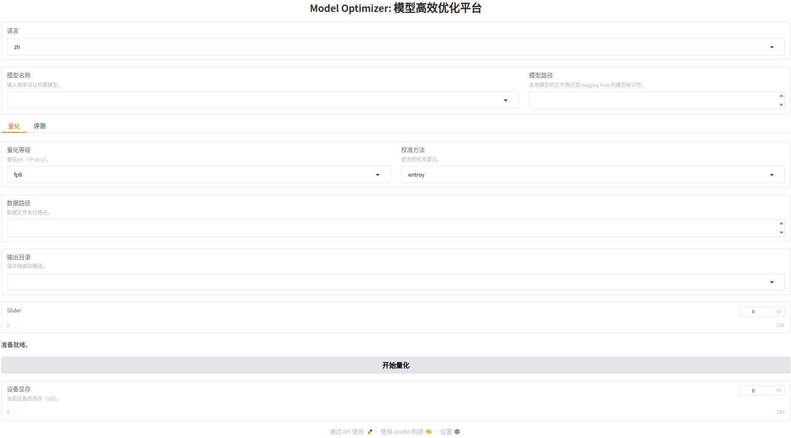

<div align="center">

model optimizer
===========================

<div align="left">

## 1. Overview

model optimizer is a tool to make model quantize, optimize, deploy easier. including functions:

- quantize model
- optimize model
- deploy model


## 2. Getting Started

The code was tested in the following environments

- Ubuntu 24.04.03 LTS
- NVIDIA GPU `3090/4070/5090/Thor` driver version 580.95.05 with CUDA 13.0
- Docker nvcr.io/nvidia/tensorrt:25.10-py3

### 2.1 Installation

#### 2.1.1 `download code`

```bash
git clone git@github.com:happyAnger66-an/model_optimizer.git
git checkout release-0.1
```

#### 2.1.2 `build docker image`

+ you may need install `docker-buildx`

```shell
sudo apt update && apt install docker-buildx
```


`x86`:

```shell
make build_x86
```

`jetson thor`:

```shell
make build_thor
```

#### 2.1.3 `run docker`

+ `CAUTION:` You should use `-v` to mount your `openpi` codes path into docker to use pi05 model.

+ `CAUTION:` To use host .cache huggingface or modelscope you should use `-v` to mount your `~/.cache` into docker.

###### you can see `Makefile` in codes to do these.

```Makefile
run_x86:
	docker run -it --network host \
	--gpus all \
	-v ${PWD}:/workspace \
	-v ${HOME}:/srcs \
	-v ${HOME}/.cache:/srcs/.cache \
	--shm-size=4g \
	--env PYTHONPATH=/usr/local/lib/python3.12/dist-packages/:/srcs/sources/opensrc/robot/openpi/src/:/srcs/sources/opensrc/robot/openpi/packages/openpi-client/src/ \
	model_optimizer:x86 \
	/bin/bash
```

+ Then use make run_x86 to run docker.

```shell
make run_x86
```


## 3. Supported Models

#### 3.1 supported model arch.

|**Architecture**|**Model**||
|-|-|-|
|YOLO11|yolo||
|π0.5|pi05_libero||
|π0.5|pi05_libero/vit||
|π0.5|pi05_libero/llm||
|π0.5|pi05_libero/expert||

#### 3.2 Tested and passed in the following environments

+ 3090

```shell
+-----------------------------------------------------------------------------------------+
| NVIDIA-SMI 580.126.09             Driver Version: 580.126.09     CUDA Version: 13.0     |
+-----------------------------------------+------------------------+----------------------+
| GPU  Name                 Persistence-M | Bus-Id          Disp.A | Volatile Uncorr. ECC |
| Fan  Temp   Perf          Pwr:Usage/Cap |           Memory-Usage | GPU-Util  Compute M. |
|                                         |                        |               MIG M. |
|=========================================+========================+======================|
|   0  NVIDIA GeForce RTX 3090        Off |   00000000:01:00.0  On |                  N/A |
| 30%   41C    P8             30W /  350W |    1722MiB /  24576MiB |     18%      Default |
|                                         |                        |                  N/A |
+-----------------------------------------+------------------------+----------------------+
```

+ Jetson Thor

```shell
NVIDIA Jetson AGX Thor Developer Kit - Jetpack 7.0 [L4T 38.2.1]

+-----------------------------------------------------------------------------------------+
| NVIDIA-SMI 580.00                 Driver Version: 580.00         CUDA Version: 13.0     |
+-----------------------------------------+------------------------+----------------------+
| GPU  Name                 Persistence-M | Bus-Id          Disp.A | Volatile Uncorr. ECC |
| Fan  Temp   Perf          Pwr:Usage/Cap |           Memory-Usage | GPU-Util  Compute M. |
|                                         |                        |               MIG M. |
|=========================================+========================+======================|
|   0  NVIDIA Thor                    Off |   00000000:01:00.0 Off |                  N/A |
| N/A   N/A  N/A             N/A  /  N/A  | Not Supported          |      0%      Default |
|                                         |                        |             Disabled |
+-----------------------------------------+------------------------+----------------------+
```

## 4. Usage

|**Architecture**|**Detial usage**||
|-|-|-|
|π0.5|[manual](./docs/pi05.md)||
|YOLO11|[manual](./docs/yolo.md)||


### 4.1 CLI (Product Ready)

+ All the following operations are performed within Docker.

perform `make run_x86` or `make run_thor` enter the docker first.

#### 4.1.1 `π0.5` inference
```shell
python scripts/deployment/pi05/standalone_inference_script.py --model_path /openpi/pytorch_pi05_libero/ --inference_mode tensorrt  --perf 
```

`output`:
```shell
Inference time: 0.4213 seconds
e2e 419.43 ± 4.14 ms (shared)
action 25.14 ± 0.77 ms (shared)
vit 62.79 ± 0.49 ms (shared)
llm 100.47 ± 1.55 ms (shared)
```

+ `model_path`: pi05 model path, must a `pytorch` model
+ `inference_mode`: `tensorrt` or `pytorch`, choose tensorrt or pytorch as inference backend.
+ `--perf`: perf stats

#### 4.2 For more cli usages

[ALL CLI usage docs](./docs/cli.md)

##### 4.2.1 Models examples.
[`YOLO` usage example docs](./docs/yolo.md)
[`π0.5` usage example docs](./docs/pi05.md)

### 4.2 WebPage (Not all ready yet.)
use it in the web browser: `http://ip:7860`



## 5. Contributing

## 6. License

## 7. Contact

+ `email:` `happyAnger66@163.com`