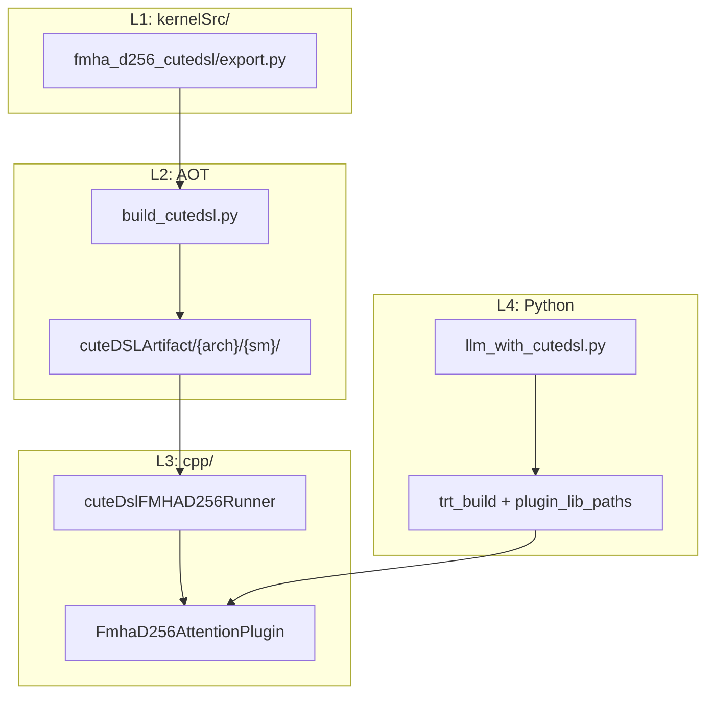

# model_optimizer CuTe DSL 框架

本文档描述 **model_optimizer 独立 CuTe DSL AOT + TRT Plugin** 架构，用于 π0.5 等模型的定制内核部署。**不依赖 TensorRT-Edge-LLM**。

---

## 1. 目标

| 能力 | 说明 |
|------|------|
| CUTLASS AOT 导出 | `cute.compile` + `export_to_c` → `.o` + `.h` + 静态库 |
| 运行时参数化 | B/S/H、KV cache 容量、`cu_kv_seqlens` 等为运行时 dynamic shapes |
| TRT Plugin 闭环 | ONNX `trt::FmhaD256AttentionPlugin` → C++ Plugin → AOT Runner |
| π0.5 首批集成 | Gemma LLM `head_dim=256` FMHA（来自 study_cute/fmha_d256） |

---

## 2. 四层架构

```text
L1  kernelSrc/              CuTe DSL Python 源码（fmha_d256_cutedsl/）
L2  kernelSrc/build_cutedsl.py   AOT 编排 → cpp/kernels/cuteDSLArtifact/
L3  cpp/                     Runner + TRT Plugin（libmodel_opt_plugin.so）
L4  src/model_optimizer/     ONNX symbolic + π0.5 export + trt_build
```



---

## 3. 目录布局

```text
model_optimizer/
├── kernelSrc/
│   ├── build_cutedsl.py           # AOT 编排器
│   ├── requirements-cutedsl.txt   # nvidia-cutlass-dsl, cupy
│   └── fmha_d256_cutedsl/         # D=256 FMHA（源自 study_cute）
│       ├── export.py              # --export_only 入口
│       ├── host/                  # config, launcher, tensor_layout
│       └── device/                # kernel, warp_*
├── cpp/
│   ├── CMakeLists.txt
│   ├── cmake/CuteDsl.cmake
│   ├── kernels/
│   │   ├── cuteDSLArtifact/       # AOT 产物（gitignore）
│   │   └── fmha/cuteDslFMHAD256Runner.{h,cpp}
│   └── plugins/
│       └── fmha_d256/FmhaD256AttentionPlugin.{h,cpp}
├── config/
│   ├── cutedsl_build.yaml
│   └── build_configs/llm_cutedsl_build_cfg.py
├── src/model_optimizer/
│   ├── kernels/cutedsl_build.py   # CLI 包装
│   ├── ops/fmha_d256_attention_plugin.py
│   └── models/pi05/llm_with_cutedsl.py
└── docs/cutedsl.md                # 本文档
```

---

## 4. 编译期 vs 运行时参数

| 编译期（AOT variant） | 运行时（Plugin / dynamic_shapes） |
|----------------------|----------------------------------|
| head_dim=256 | batch B、seq_len S_q/S_kv |
| homo BF16 / FP16 | num_heads H_q、H_kv |
| causal + persistent + bottom_right | KV cache 容量 cap |
| mixed vs homo（未来） | `cu_kv_seqlens[B+1]` |

π0.5 Gemma：`hidden_size=2048`, `num_heads=8` → **head_dim=256**，与 `fmha_d256` 完全匹配。

---

## 5. AOT 构建

### 5.1 依赖

```bash
pip install -r kernelSrc/requirements-cutedsl.txt
# nvidia-cutlass-dsl==4.4.1, cupy-cuda12x/13x, cuda-python
```

需在 **Blackwell / Thor GPU**（SM100/SM110）上运行 AOT 编译。

### 5.2 命令

```bash
# 方式 1：直接调用
python kernelSrc/build_cutedsl.py --kernels fmha --gpu_arch sm_110 --clean -j 2

# 方式 2：CLI
model-optimizer-cli kernels build --config config/cutedsl_build.yaml
```

### 5.3 产物

```text
cpp/kernels/cuteDSLArtifact/{x86_64|aarch64}/sm_110/
├── libcutedsl_{arch}.a
├── metadata.json
└── include/
    ├── cutedsl_all.h
    ├── fmha_d256_homo_bf16.h
    └── fmha_d256_homo_fp16.h
```

### 5.4 首批 variant

| name | 用途 | dtype |
|------|------|-------|
| `fmha_d256_homo_bf16` | π0.5 LLM prefill（默认） | BF16 Q/K/V |
| `fmha_d256_homo_fp16` | TRT FP16 引擎 | FP16 Q/K/V |

---

## 6. C++ 构建与 Plugin

```bash
mkdir -p cpp/build && cd cpp/build
cmake .. \
  -DTRT_PACKAGE_DIR=/path/to/TensorRT \
  -DENABLE_CUTE_DSL=fmha \
  -DCUTE_DSL_ARTIFACT_TAG=sm_110
make -j$(nproc)
# → libmodel_opt_plugin.so
```

### Runner 契约

`CuteDslFMHAD256Runner` 负责：

1. `canImplement(head_dim, sm)` — 仅 D=256 + SM100+
2. `loadKernelModules()` — 加载 AOT module
3. `run(Params, stream)` — 填 `Tensor_*_t.dynamic_shapes[]` 并调用 `cute_dsl_*_wrapper`

### Plugin I/O（LLM prefill）

| Tensor | Shape | dtype |
|--------|-------|-------|
| Q | `[B, S_q, H_q, 256]` | FP16/BF16 |
| KV cache | `[B, 2, H_kv, Cap, 256]` | 同 Q |
| cu_kv_seqlens | `[B+1]` | INT32 |
| O（输出） | `[B, S_q, H_q, 256]` | 同 Q |

ONNX 域：`trt::FmhaD256AttentionPlugin`（与 Edge-LLM `trt::AttentionPlugin` 独立，避免符号冲突）。

---

## 7. π0.5 集成流程

```text
1. AOT:  python kernelSrc/build_cutedsl.py --gpu_arch sm_110
2. C++:  cmake cpp/ → libmodel_opt_plugin.so
3. 导出:  model-optimizer-cli export --model_name pi05_libero/llm_with_cutedsl
4. 建引擎: model-optimizer-cli build --build_cfg config/build_configs/llm_cutedsl_build_cfg.py
5. 推理:  Pi05TensorRTExecutor（plugin_lib_paths 含 libmodel_opt_plugin.so）
```

### 模型注册

| model_name | 类 | 说明 |
|------------|-----|------|
| `pi05_libero/llm` | `LLM` | 原生 HF attention |
| `pi05_libero/llm_with_trtedge` | `LLMWithTrtEdgeLLM` | Edge-LLM 插件（旧路径） |
| `pi05_libero/llm_with_cutedsl` | `LLMWithCuteDsl` | **本框架** D=256 FMHA |

`LLMWithCuteDsl` 结构与 `LLMWithTrtEdgeLLM` 同构：

- 训练/校准：走原生 `GemmaAttention.forward`
- ONNX 导出：`GemmaModelCuteDslOnnxExport` 显式调用 `FmhaD256Attention.forward` → 图中出现 `trt::FmhaD256AttentionPlugin`

---

## 8. 与 study_cute 的关系

| study_cute | model_optimizer |
|------------|-----------------|
| JIT 验证、`fmha_d256.py` 测试 | AOT 固化、`export.py` |
| `launch_homo` / `_call_llm` | Runner `Params` + Plugin enqueue |
| mixed i8 + scale（研究） | 后续 variant `fmha_d256_mixed_i8` |

研究在 study_cute 完成 → patch 迁入 `kernelSrc/fmha_d256_cutedsl/` → AOT → Plugin。

---

## 9. 扩展新算子 checklist

1. 在 `kernelSrc/<op>_cutedsl/export.py` 实现 `--export_only` + `export_to_c`
2. 在 `build_cutedsl.py` 的 `KERNEL_VARIANTS` 注册
3. 添加 `cpp/kernels/<op>/cuteDsl*Runner.{h,cpp}`
4. 添加 `cpp/plugins/<op>/` + CMake 链接
5. 添加 `src/model_optimizer/ops/<op>_plugin.py` ONNX symbolic
6. 更新 `config/cutedsl_build.yaml` 与 build_cfg

---

## 10. 风险与缓解

| 风险 | 缓解 |
|------|------|
| AOT 需目标 GPU | CI/prebuilt tarball；开发机本地编译 |
| DSL 版本漂移 | `metadata.json` + 钉死 4.4.1 |
| D=256 SMEM 超限 | `canImplement` 返回 false；Thor 实测 |
| 双 plugin .so | 独立域名 `trt::FmhaD256*` |
