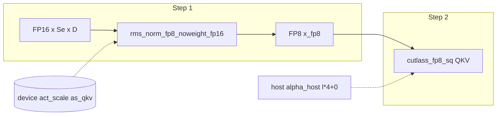

# Encoder 段：`act_scales` 指针与 `rms_norm_fp8_noweight_fp16`

本文对应 `flash_rt/hardware/thor/shared_primitives.py` 中 `encoder_forward` 每层循环起始处（约 245–253 行），以及 CUDA 实现 `csrc/kernels/norm.cu` 中的 **`rms_norm_fp8_noweight_fp16` / `rms_norm_fp8_noweight_kernel`**。

## 1. Python 侧：这段代码在干什么？

```243:257:/home/zhangxa/codes/model_optimizer/third_party/FlashRT/flash_rt/hardware/thor/shared_primitives.py
    for l in range(L):
        last = (l == L - 1)

        # Per-layer act_scale device pointers (float32 = 4 bytes each)
        as_qkv = act_scales + (l * 4 + 0) * 4
        as_o   = act_scales + (l * 4 + 1) * 4
        as_gu  = act_scales + (l * 4 + 2) * 4
        as_d   = act_scales + (l * 4 + 3) * 4

        # ── 1. RMSNorm → FP8 with act_scale (noweight, matches production) ──
        fvk.rms_norm_fp8_noweight_fp16(x, x_fp8, Se, D, as_qkv, stream)

        # ── 2. QKV GEMM (alpha = act_scale * w_scale) ──
        fvk.cutlass_fp8_sq(x_fp8, weights['qkv_w'][l], qkv,
                           Se, 2560, D, alpha_host[l * 4 + 0], 0.0, stream)
```

### 1.1 `act_scales` 与四个 `as_*`

- **`act_scales`**：来自 `weights['act_scales']`，是 **GPU 上连续 `float32` 缓冲区** 的 **基址**（Python 里一般为 `torch.Tensor.data_ptr()` 的整型值）。
- **每层 4 个标量**（与 `encoder_forward` 文档一致），顺序为：
  - **`l*4+0`**：进入 **QKV** 前的 RMS→FP8 所用 **activation scale**（本行 `rms_norm` 传入的 `as_qkv`）。
  - **`l*4+1`**：**Attention 输出** 再量化 FP8 / O 支路（见同函数后续 `quantize_fp8_static_fp16(..., as_o, ...)`）。
  - **`l*4+2`**：**Residual + RMSNorm** 后进入 **Gate+Up** 前（`residual_add_rms_norm_fp8_noweight_fp16(..., as_gu, ...)`）。
  - **`l*4+3`**：**GELU(gate)×up** 后 down 支路（`gate_geglu_merged_fp8_fp16(..., as_d, ...)`）。

- **`(l * 4 + k) * 4`**：在 **字节地址**上偏移。每个标量是 **`float32` = 4 字节**，故第 `l` 层、第 `k` 个标量的地址为 **`act_scales + (l*4+k)*4`**。

### 1.2 与 `alpha_host` 的分工

`encoder_forward` 文档说明：**静态 FP8** 下 **`alpha_host[l*4+i]`** 一般为 **`act_scale * w_scale`** 的 **预乘结果**（主机 `float`），供 **CUTLASS FP8 GEMM** 作为标量 α 使用；而 **`as_*`** 指向 **设备上的 `act_scale` 本体**，供 **RMS / quantize / geglu 等内核**在 epilogue 或 cast 时读取。

校准流程（如 `pi05_thor._calibrate`）会：

1. 跑 `encoder_forward_calibrate` 等，把各路径的 **amax** 写入 **`_enc_calib_scales`**（形状 **`L*4`**，`float32`，设备上）。
2. 再在 CPU 上算 **`_enc_alpha_host[i] = float32(enc_scales[i]) * float32(enc_w_scales[i])`**，与 C 侧 float 语义对齐。

因此：**`as_qkv` 只给「第 1 步 RMS→FP8」用**；紧接着的 **QKV GEMM** 用的是 **`alpha_host[l*4+0]`**（已含权重 scale），两者来自同一套校准，职责拆分。

---

## 2. `rms_norm_fp8_noweight_fp16` 调用语义

```769:778:/home/zhangxa/codes/model_optimizer/third_party/FlashRT/csrc/bindings.cpp
    m.def("rms_norm_fp8_noweight_fp16", [](uintptr_t x, uintptr_t out,
                                            int seq_len, int dim,
                                            uintptr_t d_scale, uintptr_t stream) {
        rms_norm_fp8_noweight_fp16(reinterpret_cast<const __half*>(x),
                                    typed_ptr<__nv_fp8_e4m3>(out), seq_len, dim,
                                    reinterpret_cast<const float*>(d_scale), to_stream(stream));
    }, py::arg("x"), py::arg("out"),
       py::arg("seq_len"), py::arg("dim"),
       py::arg("d_scale"), py::arg("stream") = 0);
```

| 实参 | 含义 |
|------|------|
| `x` | 当前层输入 **`x`**，**FP16**，逻辑形状 **`[Se, D]`**（行主序展平）。 |
| `x_fp8` | 输出 **`out`**，**FP8 E4M3**，同形状展平。 |
| `Se` | `seq_len`，token 数。 |
| `D` | `dim`，隐藏维（Paligemma encoder 为 2048，与本核 **D≤2048** 假设一致，见下节）。 |
| `as_qkv` | **设备上单个 `float32`** 的地址，即该层 **QKV 路径的 activation scale**（内核参数名 `d_scale`，实现里按 **descale** 使用）。 |
| `stream` | CUDA stream。 |

**`noweight`**：不做 RMSNorm 的 **可学习仿射参数 `γ`（乘）/ `β`（加）**；注释写明 **norm 权重已 bake 进后续 GEMM 权重**（与部分 HF 导出 / 融合布局一致）。

---

## 3. CUDA 实现流程（`rms_norm_fp8_noweight_kernel`）

启动配置：

```668:672:/home/zhangxa/codes/model_optimizer/third_party/FlashRT/csrc/kernels/norm.cu
void rms_norm_fp8_noweight_fp16(const __half *x, __nv_fp8_e4m3 *out,
                                int seq_len, int dim, const float *d_scale,
                                cudaStream_t stream) {
  rms_norm_fp8_noweight_kernel<<<seq_len, 256, 0, stream>>>(x, out, seq_len,
                                                            dim, d_scale);
}
```

- **Grid**：**`seq_len` 个 block**，**每个 block 处理一行**（一个 token），`blockIdx.x == r` 为行号。
- **Block**：**256 线程**，无动态共享内存（`shared` 仅固定大小 `sh[16]` 用于规约）。

### 3.1 每行：先算平方和，再 RMS，再乘 `1/d_scale`，再写 FP8

核心逻辑（节选）：

```603:665:/home/zhangxa/codes/model_optimizer/third_party/FlashRT/csrc/kernels/norm.cu
__global__ void rms_norm_fp8_noweight_kernel(const __half *in,
                                             __nv_fp8_e4m3 *out, int R, int C,
                                             const float *descale_ptr) {
  int r = blockIdx.x;
  if (r >= R)
    return;
  const __half *row = in + r * C;
  __nv_fp8_e4m3 *orow = out + r * C;
  // ... 按 __half2 遍历该行，线程局部 ssq，warp/block 规约得到 sh[0] = sum_sq ...
  float scale = __frsqrt_rn(sh[0] / C + 1e-6f) / fmaxf(*descale_ptr, 1e-12f);
  // ... 对每个元素: clamp(cache * scale, -448, 448) -> __nv_fp8_e4m3 ...
}
```

数学上（对每个元素 \(x_j\) 在行内）：

1. **方差项**：\(s = \sum_j x_j^2\)（实现为对 **半精度** 转 float 后累加；分母用 **`C`** 即 `dim`）。  
2. **RMS 逆**：\(\text{inv\_rms} = \mathrm{rsqrt}(s / C + \varepsilon)\)，\(\varepsilon = 10^{-6}\)。  
3. **与标定尺度结合**：\(\text{scale} = \text{inv\_rms} / \max(\texttt{*descale\_ptr}, 10^{-12})\)。  
   - 这里 **`descale_ptr` 与 Python 传入的 `as_qkv`（act_scale）同址**；名字表示在归一化之后 **再除以一个标量**，把激活幅度收到 **FP8 E4M3** 舒适区间，与 **静态量化** 流程一致。  
4. **输出**：\(\text{out} = \mathrm{clamp}(x_j^{\text{cached}} \cdot \text{scale}, \pm 448)\) 再转为 **`__nv_fp8_e4m3`**（实现中对成对元素 **`uint16_t` 打包写回**）。

### 3.2 维度与常量限制

头文件附近宏（与生产 `rms_norm_fp8_static_k` 一致）：

```599:601:/home/zhangxa/codes/model_optimizer/third_party/FlashRT/csrc/kernels/norm.cu
#define RMS_NW_THREADS 256
#define RMS_NW_D_MAX 2048
#define RMS_NW_ELEMS_PER_THREAD (RMS_NW_D_MAX / RMS_NW_THREADS) // 8
```

即 **每线程固定负责最多 8 个 float 槽位（4 个 `half2`）**，整块 256 线程覆盖 **一行最多 2048 个 FP16 元素**。Encoder **`D=2048`** 与此上限对齐；若 **`dim > 2048`**，该核 **不会** 覆盖整行（当前产品线假设 **D≤2048**）。

---

## 4. 数据流小结（第 1 步在整层中的位置）



- **`as_qkv`**：设备 **`float32`**，参与 **RMS 后、写 FP8 前** 的缩放。  
- **`alpha_host[l*4+0]`**：主机 **`float32`**，参与 **FP8 QKV GEMM** 的 **`α`**（已融合权重 scale）。

---

## 5. 一句话结论

**245–250 行**从 **`act_scales`** 设备缓冲区中，用 **字节偏移** 取出当前层 **四条路径** 的 **activation scale 指针**；**252–253 行**对 **整段序列 `x`（FP16）** 做 **无仿射权重的 RMSNorm**，并 **按 `as_qkv` 标定后写入 `x_fp8`（E4M3）**，作为后续 **静态 FP8 QKV GEMM** 的输入，与 **`alpha_host`** 中的 **act×weight** 预乘共同构成 Thor encoder 的 **校准静态 FP8** 流水线。
