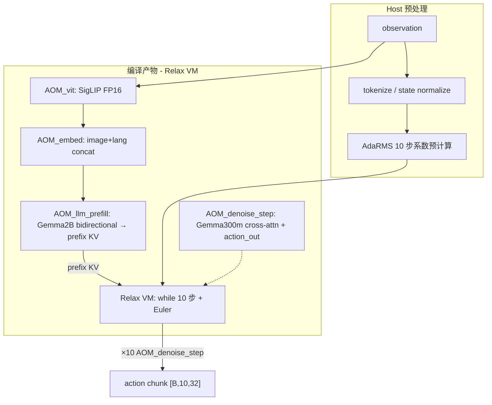
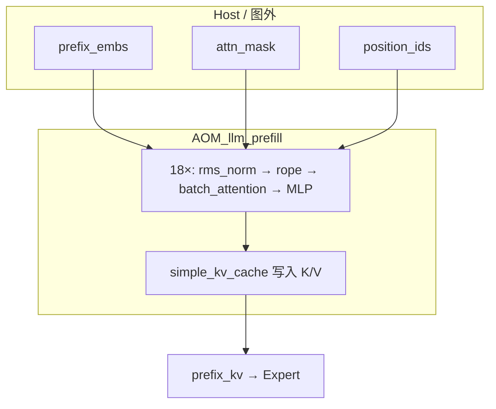
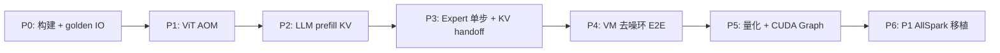

# pi05 通过 TVM + MLC-LLM 推理部署落地方案

> 本文回答：**如何用 TVM + MLC-LLM 将 pi05（π0.5 VLA）推理部署到 TVM Runtime？** 给出架构设计、MLC 可复用范围、分 stage 技术路线与分阶段 Roadmap。
>
> - GPU 侧优化基线对齐 `config/webui_configs/tensorrt_native_denoise.yaml`（TensorRT + FlashRT）。
> - 若目标是 **AllSpark P1（NT3 ASIC）**，P1 能力 Gap 与 AllSpark 细节见 companion 文档 [run_on_p1_with_tvm.md](./run_on_p1_with_tvm.md)。
>
> 涉及仓库：
> - `model_optimizer` — pi05 模型、导出、GPU 推理基线
> - `edge/tvm` — Apache TVM（Relax 编译 + VM Runtime）
> - `edge/mlc-llm` — MLC LLM 前端（Gemma Relax IR + 编译管线 + 量化）

---

## 目录

1. [结论先行](#一结论先行)
2. [目标架构](#二目标架构)
3. [MLC-LLM 能复用什么](#三mlc-llm-能复用什么)
4. [分 Stage 技术路线](#四分-stage-技术路线)
5. [分阶段 Roadmap](#五分阶段-roadmap)
6. [关键工程决策](#六关键工程决策)
7. [与现有 GPU 路径的复用清单](#七与现有-gpu-路径的复用清单)
8. [主要风险](#八主要风险)
9. [建议的下一步](#九建议的下一步)
10. [关键参考](#十关键参考)

---

## 一、结论先行

pi05 推理本质是 **三段异构流水线 + 10 步 flow-matching 去噪环**，与 MLC-LLM 默认的「因果 LM 聊天 / serving」假设差异很大。**MLC-LLM 不能一键编译出 pi05**，但可作为 **Gemma 主干 + Relax 编译管线** 的复用基座。

| 差异点 | pi05 需要 | MLC-LLM 默认 |
|--------|-----------|--------------|
| Attention | **双向** + padding / 块状 mask | **因果** mask（`PagedKVCache`） |
| LLM 输出 | **KV-only**（不算 lm_head） | prefill 后算 logits |
| Expert | **cross-attn 读 prefix KV** + **AdaRMSNorm** | 标准 self-attn Gemma |
| ViT | SigLIP 多相机 | 不在 MLC 模型库 |
| 控制流 | 10 步 Euler loop | decode 逐步 token |

**推荐路线**：**MLC-LLM 负责 Gemma IR / 权重加载 / 编译管线；ViT、双向 prefill、cross-attn expert、去噪环用 Relax 扩展 + VM 编排。**

| 部署 Target | TVM 分支 | MLC 后端 |
|-------------|----------|----------|
| **CUDA 开发 / 验证** | `edge/tvm`（上游 Apache TVM） | flashinfer / cutlass |
| **AllSpark P1** | NIO TVM（含 `partition_for_allspark`） | `MLC_USE_ALLSPARK=ON` + AllSpark Relax 后端 |

> 当前 `edge/tvm` 是上游 Apache TVM，**不含 AllSpark**。P1 落地需切 NIO TVM 分支，详见 [run_on_p1_with_tvm.md](./run_on_p1_with_tvm.md)。

---

## 二、目标架构

对齐 `PI0Pytorch.sample_actions` 的三段结构（`third_party/openpi/src/openpi/models_pytorch/pi0_pytorch.py`）：



与 GPU 侧（TensorRT + FlashRT）的 stage 对应：

| pi05 Stage | 计算 | GPU 现状 | TVM + MLC 落点 |
|------------|------|----------|----------------|
| **vit** | SigLIP 多相机 self-attn | TRT FP8 engine | 独立 Relax AOM（或 ONNX→Relax） |
| **embed_prefix** | image + lang embedding 拼接 | TRT / PyTorch | Relax 小图或 host 侧预计算 |
| **llm prefill** | Gemma 2B 双向 prefill，写 KV | TRT KV-only engine | **扩展 MLC Gemma** → bidirectional prefill + KV 导出 |
| **expert + denoise** | Gemma 300m × 10 步，cross-attn + AdaRMS | FlashRT fused decoder | **自定义 Relax Gemma300m** + VM while-loop |
| **AdaRMS** | 按 timestep 条件化 norm | host 预计算 `adarms_mod` | 复用 `infer/pi05_adarms.py` 思路 |

pi05 模型 variant（`third_party/openpi/src/openpi/models/gemma.py`）：

| 组件 | 配置 |
|------|------|
| PaliGemma LLM | `gemma_2b`：width=2048, depth=18, mlp=16384, heads=8, kv_heads=1, head_dim=256 |
| Action Expert | `gemma_300m`：width=1024, depth=18, mlp=4096, heads=8, kv_heads=1, head_dim=256 |

去噪环 Euler 积分：`x_t = x_t + dt * v_t`，`dt = -1/num_steps`，`num_steps=10`。

---

## 三、MLC-LLM 能复用什么

MLC-LLM 已有 `gemma` 模型（`mlc-llm/python/mlc_llm/model/gemma/`），结构与 pi05 的 Gemma 主干接近。

### 3.1 可直接复用

- `GemmaConfig` / `GemmaDecoderLayer` / `GemmaMLP` / weight loader（RMSNorm +1 融合，`gemma_loader.py`）
- `mlc_llm compile` → Relax IR → VM 产物（`mlc_llm/interface/compile.py`）
- 量化框架（`q4f16_1`、`q0f16` 等；对标 GPU FP8 的第一轮优化可用 INT8/INT4）
- `PagedKVCache` 的 KV 存储机制（**需改 attention 语义**，见下）
- CUDA Graph 编译选项（`relax.backend.use_cuda_graph`）

### 3.2 不能直接复用

| 能力 | 原因 |
|------|------|
| 标准 `prefill` / `decode` API | 因果 attention + 输出 logits，不符合 pi05 KV-only / 双向 prefill |
| MLC Serve 引擎 | 面向 chat serving，不是 VLA policy |
| ViT / SigLIP | 不在 MLC 模型库 |
| cross-attention 读外部 prefix KV | MLC Gemma 只有 self-attn + `PagedKVCache` |
| AdaRMSNorm | MLC 只有标准 RMSNorm |
| flow-matching 去噪环 | 需 Relax VM 控制流编排 |

### 3.3 MLC 编译管线概览

```
checkpoint → mlc_llm compile
  → Gemma Relax IR（model.export_tvm）
  → TVM Relax 优化 + codegen
  → VM .so + params
  → Runtime: embed / prefill / decode（需扩展为 pi05 专用 API）
```

---

## 四、分 Stage 技术路线

### 4.0 环境与基线对齐

**TVM 构建**（`edge/tvm`）：

```bash
cd edge/tvm
git submodule update --init --recursive
mkdir -p build && cp cmake/config.cmake build/config.cmake
cmake -S . -B build -G Ninja -DCMAKE_BUILD_TYPE=RelWithDebInfo
cmake --build build --parallel
export PYTHONPATH="$(pwd)/python:$(pwd)/.local/python"
```

**MLC-LLM 构建**（链接上述 TVM，按 MLC 文档配置 TVM 路径）。

**P1 目标**：换 NIO TVM + `MLC_USE_ALLSPARK=ON` 构建 MLC，target 设为 `tvm.allspark()`。

**Golden 数据**：用 `edge-llm/scripts/dump_pi05_io.py` 导出各 stage 输入/输出，作为逐段数值对齐基准。

---

### 4.1 Stage 1：ViT 段（独立 Relax，不经过 MLC）

- **输入**：`[N, 3, 224, 224]` 多相机
- **输出**：`[N, 256, 1152]`
- **实现**：SigLIP → Relax IR → `partition_for_cutlass`（CUDA）或 `partition_for_allspark`（P1）
- **复用**：`model_optimizer` 已有 `vit.onnx` 导出（`convert/pi05.py`），可先 ONNX import 再改 attention pattern
- **Attention**：非 causal，`use_causal=0` + 显式全 1 mask（ViT 无 padding，现有 rewrite 基本可用）
- **验收**：ViT 输出与 PyTorch FP16 容差内一致

---

### 4.2 Stage 2：LLM Prefill（MLC Gemma 扩展 — 核心改造点）

在 `mlc-llm/python/mlc_llm/model/` 新增 **`pi05_gemma/`**（或 fork `gemma_model.py`）。本节展开 **为何不能走 MLC 默认 `attention_with_fused_qkv`**，以及如何改成 **`batch_attention` / 显式 mask 的 flashattn（`use_causal=0`）**。

#### 4.2.1 pi05 LLM prefill 在算什么

推理入口（`pi0_pytorch.py` → `sample_actions`）：

```python
prefix_embs, prefix_pad_masks, prefix_att_masks = embed_prefix(...)
prefix_att_2d_masks = make_att_2d_masks(prefix_pad_masks, prefix_att_masks)
prefix_position_ids = torch.cumsum(prefix_pad_masks, dim=1) - 1
prefix_att_2d_masks_4d = _prepare_attention_masks_4d(prefix_att_2d_masks)

_, past_key_values = paligemma_with_expert.forward(
    attention_mask=prefix_att_2d_masks_4d,
    position_ids=prefix_position_ids,
    past_key_values=None,
    inputs_embeds=[prefix_embs, None],
    use_cache=True,
)
```

| 项 | pi05 实际要求 |
|----|---------------|
| 输入 | `prefix_embs [B, L, 2048]`（ViT embedding + 语言 embedding 已拼好） |
| Attention | **双向** + **padding 屏蔽** + 可选缺相机 mask |
| RoPE | `position_ids = cumsum(pad_masks) - 1` |
| GQA | 8 query heads / 1 kv head |
| 输出 | **`past_key_values`（18 层 KV）**，不要 lm_head logits |
| 长度 | 固定编译时 L≈768~968（如 3 相机×256 + lang 200） |

GPU 侧对应 `llm_kv_fp8.engine` / `llm_kv_only`：只写 KV，不算 lm_head。

#### 4.2.2 为何不能用 `paged_kv_cache.attention_with_fused_qkv`

MLC Gemma 默认每层 attention（`gemma_model.py`）：

```python
output = paged_kv_cache.attention_with_fused_qkv(
    layer_id, qkv, self.num_q_heads, sm_scale=self.head_dim**-0.5
)
```

底层走 `vm.builtin.attention_kv_cache_attention_with_fused_qkv`，mask 在 kernel 内部二选一（`tvm/relax/frontend/nn/llm/_kernel_common.py`）：

```python
def _causal_mask(causal, row, col, kv_len, qo_len):
    return T.if_then_else(
        causal > 0,
        col < kv_len - qo_len + row + 1,   # 因果：下三角
        col < kv_len,                         # 非因果：cache 内全可见
    )
```

与 pi05 的冲突：

| # | `fused_qkv` 行为 | pi05 prefill 需要 | 后果 |
|---|------------------|-------------------|------|
| 1 | **无外部 mask 入参** | 显式 `[B,H,L,L]` padding/块状 mask | 语言 padding 会被 attend，**算错** |
| 2 | 为 **自回归 chat** 设计 | 一次全长 bidirectional prefill | 语义不对 |
| 3 | RoPE 在 cache 读写流程里内置 | `position_ids` 来自 `pad_masks` cumsum | 变长/trim 难对齐 |
| 4 | `prefill()` 还算 **logits** | **KV-only**，不要 lm_head | 多余计算 + 接口不对 |
| 5 | PagedKVCache 面向 serving | 单 policy、固定 L | 能用但接口不匹配 |

**结论**：不是改一个 flag 能从 causal 变 bidirectional，而是 **整条 API（无 mask 入参 + 因果 KV 流 + logits 输出）与 pi05 prefill 不匹配**。

#### 4.2.3 目标路径：`flashattn` vs `batch_attention`

NIO TVM AllSpark 侧有两类可用 attention（详见 [run_on_p1_with_tvm.md](./run_on_p1_with_tvm.md) 附录 A/B）：

**`flashattn`（`use_causal=0` + 显式 mask）** — 适合 prefill 段 **self-attention**（Q/K/V 同源、方阵 mask）：

```
q = q * (1/sqrt(d))
add_mask = (1 - mask) * (-1e5)     # mask: fp32 [B,H,L,L]，1=可见 0=屏蔽
qk = matmul(q, k) + add_mask
prob = softmax(qk)
out = matmul(prob, v)
→ AddFlashAttentionOperation(..., use_causal=0)
```

**`batch_attention`** — 接口更全，**prefill 段推荐**（与 expert cross-attn 同一算子族）：

```
batch_attention(
    q,                          # [B, H_q, q_len, D]
    prefix_k, prefix_v,         # expert 段：外部 prefix KV
    batch_cached_k/v[],
    cur_k, cur_v,               # prefill 段：当前段 K/V
    mask,                       # 显式 [B,H,q_len,kv_len]
    batch_offset,               # 每样本有效 prefix 长度
    use_default_causal=False,   # pi05 必须 False
)
```

prefill 段可退化为 `q_len = kv_len = L`，只用 `cur_k/cur_v` + 方阵 mask；expert 段必须用完整接口读 prefix KV。推荐 prefill 用 **`batch_attention`** 的原因：原生 GQA（不必 `repeat` 物化 KV）、与 expert 统一 KV layout、支持 `batch_offset`（对齐 GPU KV trim/pad）。

#### 4.2.4 Mask 如何从 pi05 构造

PyTorch 两步（`pi0_pytorch.py`）：

```python
# Step A：2D 可见性（双向 + padding）
cumsum = torch.cumsum(att_masks, dim=1)
att_2d_masks = cumsum[:, None, :] <= cumsum[:, :, None]
pad_2d_masks = pad_masks[:, None, :] * pad_masks[:, :, None]
att_2d_masks = att_2d_masks & pad_2d_masks

# Step B：转成 attention bias
att_2d_masks_4d = att_2d_masks[:, None, :, :]
attn_bias = torch.where(att_2d_masks_4d, 0.0, -2.3819763e38)
```

prefix 段 `att_masks` 全 0 → 有效 token 之间 **全互看**；`pad_masks` 屏蔽语言 padding 与缺相机 token。

TVM / AllSpark 侧需 **fp32 mask**（1=可见，0=屏蔽）：

```python
visible = att_2d_masks.astype("float32")              # [B, L, L]
mask_bhll = visible[:, None, :, :].expand(B, H, L, L)  # H=8
add_mask = (R.const(1.0) - mask_bhll) * R.const(-1e5)
```

| 落地方式 | 做法 | 适用 |
|----------|------|------|
| **Host 预计算** | 固定 L、固定相机数 → mask 离线算好当常量 | MVP 首选 |
| **Runtime 输入** | `main(prefix_embs, attn_mask)` 传入 | 变长 prefix 时再上 |

GPU 侧有 `trt_attention_mask_neg_cap=-1e4` 防 FP8 溢出；P1 FP16 先用 `-1e5` 对齐 PyTorch。

> **注意**：不能用 MLC 默认 `SpecializeRewriter` 的全 1 mask decompose（LLM prefill 会算错）。详见 [run_on_p1_with_tvm.md 附录 B](./run_on_p1_with_tvm.md#附录-battention-概念参考causal--非-causal--cross-attention)。

#### 4.2.5 改造 `GemmaAttention` 与 KV Cache

**Before（MLC 默认）**：

```python
paged_kv_cache.attention_with_fused_qkv(layer_id, qkv, ...)
```

**After（pi05 prefill）**：

```python
def forward(self, hidden_states, kv_cache, layer_id, attn_mask, position_ids):
    q, k, v = split_qkv(self.qkv_proj(hidden_states), num_q=8, num_kv=1)
    q = rope(q, position_ids, ...)
    k = rope(k, position_ids, ...)
    out = batch_attention(q, k, v, mask=attn_mask, use_default_causal=False)
    kv_cache.update(layer_id, k, v)   # 存 RoPE 后的 K
    return self.o_proj(out)
```

KV Cache：**不用** MLC `PagedKVCache.create_generic`，改用 NIO TVM 已测路径（[run_on_p1_with_tvm.md §2.3](./run_on_p1_with_tvm.md#23-llm-prefill-段--kv-handoff关键契约)）：

```
vm.builtin.simple_attention_kv_cache_create
  → 每层 attention 后 mark_next_output
  → 导出 prefix_kv 张量（18 层 × K/V）
```

**新增 API `prefill_to_kv`**（替代 MLC `prefill` 的 logits 输出）：

```python
def prefill_to_kv(prefix_embs, attn_mask, position_ids):
    hidden = prefix_embs * sqrt(hidden_size)
    kv = create_simple_kv_cache(...)
    for layer_id, layer in enumerate(layers):
        hidden = layer(hidden, kv, layer_id, attn_mask, position_ids)
    hidden = norm(hidden)
    prefix_kv = kv.export_all_layers()
    return prefix_kv, hidden   # 无 lm_head
```

在 `get_default_spec()` 注册 `prefill_to_kv`，供 `mlc_llm compile` / Relax VM 调用。

#### 4.2.6 端到端数据流（改造后）



单层内部：

```
hidden [B,L,2048]
  → rms_norm → qkv_proj → q,k,v
  → rope(q,k; position_ids)
  → batch_attention(..., mask=[B,H,L,L], use_default_causal=0)
  → o_proj → kv_cache.store(layer_id, k, v)
  → mlp → next layer
```

#### 4.2.7 GQA、RoPE、KV handoff

| 主题 | 要点 |
|------|------|
| **GQA（8:1）** | `batch_attention` 内部广播；cache 只存 1 个 kv head，与 PyTorch `past_key_values` 一致；避免 decompose rewrite 的 `repeat(k, 8)` 物化 |
| **RoPE** | attention 前对 Q/K 显式 `rope`；写入 cache 的 K **必须是 RoPE 后的 K**；Expert 读 cache 时 Q 的 RoPE 用 prefix_len 偏移 |
| **KV layout** | `key/value: [B, num_kv_heads=1, L, head_dim=256]` × 18 层；RoPE interleave、trim/pad、`batch_offset` 与 GPU `fill_prefix_kv_from_trt` 对齐（O8） |

#### 4.2.8 权重加载与编译

**权重**（第 3 处必改）：

- 从 pi05 checkpoint 提取 PaliGemma `language_model` 权重
- 复用 `gemma_loader.py` 的 RMSNorm +1 mapping
- pi05 命名与 HF Gemma 不同 → **`pi05_gemma_loader.py`** name remap

**编译命令示例（CUDA 先行）**：

```bash
mlc_llm compile ./pi05_llm_config \
  --model-type gemma \
  --quantization q0f16 \
  --device cuda \
  --overrides context_window_size=1024 prefill_chunk_size=1024 max_batch_size=1 \
  -o pi05_llm_prefill.so
```

**Partition（P1）**：

```python
mod = rewrite_to_batch_attention(mod)   # 确保无 fused_qkv 残留
mod = partition_for_allspark(mod)
ex = relax.build(mod, target="allspark", params=params)
```

验收：IR 中 attention 为 AllSpark composite op；**不能**残留 `attention_with_fused_qkv`。

#### 4.2.9 数值验证

```python
# Golden: PyTorch
_, kv_pt = paligemma_with_expert.forward(
    attention_mask=att_4d, position_ids=pos,
    inputs_embeds=[prefix_embs, None], use_cache=True,
)
# TVM
kv_tvm = vm["prefill_to_kv"](prefix_embs_nd, attn_mask_nd, pos_nd)
# 逐层对比 kv_pt[layer].key / .value（fp16 容差）
```

Golden 来源：`edge-llm/scripts/dump_pi05_io.py`。先用固定 L + host 预计算 mask 常量。

#### 4.2.10 实施顺序（P2 阶段）

```
1. dump 固定 prefix_embs / mask / position_ids golden
2. Fork GemmaAttention：去掉 fused_qkv → rope + batch_attention + mask 入参
3. 接 simple_attention_kv_cache + prefill_to_kv（无 lm_head）
4. partition → 单层 → 18 层 → 逐层 KV 对齐
5. 固化 KV layout，接 Expert cross-attn
6. （可选）mask 从常量改为 runtime 输入
```

---

### 4.3 Stage 3：Action Expert 单步（MLC Gemma300m 深度定制）

`denoise_step` 逻辑（`pi0_pytorch.py`）：

```
suffix_embs = embed_suffix(state, x_t, timestep)
full_att_mask = concat(prefix_pad_mask, suffix_att_mask)   # 矩形 mask
position_ids = prefix_len + cumsum(suffix_pad)              # RoPE 偏移
outputs = forward(inputs_embeds=[None, suffix_embs],
                  past_key_values=prefix_kv,                 # cross-attn
                  adarms_cond=[None, adarms_cond])
v_t = action_out_proj(suffix_out[:, -action_horizon:])
```

**Relax 侧 `AOM_denoise_step` 需包含**：

| 子模块 | 实现 |
|--------|------|
| `embed_suffix` | action_in_proj + time 相关（或 host 预计算） |
| AdaRMSNorm | **host 预计算** 10 步 `adarms_mod` 常量（复用 `infer/pi05_adarms.py`） |
| 18 层 transformer | Gemma300m，cross-attn 用 `batch_attention` 读 prefix KV |
| RoPE 位置 | Q 的 position = prefix_len + suffix_offset |
| 输出 | `action_out_proj` → `v_t [B, 10, 32]` |

**KV handoff 契约**（成败关键，需文档化）：

- layout：`[layers, 2, batch, kv_heads, seq, head_dim]`
- RoPE interleave 是否与 GPU TRT 路径一致
- 有效 prefix 长度 trim / pad 到偶数
- `batch_offset` 对齐每样本有效 prefix 长度

---

### 4.4 Stage 4：去噪环 VM 编排

```python
# Relax VM 控制流（伪代码）
x_t = noise
dt = -1.0 / num_steps
for s in range(num_steps):
    v_t = vm["denoise_step"](x_t, prefix_kv, adarms_mod[s])
    x_t = x_t + dt * v_t
return x_t
```

两条性能路线：

| 方案 | 描述 | 优先级 |
|------|------|--------|
| **A（推荐先行）** | VM while-loop 逐步调 `AOM_denoise_step` + 整环 CUDA Graph 捕获 | 先打通端到端与精度 |
| **B（中长期）** | npcc 融合 device kernel（18 层 × 10 步 fused，对标 FlashRT） | 延迟不达标时再上 |

---

### 4.5 Stage 5：统一 Runtime（对接 model_optimizer）

建议目录结构：

```
src/model_optimizer/infer/tvm/
  pi05_executor.py          # 实现 Pi05Executor 接口
  pi05_vit_aom.py
  pi05_llm_prefill_aom.py
  pi05_denoise_vm.py
  kv_handoff.py             # prefix KV layout 转换
```

WebSocket policy 侧只需换 backend config，不改协议（对齐 `docs/pi05_deploy.md`）。

---

## 五、分阶段 Roadmap



| 阶段 | 分级 | 目标 | 验收 |
|------|------|------|------|
| **P0** | 必需 | 构建 TVM+MLC，dump golden IO | 各 stage numpy 基准就绪 |
| **P1** | 必需 | ViT AOM 单段跑通 | ViT 输出与 PyTorch FP16 对齐 |
| **P2** | 必需 | MLC Gemma2B bidirectional prefill + KV 导出 | prefix KV 与 PyTorch 对齐 |
| **P3** | 必需 | Expert 单步 AOM + KV handoff | 单步 `v_t` 对齐 |
| **P4** | 必需 | VM 10 步去噪环端到端 | action chunk 对齐 GPU 路径 |
| **P5** | 可选 | INT8 量化 + 去噪环整环 CUDA Graph | 精度达标 + 延迟下降 |
| **P6** | 可选 | P1 AllSpark 移植（`partition_for_allspark`） | P1 或 jarvis 模拟器跑通 |

阶段 **P0–P4 是 MVP**（FP16、零新算子）；P5/P6 是优化项。P6 细节见 [run_on_p1_with_tvm.md](./run_on_p1_with_tvm.md)。

---

## 六、关键工程决策

### 6.1 MLC 扩展 vs 全手写 Relax

| 选项 | 优点 | 缺点 |
|------|------|------|
| **A. 扩展 MLC Gemma**（推荐） | 复用 loader / compile / 量化；维护成本低 | 需 fork mlc-llm |
| B. 全手写 Relax | 最大灵活 | 权重映射、编译管线全自建 |

### 6.2 AdaRMS 策略

优先 **host 预计算 10 步**（与 GPU `denoise_adarms_precompute` 一致）：离线展开 norm 调制系数（sa/sf/fs），热路径只做 `rms_norm + scale/shift`，不必新建 Engine op。实现参考 `src/model_optimizer/infer/pi05_adarms.py`。

若去噪步数可变，再考虑通用 AdaRMS Engine op。

### 6.3 Attention 算子选择

| Stage | 可见性 | 推荐算子 |
|-------|--------|----------|
| ViT self-attn | 非 causal，无 padding | `flashattn`（`use_causal=0`）或全 1 mask |
| LLM prefill | 非 causal，**有 padding + 块状 mask** | **`batch_attention` + 显式 mask** |
| Expert cross-attn | action token attend 全部有效 prefix | **`batch_attention` + prefix/cache KV 输入** |

**不要用** MLC 默认 `SpecializeRewriter` 的全 1 mask decompose（LLM prefill 会算错）。cross-attention 的 K/V 来自外部 KV cache，flashattn pattern 套不上，必须显式用 `batch_attention` 的 cache 接口。

---

## 七、与现有 GPU 路径的复用清单

| 资产 | 路径 | 用途 |
|------|------|------|
| Stage 划分 | `src/model_optimizer/architectures/pi05.py` | vit / llm / expert / denoise 边界 |
| AdaRMS 预计算 | `src/model_optimizer/infer/pi05_adarms.py` | host 侧 modulation |
| IO dump | `edge-llm/scripts/dump_pi05_io.py` | golden 数值对齐 |
| TRT KV 适配 | `src/model_optimizer/infer/tensorrt/pi05_trt_engine_setup.py` | KV handoff layout 参考 |
| GPU 优化基线 | `config/webui_configs/tensorrt_native_denoise.yaml` | O1–O10 优化项对照 |
| P1 架构 / Gap | `docs/pi05/run_on_p1_with_tvm.md` | AllSpark 能力与 attention 细节 |
| 部署协议 | `docs/pi05_deploy.md` | serve_policy / WebSocket 对接 |

---

## 八、主要风险

1. **MLC Gemma 改 bidirectional**：改动面在 `GemmaAttention` + KV cache，需回归 MLC 原有 causal 路径不受影响。
2. **KV handoff**：prefill 与 expert 的 layout / RoPE / trim / pad 不一致会**静默算错**（数值不报错但结果偏）。
3. **权重命名**：pi05 checkpoint 是 PaliGemma + Expert 合体，loader 映射工作量大。
4. **去噪环延迟**：VM 10 次 launch vs FlashRT 一次 fused；CUDA Graph 在 Relax LLM 路径上需实测（方案 A 未验证）。
5. **repo 分裂**：`edge/tvm` 无 AllSpark；P1 落地必须切 NIO TVM 分支。
6. **前端构造成本**：无 ONNX 直导 LLM→TVM 的 turnkey 链路，三段 Relax IR 需手写或借 MLC frontend。

---

## 九、建议的下一步

最小可行切入点：**P2 — LLM prefill KV 导出**（整条链路的核心瓶颈，也最能验证 MLC 扩展路线是否可行）。

1. 从 pi05 checkpoint 导出 PaliGemma LLM 权重到 HF 格式目录
2. 在 `mlc-llm` fork 中给 `gemma_model.py` 增加 `prefill_to_kv` + 显式 mask 入参
3. 用固定 `prefix_embs`（来自 dump）编译并在 VM 上跑通
4. 对比 PyTorch `past_key_values` 逐层 KV

并行可启动 P1（ViT AOM）与 P0（golden IO dump），两者无依赖。

---

## 十、关键参考

- pi05 推理入口：`third_party/openpi/src/openpi/models_pytorch/pi0_pytorch.py` — `sample_actions` / `denoise_step`
- PyTorch Gemma 实现：`third_party/openpi/src/openpi/models_pytorch/transformers_replace/models/gemma/modeling_gemma.py`
- pi05 Gemma 配置：`third_party/openpi/src/openpi/models/gemma.py`
- MLC Gemma 模型：`mlc-llm/python/mlc_llm/model/gemma/gemma_model.py`
- TVM PagedKVCache / causal mask：`tvm/python/tvm/relax/frontend/nn/llm/kv_cache.py`、`_kernel_common.py`
- MLC 编译入口：`mlc-llm/python/mlc_llm/interface/compile.py`
- MLC compile CLI：`mlc-llm/python/mlc_llm/cli/compile.py`
- TVM Relax 编译：`edge/tvm/python/tvm/relax/`
- P1 AllSpark Gap 与架构：[run_on_p1_with_tvm.md](./run_on_p1_with_tvm.md)

---

*文档基于 model_optimizer、edge/tvm、edge/mlc-llm 现状分析生成。*
