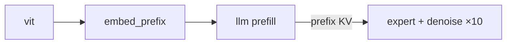

# pi05 TVM 部署 Pipeline（分阶段工作说明）

> 本文按 **stage × 阶段（export / quantize / build）** 记录 pi05 落到 TVM + MLC-LLM 时各段要做什么、关键实现细节与常见坑。  
> 架构设计与 Roadmap 见 [how_to_use_tvm.md](./how_to_use_tvm.md)；P1 AllSpark 能力 Gap 见 [run_on_p1_with_tvm.md](./run_on_p1_with_tvm.md)。

---

## 总览

pi05 推理（`PI0Pytorch.sample_actions`）在 TVM 侧拆成多段 AOM + VM 去噪环：



| Stage | 输入 → 输出 | TVM 落点 | 代码入口 |
|-------|-------------|----------|----------|
| **vit** | `[N,3,224,224]` → `[N,256,1152]` | Relax AOM（ONNX→Relax） | `models/pi05/vit.py` |
| **embed_prefix** | 图像特征 + lang token → `prefix_embs` | 小图或 host 拼接 | `embed_prefix.py` / TRT batched 路径 |
| **llm** | `prefix_embs` → `prefix_kv`（18 层） | 扩展 MLC Gemma + `batch_attention` | `mlc-llm/.../gemma_model.py` fork |
| **expert + denoise** | `prefix_kv` + `x_t` → `v_t` → action | `AOM_denoise_step` + VM while-loop | `pi0_pytorch.py` `denoise_step` |

每段典型流水线：**export（导出中间产物）→ quantize（可选）→ build（编译为 TVM VM / AOM）**。

---

# vit

SigLIP vision tower + multi_modal_projector；单张图 **256 patch token**，段内 **双向 self-attn、无 padding**。

## export

**做什么**：从 PyTorch 导出 `vit.onnx`，供后续 TVM `from_onnx` 或 TRT 使用。

**入口**：`Vit.export()` / `Vit.export_onnx()`（`src/model_optimizer/models/pi05/vit.py`）

```bash
# 示例：整条 convert 链路
python -m model_optimizer.convert.pi05 --model_path ... --export_dir ...
# 或 Python：Vit.export_onnx(pi05_model, export_dir)
```

**导出配置**：

| 项 | 值 |
|----|-----|
| 输入 | `pixel_values [batch, 3, 224, 224]`，`batch` 为动态轴（多相机 stack） |
| 输出 | `image_features` / `vit_embeds [batch, 256, 1152]` |
| opset | 19 |

**关键实现：强制 eager attention（第 92 行）**

```python
with _force_vision_eager_attention_temporarily(self.vision_tower):
    with _sdp_math_backend_only():
        torch.onnx.export(...)
```

| 机制 | 作用 |
|------|------|
| `_force_vision_eager_attention_temporarily` | 临时设 `vision_tower.config._attn_implementation = "eager"`，SigLIP 走 **MatMul + Softmax + MatMul**，避免 SDPA/Flash 融合路径 trace 失败 |
| `_sdp_math_backend_only` | 强制 SDPA math 后端，避免 `ComplexDouble` 等 ONNX trace 问题 |
| `finally` 恢复 | 仅影响 export 窗口，不改变日常 PyTorch 推理配置 |

导出结束后 ONNX 里是朴素 attention 子图，便于 TVM 改 pattern 或 TRT 编译。

**Attention 语义（ViT 段）**：

- SigLIP `is_causal = False`：**256 token 彼此全互看** = 双向 full self-attn
- **单图内部无 padding**（固定 224×224 → 256 patch）
- **多相机**：`vit_batch_views` 将 N 路图 `cat` 到 batch 维 `[N,3,224,224]` 一次 forward；**attention 仍在每张图各自的 256 token 内**，batch 间不互看；跨相机融合在 **后续 LLM prefill** 完成

## quantize

**做什么**：可选 FP8 / NVFP4 等；量化后再 `export(export_dir, dynamo=False)` 产出量化版 `vit.onnx`。

**入口**：`Vit.quantize()` → `quantize_model` → `export`

**注意**：量化 ONNX 的 attention 子图更复杂，TVM MVP 建议 **先 FP16 跑通** 再量化。

## build

**做什么**：`vit.onnx` → Relax IR → attention pattern 对齐 → `partition_for_allspark`（P1）或 `partition_for_cutlass`（CUDA 验证）→ VM / AOM。

**步骤概要**：

```
1. from_onnx(vit.onnx) → mod.show() 定位每层 MatMul-Softmax-MatMul
2. LegalizeOps / FoldConstant / FuseOps
3. IR 改写：attention → flashattn 标准链（use_causal=0 + 全 1 mask）
4. FuseOpsByPattern(flashattn) → partition_for_allspark
5. relax.build → 数值对齐 PyTorch Vit 输出
```

**为何要做 pattern 改写**：ONNX 导入后是散落 MatMul 链，**不会自动**变成 AllSpark `AddFlashAttentionOperation`；ViT 无 padding，mask 可 **编译期常量全 1**：

```
q = q * (1/sqrt(d))
add_mask = (1 - mask) * (-1e5)   # mask 全 1 → add_mask = 0
qk = matmul(q,k) + add_mask → softmax → matmul(·,v)
```

**验收**：`[1,3,224,224]` 然后 `[3,3,224,224]`（多相机 batch）与 PyTorch FP16 容差内一致。

**参考**：[how_to_use_tvm.md §4.1](./how_to_use_tvm.md#41-stage-1vit-段独立-relax不经过-mlc)

---

# embed_prefix

图像 ViT 特征 + 语言 embedding 拼成 `prefix_embs [B,L,2048]`，并生成 **`pad_masks` / `att_masks`**（供 LLM 用）。

## export

**做什么**：GPU 路径可导出 `embed_prefix.onnx` 或走 TRT `embed_prefix_vit_batched`（`pi05_trt_engine_setup.py`）；TVM MVP 常 **host 侧拼接**（ViT AOM 输出 + lang lookup），不单独编译本段。

**`att_masks` 规则**（`pi0_pytorch.py` `embed_prefix`）：

- 每个相机的 256 image token：`att_masks += [0] * 256`（块内双向）
- 语言 token：`att_masks += [0] * num_lang`（与 image 全互看）
- `pad_masks`：语言侧来自 `lang_masks`（tokenizer pad）；缺相机时 `img_mask` 屏蔽该路 256 token

## quantize

可选 FP8 lang embedding（`vit_batch_views` 时 `maybe_install_fp8_lang_embedding`）；TVM 第一阶段可跳过。

## build

TVM 侧通常 **不单独成 AOM**：ViT AOM 输出 + 常量或小型 Relax 图做 lang embed + `concat`。  
本段产物 **`prefix_embs`、`pad_masks`、`att_masks`** 作为 LLM prefill 输入；mask 构造见 llm 节。

---

# llm

Gemma 2B **双向 prefix prefill**，**KV-only** 输出（不算 lm_head）。与 MLC 默认因果 `prefill` 差异最大。

## export

**做什么**：准备权重与 golden，而非简单 `torch.onnx.export` 整图。

| 工作 | 说明 |
|------|------|
| 权重提取 | 从 pi05 checkpoint 取 PaliGemma `language_model` |
| Name remap | `pi05_gemma_loader.py`（HF Gemma 命名不一致） |
| RMSNorm +1 | 复用 `gemma_loader.py` 的 loader 融合规则 |
| Golden IO | `edge-llm/scripts/dump_pi05_io.py` → `prefix_embs`、`past_key_values` |

**PyTorch prefill 入口**（对齐目标）：

```python
prefix_att_2d_masks = make_att_2d_masks(prefix_pad_masks, prefix_att_masks)
prefix_position_ids = torch.cumsum(prefix_pad_masks, dim=1) - 1
_, past_key_values = forward(..., attention_mask=att_4d, use_cache=True)
```

## quantize

可选 INT8 W8A8（AllSpark 已支持）；对标 GPU FP8 的第一轮优化。MVP 用 FP16。

## build

**做什么**：fork MLC Gemma → `prefill_to_kv` API → `batch_attention` + `simple_attention_kv_cache` → `partition_for_allspark`。

### 为何不能用 `attention_with_fused_qkv`

MLC 默认（`gemma_model.py`）：

```python
paged_kv_cache.attention_with_fused_qkv(layer_id, qkv, ...)
```

| 冲突 | 说明 |
|------|------|
| 无 mask 入参 | kernel 内仅「因果」或「cache 全可见」；**无法表达语言 padding mask** |
| 面向 chat decode | pi05 要一次全长 **双向** prefill |
| 输出 logits | pi05 要 **KV-only**（`llm_kv_only`） |

### 目标算子：`batch_attention`（`use_default_causal=False`）

prefill 段：`q_len = kv_len = L`，显式 `mask [B,H,L,L]`；与 expert cross-attn **同一算子族**，KV layout 一致。

### Mask 构造（LLM 有 padding，ViT 无）

| 段 | padding | 原因 |
|----|---------|------|
| ViT | 无 | 固定 256 patch |
| LLM prefix | **有** | 语言 token pad 到 `max_token_len`（pi05 默认 200）；缺相机用 `img_mask` |

```python
# Step A：有效 token 双向 + padding 屏蔽
att_2d = (cumsum(att_masks)[:,None,:] <= cumsum(att_masks)[:,:,None]) & (pad_masks[:,None,:] * pad_masks[:,:,None])
# Step B → TVM：fp32 mask，1=可见 0=屏蔽；add_mask = (1-mask)*(-1e5)
```

prefix 段 `att_masks` 全 0 → 有效 token **全互看**；`pad_masks` 屏蔽 pad。

### RoPE（`apply_rotary_pos_emb`）

`modeling_gemma.py` 在 attention **之前**对 Q/K 旋转：

```python
query_states, key_states = apply_rotary_pos_emb(query_states, key_states, cos, sin)
```

| 要点 | 说明 |
|------|------|
| 只旋转 Q、K | V 不参与位置打分 |
| `position_ids` | `cumsum(pad_masks) - 1` |
| 写 KV cache | **必须先 RoPE 再写入**；cache 里 K 已是旋转后的 |
| TVM 对齐 | 显式 `rope` op + 与 PyTorch 相同 `position_ids` |

### 改造清单

1. `GemmaAttention.forward`：`fused_qkv` → `rope` + `batch_attention(..., mask=, use_default_causal=False)` + `kv_cache.update`
2. KV cache：`simple_attention_kv_cache_create` + `mark_next_output`（不用 MLC PagedKVCache 默认路径）
3. 新 API：`prefill_to_kv(prefix_embs, attn_mask, position_ids) → prefix_kv`（无 lm_head）
4. 编译：`mlc_llm compile` + `partition_for_allspark`

**验收**：逐层对比 PyTorch `past_key_values` 的 K/V（fp16 容差）。

**参考**：[how_to_use_tvm.md §4.2](./how_to_use_tvm.md#42-stage-2llm-prefillmlc-gemma-扩展--核心改造点)

---

# expert

Gemma 300m 单步前向；**cross-attn 读 prefix KV** + **AdaRMSNorm**。

## export

权重从 pi05 checkpoint 的 `gemma_expert` 提取；与 LLM 类似需 loader remap。  
单步逻辑：`pi0_pytorch.py` `denoise_step`（`inputs_embeds=[None, suffix_embs]`，`past_key_values=prefix_kv`）。

## quantize

可选；与 denoise 环一并考虑。

## build

**做什么**：`AOM_denoise_step` 单层图（18 层 transformer + `action_out_proj`）。

| 子模块 | 实现 |
|--------|------|
| `embed_suffix` | `action_in_proj`；time 相关可 host 预计算 |
| AdaRMS | host 预计算 10 步 `adarms_mod`（`infer/pi05_adarms.py`） |
| Attention | **`batch_attention`** 读 **外部 prefix KV**（不能用 flashattn 自动融合：K/V 不在内联链） |
| Mask | **矩形** `[suffix_len, prefix_len+suffix_len]`；`att_masks` 块状（suffix 首 token=1） |
| RoPE | Q 的 position = **prefix_len + suffix_offset** |
| 输出 | `v_t [B, 10, 32]` |

**KV handoff**（prefill → expert）：layout `[layers, 2, B, kv_heads, seq, head_dim]`；RoPE interleave、trim/pad、`batch_offset` 与 GPU `fill_prefix_kv_from_trt` 对齐。

**参考**：[how_to_use_tvm.md §4.3](./how_to_use_tvm.md#43-stage-3action-expert-单步mlc-gemma300m-深度定制)、[run_on_p1_with_tvm.md 附录 B.2](./run_on_p1_with_tvm.md#b2-cross-attention-与-self-attention-的区别和难点)

---

# denoise

10 步 flow-matching Euler 环；**控制流在 Relax VM**，不是单个 AOM。

## export

无独立 ONNX；依赖 expert 单步 AOM + 常量（`adarms_mod[0..9]`、`dt`、固定 `noise` 可选）。

## quantize

整环量化需关注每步误差累积；MVP 先 FP16。

## build

**做什么**：VM 编排 `while` 10 次调用 `AOM_denoise_step`：

```python
x_t = noise
for s in range(10):
    v_t = vm["denoise_step"](x_t, prefix_kv, adarms_mod[s])
    x_t = x_t + dt * v_t
return x_t
```

| 方案 | 说明 |
|------|------|
| **A（先行）** | VM while-loop + 整环 CUDA Graph 捕获 |
| **B（远期）** | npcc 融合 kernel（对标 FlashRT） |

**验收**：端到端 `action chunk` 与 GPU（TensorRT + FlashRT）路径对齐。

**参考**：[how_to_use_tvm.md §4.4](./how_to_use_tvm.md#44-stage-4去噪环-vm-编排)

---

# 端到端 Runtime

**做什么**：`src/model_optimizer/infer/tvm/` 下 executor 串联各段 AOM + VM；对接 `serve_policy` WebSocket。

```
vit AOM → embed_prefix（host/小图）→ llm prefill_to_kv → denoise VM loop → action
```

**参考**：[how_to_use_tvm.md §4.5](./how_to_use_tvm.md#45-stage-5统一-runtime对接-model_optimizer)、[pi05_deploy.md](./pi05_deploy.md)

---

# 附录：Attention 选型速查

| Stage | 可见性 | Padding | 推荐算子 | 能否用 MLC `fused_qkv` |
|-------|--------|---------|----------|------------------------|
| ViT | 双向 | 无（单图 256 token） | `flashattn`（`use_causal=0`，全 1 mask） | 不适用（不走 MLC） |
| LLM prefill | 双向 | **有**（lang pad + 缺相机） | **`batch_attention` + 显式 mask** | **否** |
| Expert cross-attn | 双向读 prefix | 矩形 mask | **`batch_attention` + prefix KV** | **否** |

**因果 vs 双向（工程差异）**：数学上只差 mask；MLC 把 mask **写进** `fused_qkv` kernel（仅因果/全可见二选一），pi05 必须换 **带 mask 入参** 的算子并改 frontend 图结构，不是改一个常量即可。

---

# 附录：推荐实施顺序

| 顺序 | Stage | 阶段 | 验收 |
|------|-------|------|------|
| 1 | vit | export → build | `vit.onnx` + AOM 数值对齐 |
| 2 | llm | export 权重 + build `prefill_to_kv` | 逐层 KV 对齐 |
| 3 | expert | build 单步 AOM | 单步 `v_t` 对齐 |
| 4 | denoise | build VM 环 | action chunk E2E |
| 5 | 各段 | quantize（可选） | 精度 + 延迟 |

---

*文档整理自 pi05 TVM 部署讨论与 [how_to_use_tvm.md](./how_to_use_tvm.md)。*
