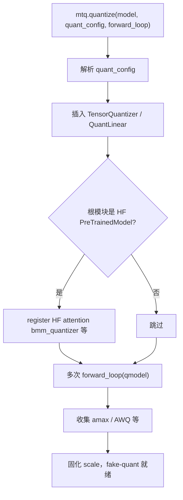
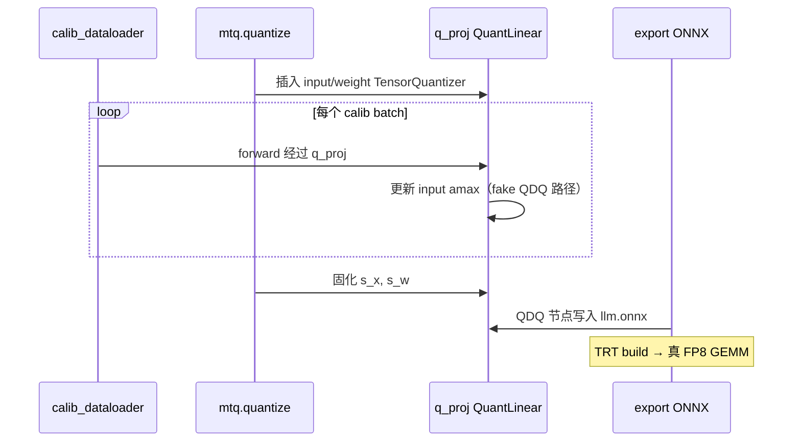
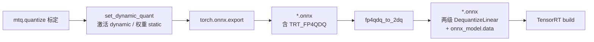

# pi05 量化标定流程与 Fake Quantization（QDQ）说明

> 本文说明 `quantize_model` → `mtq.quantize` 中标定阶段 **为何使用 fake quantization**，并以 pi05 真实 **Linear 层** 为例走通全过程。  
> 流水线各 stage 的 export / quantize / build 分工见 [pipeline.md](./pipeline.md)；入口代码见 `src/model_optimizer/quantization/quantization_utils.py`。

---

## 目录

1. [Fake quant 是什么](#一fake-quant-是什么)
2. [为什么要 fake quant（而非纯 FP32 标定）](#二为什么要-fake-quant而非纯-fp32-标定)
3. [与真量化的区别](#三与真量化的区别)
4. [代码入口：`quantize_model` 与第 331 行](#四代码入口quantize_model-与第-331-行)
5. [实例：Gemma `q_proj` 一层 Linear 的完整过程](#五实例gemma-q_proj-一层-linear-的完整过程)
6. [AWQ 等算法与 fake quant](#六awq-等算法与-fake-quant)
7. [与 pi05 各 stage 的关系](#七与-pi05-各-stage-的关系)
8. [NVFP4 导出：`set_dynamic_quant` 与 `_nvfp4_post_processing`](#八nvfp4-导出set_dynamic_quant-与-_nvfp4_post_processing)
9. [关键参考](#九关键参考)

---

## 一、Fake quant 是什么

在 `mtq.quantize`（NVIDIA ModelOpt）里，会在 `nn.Linear` / `nn.Conv2d` 等旁插入 **`TensorQuantizer`**。前向路径大致为：

```
x (fp16/bf16/fp32)
  → 按当前 scale 量化到 INT8/FP8 等
  → 立刻反量化回浮点
  → 再送进 Linear / MatMul
```

数学上仍是 **浮点张量**在流，但数值上已经带了一次「量化再还原」的误差。这就是 **fake quantization（QDQ：Quantize → Dequantize）**，与 TRT/ONNX 里的 **QuantizeLinear + DequantizeLinear** 是同一类思想。

改造后的模块概念结构：

```
原来:  x → Linear(W) → y

改造后:
  x → [input_quantizer]  → x̂ (QDQ 后)
      → Linear(Ŵ)        → y
      （权重侧有 weight_quantizer，对 W 做 QDQ）
```

标定阶段 **不跑整数 GEMM**；部署时 TRT 等后端才用 FP8/INT8 **真算子**。

---

## 二、为什么要 fake quant（而非纯 FP32 标定）

### 2.1 标定的是「会被量化的那个张量」

Max / percentile 等标定器挂在 `TensorQuantizer` 上，统计的是 **经过 QDQ 之后、或即将被量化那一截** 的动态范围（amax），而不是「假如永远不量化」的 FP32 极值。

若只用 FP32 前向取激活 max 再硬套 scale，与真实 QDQ 路径不完全一致。

### 2.2 后面层看到的是「前面量化后的输出」（误差传播）

部署时数据流是：

```
Linear1 → QDQ → Linear2 → QDQ → Linear3 → ...
```

若标定 **全程 FP32**，`k_proj` 收集的激活来自 **无误差** 的 `q_proj` 输出；部署时 `k_proj` 的输入却是 **带量化噪声** 的。两者分布会有偏差。

Fake quant 标定时，**上一层 QDQ 后的输出** 作为下一层输入，后面 Linear 收集到的统计更接近 **链式量化后的真实分布**。  
因此：**既是为本层定准 scale，也是让后续层在标定阶段就看到「使用量化后的分布」**——两层目的都有。

### 2.3 部分算法必须在 QDQ 图里跑

| 方法 | 为何需要 fake quant |
|------|---------------------|
| **Max / percentile** | 在 quantizer 上直接统计待量化张量 |
| **AWQ（awq_lite 等）** | 在 QDQ 环境下搜索 `pre_quant_scale`；LLM 标定常临时转 fp32（`llm.py`） |
| **SmoothQuant 等** | 依赖带 quantizer 的前向 |

### 2.4 与导出一致

标定结束后 scale 固定；`export` 时 ONNX/TRT 图里就是 **QDQ 节点 + 同一套 scale**。标定若不用 QDQ，导出图与标定假设容易不一致。

### 2.5 代码里的佐证

`measure_quant_error=True` 时，`_tensor_qdq_error_analysis` 对每个 `TensorQuantizer` 比较 **输入 vs 输出**（量化后再反量化相对原输入差多少），量化的是 **单点 fake quant 误差**；整条链路则靠标定循环里 **每层都走 QDQ** 来对齐。

---

## 三、与真量化的区别

| | Fake quant（标定 / PyTorch） | 真量化（TRT / Engine） |
|--|------------------------------|-------------------------|
| 中间算子 | 仍是 FP32/BF16 **MatMul** | INT8/FP8 **Gemm** 等 |
| 目的 | 定 scale、搜权重、评估 QDQ 误差 | 低延迟、省带宽 |
| 数值 | 浮点算子 + 模拟量化噪声 | 低精度硬件路径 |

Fake quant **不是为了在 PyTorch 里永久用整数算子**，而是在仍用浮点 kernel 的前提下 **复现量化误差，并把 scale 定准**。

---

## 四、代码入口：`quantize_model` 与第 331 行

### 4.1 调用链（以 Vit 为例）

```
Vit.quantize(quant_cfg, calib_data, export_dir)
  ├─ get_calibrate_dataset(calib_data)     # pi05_vit / pi05_llm 等标定数据
  ├─ quantize_model(self, quant_cfg, loader)
  │    ├─ 构造 calibrate_loop / _run_calib_forward
  │    ├─ mtq.quantize(model, quant_config, forward_loop=calibrate_loop)  ← 核心
  │    ├─ mtq.print_quant_summary(model)
  │    └─ 可选 _tensor_qdq_error_analysis
  ├─ set_dynamic_quant(self, "bf16")          # 仅 NVFP4 QuantLinear 生效
  ├─ export(export_dir) → vit.onnx / llm.onnx / ...
  └─ if is_nvfp4_quantized(quant_cfg):
         _nvfp4_post_processing(onnx_path, export_dir)  # fp4qdq_to_2dq 等
```

配置来源：`src/model_optimizer/quantization/cfg.py`（如 `"fp8": mtq.FP8_DEFAULT_CFG`）。

NVFP4 导出前后两段的详细说明见 [§八](#八nvfp4-导出set_dynamic_quant-与-_nvfp4_post_processing)。

### 4.2 `calibrate_loop` 做什么

```python
def calibrate_loop(qmodel):
    for data in calib_dataloader:
        _run_calib_forward(qmodel, data)   # model(**batch) 或 forward_context(...)
```

ModelOpt 在标定阶段 **反复调用** 该回调，用真实 calib 数据跑前向，收集激活 amax / AWQ 统计等。

### 4.3 `mtq.quantize` 内部典型阶段



标定在 **已插入 quantizer 的同一棵模块树** 上原地（in-place）完成；**不导出 ONNX**（导出在调用方 `quantize()` 里的 `export()`）。

### 4.4 标定前向与 dtype

| 路径 | 行为 |
|------|------|
| 默认 | `_calib_batch_to_model_device_dtype`：张量移到 GPU，浮点对齐到 `next(model.parameters()).dtype` |
| `forward_context`（denoise + FP8_KV） | 只 `.to(device)`，避免 `x_t` 与 fp32 `action_in_proj` dtype 冲突 |

标定数据：`open_pi05_calib_for_quantize` → `list[dict]` 或分片流式；key 需与对应 `forward` 一致（如 `pixel_values`、`inputs_embeds`）。

---

## 五、实例：Gemma `q_proj` 一层 Linear 的完整过程

以 **Gemma 2B 第一层 `layers.0.self_attn.q_proj`** 为例（`nn.Linear(2048, 2048, bias=False)`），配置 **`mtq.FP8_DEFAULT_CFG`**（与 GPU `llm_kv_fp8` 同族）。

### 5.1 标定前：纯浮点

```
x:  [B, L, 2048]   # prefix embedding，L≈768~968
W:  [2048, 2048]
y = x @ W^T        # [B, L, 2048]
```

### 5.2 图改造：插入 quantizer

ModelOpt 将 `q_proj` 变为带 **`input_quantizer`**、**`weight_quantizer`** 的 `QuantLinear`（名称以 `print_quant_summary` 为准）。

| 对象 | FP8 E4M3 典型方式 | scale 来源 |
|------|-------------------|------------|
| 权重 W | per-tensor FP8 | W 的 absmax → `s_w` |
| 激活 x | per-tensor FP8 | calib 循环 fake QDQ 路径上的 amax → `s_x` |

### 5.3 一个 calib batch 内的 fake quant 前向

**（1）激活 input_quantizer**

\[
s_x = \frac{\max(|x|)}{F_{\max}}, \quad F_{\max} \approx 448 \text{（E4M3）}
\]

跨多个 calib 样本对 amax 取 max（`algorithm: max`），得到该层固定的 `s_x`。

\[
\hat{x} = \mathrm{DQ}(\mathrm{Q}(x / s_x)) \cdot s_x
\]

**（2）权重 weight_quantizer**

\[
s_w = \frac{\max(|W|)}{F_{\max}}, \quad
\hat{W} = \mathrm{DQ}(\mathrm{Q}(W / s_w)) \cdot s_w
\]

**（3）仍用浮点 MatMul**

```
y = matmul(x̂, Ŵ^T)    # bf16 GEMM，非整数 kernel
```

`k_proj`、`v_proj` 等 **下一层** 的 `input_quantizer` 观测到的是带误差的 `y`，与部署链一致。

### 5.4 缩小维度的数值直觉

设 `x: [1,4]`，`W: [4,4]`，\(F_{\max}=448\)：

```
max|W| = 2.0  →  s_w = 2.0/448
max|x| = 2.1  →  s_x = 2.1/448
x̂ = QDQ(x),  Ŵ = QDQ(W)
y = x̂ @ Ŵ^T   # 与 y_fp = x @ W^T 有舍入误差
```

真实 `q_proj` 为 `[B,L,2048]`，per-tensor 表示 **整层共用一个 `s_x`、一个 `s_w`**；calib 在 **所有样本、所有 token** 上合并 amax（对齐文档 O7 act_scales 思路）。

### 5.5 标定结束 → 导出

`mtq.print_quant_summary` 打印各层 quantizer 与 scale。  
`LLM.export()` → ONNX 中该 Linear 变为：

```
QuantizeLinear(x, scale=s_x) → DequantizeLinear
QuantizeLinear(W, scale=s_w) → DequantizeLinear
→ MatMul/Gemm  （TRT 可融合为 FP8 GEMM）
```

**标定 fake quant 与导出 QDQ 使用同一套 scale**。

### 5.6 TensorRT 部署（真量化）

Engine 内用 **FP8/BF16 混合 GEMM** 与 `s_x`、`s_w` 在硬件上执行；PyTorch 标定阶段只负责 **定 scale**，不跑 TRT 快路径。

### 5.7 单层时序总览



---

## 六、AWQ 等算法与 fake quant

`quant_cfg` 为 **`int4_awq`** 时（`cfg.py` → `mtq.INT4_AWQ_CFG`）：

1. 仍插入 `TensorQuantizer`（W4 等）
2. `forward_loop` **多轮**前向，在 **QDQ 环境**下搜索 `pre_quant_scale`
3. LLM 路径可能先将模型临时转 **fp32** 标定（`llm.py`），再恢复原 dtype 导出

AWQ **不能**在纯 FP32 图上搜索，否则搜到的权重对部署无效。

---

## 七、与 pi05 各 stage 的关系

| Stage | `quantize_model` 的 `model` 根 | 标定前向 | 量化配置示例 |
|-------|-------------------------------|----------|--------------|
| **vit** | 整个 `Vit` | `self(pixel_values)` | `fp8` / `nvfp4` |
| **llm** | HF `GemmaModel`（`self.model`） | `model(**{inputs_embeds, attention_mask, ...})` | `fp8` + 可选 `FP8_KV_CFG` |
| **denoise** | `Pi05DenoiseStep` 或 `gemma_expert` + `forward_context` | 完整 denoise `forward` | `nvfp4` / FP8_KV 等 |
| **expert** | 同 expert 子模块 | 依 collector | 同族 |

标定完成后各 stage **`export()` 产出 ONNX**；若配置为 NVFP4，还需 **`_nvfp4_post_processing`** 再 TRT build。TVM 路径见 [how_to_use_tvm.md](./how_to_use_tvm.md)（MVP 可先 FP16，INT8 复用 calib 思路）。

---

## 八、NVFP4 导出：`set_dynamic_quant` 与 `_nvfp4_post_processing`

> **结论先行**：二者同属 NVFP4 导出链路的 **相邻步骤**，不是因果关系。  
> `set_dynamic_quant` 在 **export 之前** 配置 ModelOpt ONNX 导出器；`_nvfp4_post_processing` 在 **export 之后** 把 ONNX 图改成 TensorRT 可识别的标准 QDQ。  
> 纯 FP8 路径通常只走标定 + export，**不调用** 后处理。

### 8.1 完整顺序（以 Vit 为例）

```python
# vit.py — quantize()
quantize_model(self, quant_cfg, calib_dataloader)   # ① 标定 + fake quant
self.is_quantized = True
set_dynamic_quant(self, "bf16")                       # ② 导出前：NVFP4 导出策略
self.export(export_dir, dynamo=False)                 # ③ 写出 vit.onnx（可能含 TRT_FP4QDQ）
onnx_path = f"{export_dir}/vit.onnx"
if is_nvfp4_quantized(quant_cfg):                     # ④ 仅 NVFP4 配置
    self._nvfp4_post_processing(onnx_path, export_dir)
```

| 步骤 | 函数 | 时机 | 仅 NVFP4？ |
|------|------|------|------------|
| ① | `quantize_model` / `mtq.quantize` | 标定 | 否（FP8/NVFP4/AWQ 均走） |
| ② | `set_dynamic_quant` | **export 前** | 是（只改 `is_nvfp4_linear` 层） |
| ③ | `export()` | 写 ONNX | 否 |
| ④ | `_nvfp4_post_processing` | **export 后** | 是（`is_nvfp4_quantized(quant_cfg)` 为真） |

### 8.2 `set_dynamic_quant`：导出前配置

实现见 `src/model_optimizer/utils/utils.py`。遍历模块树，对 **NVFP4 QuantLinear**（`block_sizes["scale_bits"] == (4, 3)`）设置三个导出元数据：

| 属性 | 取值 | 含义 |
|------|------|------|
| `input_quantizer._onnx_quantizer_type` | `"dynamic"` | 激活侧 Q/DQ 按 **dynamic** 导出 |
| `weight_quantizer._onnx_quantizer_type` | `"static"` | 权重侧 Q/DQ 按 **static** 导出（权重已固化） |
| `input_quantizer._trt_high_precision_dtype` | `"BFloat16"` 或 `"Half"` | TRT 高精度累加 dtype（Vit/dit 常用 `"bf16"`，LLM 部分路径用 `"fp16"`） |

**作用**：告诉 ModelOpt 的 ONNX 导出器 **如何写 Q/DQ 节点**，使 NVFP4 权重路径导出为 `TRT_FP4QDQ` 等 TRT 专用表示（含 E2M1 权值 + per-block scale + 全局 scale）。

**对 FP8 无效**：`is_nvfp4_linear` 为 false 的层不会被修改；FP8 导出走 `QuantizeLinear` / `TRT_FP8QuantizeLinear` 等标准路径，无需此步。

### 8.3 `_nvfp4_post_processing`：export 后图变换

基类实现在 `src/model_optimizer/models/model.py`；`llm.py` / `llm_with_trtedgellm.py` / `llm_with_cutedsl.py` 有几乎相同的 override（cutedsl 版适配了 `save_pretrained`）。

#### 步骤 0：保存 HF 侧 json

```python
with torch.inference_mode():
    self.model.save_pretrained(export_dir)
```

将 config 等 **`.json`** 写入 `export_dir`；后续清理会 **保留** 这些 json。

#### 步骤 1：门禁 — 模型是否含 NVFP4 层

```python
if is_fp4_quantized(self):
    ...
```

`is_fp4_quantized` 遍历模块，检查是否存在 `scale_bits == (4, 3)` 的 quantizer。若标定配置声称 NVFP4 但模型树中无对应层，则 **直接返回**，不做图改写。

#### 步骤 2：ONNX shape 推断

```python
onnx.shape_inference.infer_shapes_path(onnx_path)
onnx_model = onnx.load(onnx_path)
```

补全/校验张量 shape，供后续 `fp4qdq_to_2dq` 图改写使用。

#### 步骤 3：核心 — `fp4qdq_to_2dq`

```python
from modelopt.onnx.quantization.qdq_utils import fp4qdq_to_2dq
onnx_model = fp4qdq_to_2dq(onnx_model)
```

**这是后处理的关键。** ModelOpt 导出 NVFP4 时，权重路径常见自定义算子：

```
TRT_FP4QDQ  →  打包 E2M1 权值 + per-block FP8 scale + 全局 FP32 scale
```

TensorRT **无法直接解析** `TRT_FP4QDQ`（会报 `TRT_FP4QDQ Plugin not found` 一类错误）。`fp4qdq_to_2dq` 将图中这些节点 **改写为两级标准 ONNX `DequantizeLinear`**：

```
DequantizeLinear（block 级）
  → DequantizeLinear（全局级）
  → MatMul / Gemm
```

语义仍是 NVFP4 解压后再算，但算子变为 TRT 原生支持的 **标准 QDQ 链**。改写后应满足：

```python
assert not any(n.op_type == "TRT_FP4QDQ" for n in model.graph.node)
```

NVFP4 的「比 per-tensor 更细」来自 **per-block scale**（E2M1 + block scale + 全局标量），详见 `docs/optimizer/ddup/adarms_pre_compute.md` 中的导出粒度对照表。

#### 步骤 4：清理 export_dir

```python
for file in os.listdir(export_dir):
    if file.endswith(".json"):
        continue
    os.remove(os.path.join(export_dir, file))
```

删除 **除 `.json` 外** 的旧文件（export 产生的临时权重、旧 onnx 分片等），避免与重写后的 ONNX 混在一起。

#### 步骤 5：以外部权重形式写回 ONNX

```python
onnx.save_model(
    onnx_model,
    onnx_path,
    save_as_external_data=True,
    all_tensors_to_one_file=True,
    location="onnx_model.data",
    convert_attribute=False,
)
```

- 大图权重放到 **`onnx_model.data`**，protobuf 只保留图结构  
- `convert_attribute=False`：避免 Constant attribute 外置错位，导致 TRT 报 **Expected size / Actual size: 0 bytes**

### 8.4 NVFP4 全链路数据流



### 8.5 不同量化格式对照

| 格式 | `set_dynamic_quant` | `_nvfp4_post_processing` | 导出后 ONNX 典型形态 |
|------|---------------------|--------------------------|----------------------|
| **NVFP4** | 配置 dynamic/static + 高精度 dtype | **必须** `fp4qdq_to_2dq` | 标准 QDQ + 外部 `onnx_model.data` |
| **FP8** | 通常 no-op | **不调用** | `QuantizeLinear` / TRT FP8 QDQ |
| **INT8** | 通常 no-op | **不调用** | 标准 INT8 QDQ |

### 8.6 各 stage 谁在用

| 模块 | `set_dynamic_quant` dtype | 触发 `_nvfp4_post_processing` |
|------|---------------------------|--------------------------------|
| `vit.py` | `"bf16"` | `is_nvfp4_quantized(quant_cfg)` |
| `llm.py` | 依配置（`dynamic_quant`） | 同上 |
| `llm_with_trtedgellm.py` / `llm_with_cutedsl.py` | `"fp16"` | 同上（cutedsl 有自定义 `save_pretrained`） |
| `dit.py` / `expert.py` / `embed_prefix.py` | `"bf16"` | 同上 |

三条 LLM 导出路径均 **必须在 `export()` 之后** 调用后处理；否则 TRT 编译会挂在 NVFP4 节点上。这与是否 fused MLP 无关——凡 NVFP4 Linear 导出都会带 `TRT_FP4QDQ`。

### 8.7 与 fake quant 标定的关系

| 阶段 | 做什么 | 在哪里 |
|------|--------|--------|
| **标定** | fake QDQ + 定 scale | `mtq.quantize`（§四、§五） |
| **导出前** | 配置 ONNX Q/DQ 写法 | `set_dynamic_quant` |
| **导出** | PyTorch → ONNX | 各 stage `export()` |
| **导出后** | `TRT_FP4QDQ` → 标准 QDQ | `_nvfp4_post_processing` |
| **部署** | 真低精度 GEMM | TensorRT build |

标定 fake quant 与导出 QDQ **共用同一套 scale**；`set_dynamic_quant` 与 `_nvfp4_post_processing` 不改变 scale，只影响 **ONNX 图形态与 TRT 兼容性**。

---

## 九、关键参考

| 资源 | 路径 |
|------|------|
| 量化入口 | `src/model_optimizer/quantization/quantization_utils.py` — `quantize_model`，331 行 `mtq.quantize` |
| 量化配置 | `src/model_optimizer/quantization/cfg.py` — `QUANT_CFG_CHOICES` |
| LLM 量化 | `src/model_optimizer/models/pi05/llm.py` — `quantize()` |
| Vit 量化 | `src/model_optimizer/models/pi05/vit.py` — `quantize()` |
| Denoise 量化 | `src/model_optimizer/models/pi05/dit.py` — `quantize()` |
| NVFP4 导出前配置 | `src/model_optimizer/utils/utils.py` — `set_dynamic_quant`、`is_nvfp4_quantized` |
| NVFP4 导出后处理 | `src/model_optimizer/models/model.py` — `_nvfp4_post_processing` |
| 标定数据 | `src/model_optimizer/calibrate/pi05_calib_load.py` |
| NVFP4 导出粒度说明 | `docs/optimizer/ddup/adarms_pre_compute.md` |
| Pipeline 分工 | [pipeline.md](./pipeline.md) |

---

## 附录：一句话结论

**Fake quantization** 在标定阶段用 **QDQ + 浮点 MatMul** 模拟部署时的量化误差，为每层定准 **scale**（及 AWQ 等所需的权重变换），并使 **后续层统计到的激活分布** 与 TRT/ONNX **真量化推理** 一致；标定结束后 **同一套 scale** 写入导出图，由 TensorRT 等在运行时执行 **真 FP8/INT8 GEMM**。

**NVFP4 额外两步**：export 前 `set_dynamic_quant` 配置 dynamic 激活 / static 权重；export 后 `_nvfp4_post_processing` 将 `TRT_FP4QDQ` 转为两级标准 `DequantizeLinear` 并以 `onnx_model.data` 外置权重，供 TensorRT build。

---

*文档整理自 pi05 量化标定讨论。*
