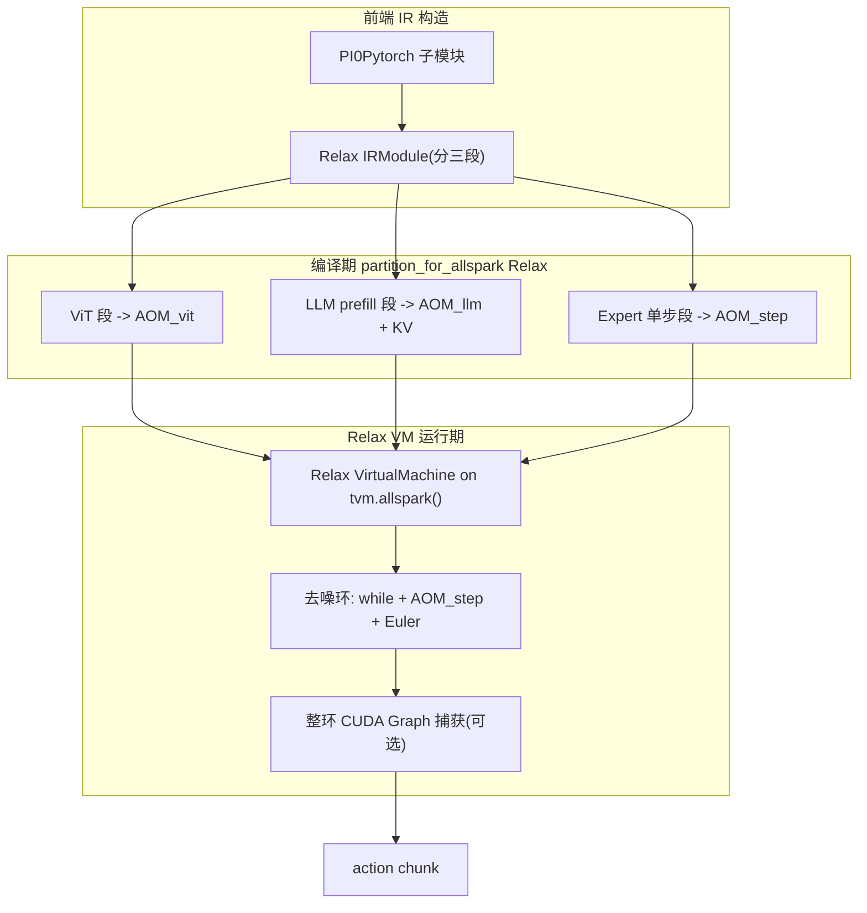
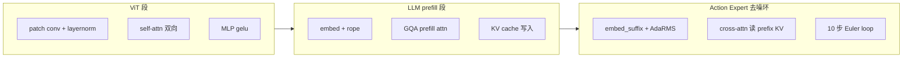

# pi05 跑到 AllSpark P1 的能力 Gap 分析与架构设计方案（基于当前 NIO TVM）

> 本文回答一个问题：**基于当前 `nio/tvm` 对 AllSpark P1（NT3 ASIC）的支持，要把 pi05（π0.5 VLA）跑到 P1 上，还需要建设哪些能力？** 并给出基于现有 NIO TVM 架构的对接设计方案。
>
> 需求基线对齐 `config/webui_configs/tensorrt_native_denoise.yaml`：vit/llm 走 TensorRT FP8、denoise 走仓内 FlashRT decoder 整 10 步循环、CUDA Graph、KV-only、显存释放等一整套 GPU 侧推理优化，需在 P1 上找到对应能力或建设方案。
>
> 阅读顺序：第一节先对齐**最小跑通需要哪些能力（必需 vs 可选）**，第二节给**架构设计**，第三节逐 stage 展开 gap，第四节起再展开 pi05 推理结构与 GPU 优化细节；P1 当前能力清单与 attention 概念介绍见**文末附录 A / B**。

---

## 目录

1. [最小跑通需要哪些能力（必需 vs 可选）](#一最小跑通需要哪些能力必需-vs-可选)
2. [基于 NIO TVM 的架构设计方案](#二基于-nio-tvm-的架构设计方案)
3. [逐 stage 能力 Gap 分析](#三逐-stage-能力-gap-分析)
4. [pi05 推理结构与 GPU 侧优化基线](#四pi05-推理结构与-gpu-侧优化基线)
5. [GPU 优化项到 P1 的映射表](#五gpu-优化项到-p1-的映射表)
6. [分阶段 Roadmap](#六分阶段-roadmap)
7. [风险与开放问题](#七风险与开放问题)
8. [关键参考](#八关键参考)
- 附录 A：[当前 TVM AllSpark P1 能力清单](#附录-a当前-tvm-allspark-p1-能力清单)
- 附录 B：[attention 概念参考（causal / 非 causal / cross-attention）](#附录-battention-概念参考causal--非-causal--cross-attention)

---

## 一、最小跑通需要哪些能力（必需 vs 可选）

> **一句话**：把 pi05 在 P1 上**跑通**所需的能力（三段 IR + KV cache + cross-attention + 去噪环编排 + AdaRMS 注入）**全部可用现有 AllSpark 能力（FP16）搭出，无需任何新算子**；**FP8 / nvfp4 / 融合 kernel / paged serving 都是可选优化**，且量化优化可**直接选用已支持的 INT8 / INT4**，不必等 FP8。
>
> 现有能力的详细清单见[附录 A](#附录-a当前-tvm-allspark-p1-能力清单)；attention 概念（causal / cross-attention）见[附录 B](#附录-battention-概念参考causal--非-causal--cross-attention)。

### 1.1 最小跑通必需能力（MVP，FP16，缺一不可）

| 能力 | 为什么必需 | 现状 / 复用 | 是否需新算子 | 工作量 |
|------|-----------|-------------|--------------|--------|
| 三段 Relax IR 构造 | 没有 IR 无法 partition/编译 | 算子齐全；手写或 MLC frontend | 否 | 中 |
| self-attention（ViT / prefill） | 前向必经 | `flashattn` pattern / `batch_attention` 已有 | 否 | 小（pattern 对齐） |
| **KV cache（prefix 写/读）** | prefill 写、expert 读，VLA 核心 | `simple_attention_kv_cache` + `mark_next_output` 已测 | 否 | 中 |
| **cross-attention 读 prefix KV** | 去噪环每步必经 | `batch_attention`（prefix/cache KV）已有 | 否 | 中（KV handoff） |
| KV handoff 契约 | 三段拼接接口（layout/offset/RoPE） | 规格固化 + 数值对齐 | 否 | 中（易错） |
| AdaRMSNorm | expert 每层必经 | `rms_norm` + host 预计算系数 | 否（预计算即可） | 小 |
| 去噪环 VM 编排 + Euler | 出 action chunk 必经 | Relax VM 控制流 + add/mul | 否 | 小 |
| FP16 主力路径 | 默认精度 | 已有 | 否 | 无 |

结论：**MVP 全部基于现有能力，零新算子**；真正的工作是 IR 构造、集成编排与逐段数值对齐，而非补功能。

### 1.2 进一步优化能力（可选，按收益与延迟指标取舍）

| 能力 | 收益 | 现状 | 必需? |
|------|------|------|-------|
| 去噪环整环 CUDA Graph（方案 A） | 摊薄 10 步 launch 开销 | 框架有，Relax LLM 未验证 | 可选（强烈建议，性价比最高） |
| **INT8 W8A8 量化** | 带宽/算力 | **已支持**（QNN / `quantize_dynamic`） | 可选（现成可用） |
| **INT4 W4A16 量化** | 权重带宽/显存 | **已支持**（group_size=16 / zp=7，recipe 需对齐） | 可选（现成可用） |
| 端到端精度对齐工具 | 加速调试 | model_optimizer compare 思路 | 可选（建议） |
| 去噪环融合 npcc kernel（方案 B） | 对标 FlashRT 延迟上限 | 缺失，大工程 | 可选（中长期，方案 A 不足时再上） |
| **FP8 Engine 路径** | GPU 侧关键加速点 | **缺失，需新建 codegen** | 可选（中长期） |
| **nvfp4 / FP4** | 更低精度 | 缺失 | 可选（远期） |
| Paged KV + 连续 batching | 多请求吞吐 / serving | AllSpark 专用 kernel 缺失 | 可选（仅 serving 场景需要） |
| 动态 shape 优化 | 变长输入 | 部分支持，需 dyn hint | 可选（固定 shape 可先不做） |

**量化口径**：优化时**直接选已支持的 INT8 / INT4 即可**；**FP8 / nvfp4 是当前缺失、需自建的可选增强**，不是跑通前提，也不阻塞优化第一步。

---

## 二、基于 NIO TVM 的架构设计方案

### 2.1 总体路线：Relax 三段 AOM + VM 编排去噪环



设计原则：**复用现有 Relax + AllSpark Engine 能力，把 pi05 拆成三段 AOM，用 Relax VM 编排去噪环**，对齐 GPU 侧"vit/llm engine + denoise 整循环"的异构结构。

### 2.2 ViT 段

- 前端：把 SigLIP（patch conv + N×(LN + 双向 self-attn + MLP)）构造为 Relax；多相机 stack 进 batch 维（对齐 O2）。
- self-attn 构造成匹配 `allspark.flashattn` 的子图（`use_causal=0` + 显式全 1/pad mask）。
- `partition_for_allspark` → 单个 `AOM_vit`；FP16 主力，layout NHWC。

### 2.3 LLM prefill 段 + KV handoff（关键契约）

- 构造 Gemma 2B prefill 的 Relax 图：embed → 18×(rms_norm + rope + GQA flashattn + MLP)。
- KV 写入用 `simple_attention_kv_cache` + `mark_next_output`（已在 AllSpark 测试过的模式），输出 prefix KV 作为段间张量。
- 对齐 O3（KV-only）：prefill 段只输出 KV（+必要 hidden），不算 lm_head。
- **KV handoff 契约**（对齐 O8）：定义 prefix KV 的 layout（heads/seq/dim、RoPE 是否 interleave、是否 trim 到有效 prefix、是否 pad 到偶数），作为 expert 段 `batch_attention` 的 cache KV 输入。**这是三段拼接的核心接口，需固化为文档化的张量规格。**

### 2.4 Action Expert 去噪环（核心建设）

把单步 denoise 编译成 `AOM_step`（embed_suffix + AdaRMS + 18 层 cross-attn 读 prefix KV + action_out_proj），由 Relax VM 编排 10 步循环：

```
x_t = randn(...)
for s in range(num_steps):           # Relax VM while-loop
    time_emb = const_precomputed[s]  # O6: host 预计算
    v_t = AOM_step(state, prefix_kv, x_t, time_emb)   # batch_attention 读 prefix KV
    x_t = x_t + dt * v_t             # Euler
return x_t
```

**先澄清一个常见误解：flow-matching 去噪环没有任何"扩散专用数学算子"需要从零发明。** 逐算子拆解如下，除 AdaRMS 的条件调制外全是已有算子的组合：

| 环节 | openpi 实现 | 数学构成 | AllSpark 现状 |
|------|-------------|----------|---------------|
| timestep 正弦嵌入 | `create_sinusoidal_pos_embedding` | linspace/pow → sin/cos → concat → mul，全逐元素 | 组合现有 op 或 **host 预计算成常量** |
| action 投影 | `action_in_proj` (Linear) | matmul + bias | 已有 |
| time_mlp（出 adarms_cond） | Linear→silu→Linear→silu | matmul + silu | 已有 |
| **AdaRMSNorm** | `GemmaRMSNorm(cond=adarms_cond)` | rms_norm + 按 cond 的 (1+scale)·x+shift | rms_norm 已有；**条件调制无原生 op** |
| 18 层 expert | rms_norm + rope + cross-attn + MLP | 标准 transformer | 已有（cross-attn 用 `batch_attention`） |
| 输出投影 | `action_out_proj` (Linear) | matmul + bias | 已有 |
| Euler 更新 | `x_t = x_t + dt*v_t` | mul + add，逐元素 | 已有 |
| 10 步循环 | `while time >= -dt/2` | 控制流，非算子 | VM while-loop 已有 |

即 flow-matching ≈ 正弦嵌入 + AdaRMS 条件化 transformer + Euler 更新 + 一个循环。**严格必须的新算子：几乎没有**（走"分解 + host 预计算"路线时连 AdaRMS 都不需新 op）。真正"需要开发"的是：(1) 可选的 AdaRMS 融合 op / denoise 整环融合 npcc kernel（方案 B，性能优化，中长期）；(2) 循环调度、KV handoff、预计算注入等**集成编排**工作。

两个关键子问题：

1. **AdaRMSNorm（O6）**：优先**离线预计算** 10 个 timestep 的 norm 调制系数（sa/sf/fs），作为常量输入喂给 `AOM_step`，热路径只做普通 rms_norm + 逐元素 scale/shift；避免在图内放 time_mlp。若需更通用，再建 AdaRMS Engine op。

2. **整循环延迟（O5）**：GPU 用 FlashRT 融合成一次 kernel。P1 侧两条候选：
   - **方案 A（推荐先行）**：VM while-loop 逐步调 `AOM_step`，用 **整环 CUDA Graph 捕获**（CCA 复用，需 shape 稳定 + 固定步数）摊薄 launch 开销。复用现有框架，落地快；风险是 Relax+AllSpark 去噪环 capture 未验证。
   - **方案 B（中长期）**：参照 FlashRT，写 **npcc 融合 device kernel**（18层×10步 fused，AdaRMS/Euler 烘入），走 TOPI/npcc 路径产出 `AllSparkCCAModule`。性能上限高，但工作量大、需 P1 kernel 工程。

   建议：**先 A 打通端到端与精度，再按延迟指标决定是否上 B**。

### 2.5 异构编排与运行期（对齐 O1/O4/O9/O10）

- 三段 AOM + 去噪环都在同一个 Relax VM（`tvm.allspark()`）内，`InvokePacked` 统一调度（O1）。
- 段间张量（ViT 输出、prefix KV、x_t）以 NDArray 在 `kDLAllSpark` 上零拷贝传递；`TVM_VM_NO_PAGEABLE` 保证 host 侧 pinned。
- CUDA Graph（O4）：先对去噪环整环捕获，再评估 prefill/vit。
- 权重（O9）：以 params/常量进 AOM，天然无 PyTorch 常驻。
- Profiling（O10）：VM profiler + `LASER_STREAM_SYNC_LEVEL` + `invoke_debug_packed`，对齐 GPU 的 stage 指标。

### 2.6 量化策略（对齐 O2/O3/O7）

- **第一阶段**：全 FP16（P1 主力路径），先把功能/精度/端到端打通。
- **第二阶段**：ViT/LLM 矩阵乘上 **INT8 W8A8**（Relay QNN 或 Relax `quantize_dynamic`，已有 AOM 路径 + 标定），对齐 GPU FP8 的部分加速收益；用 model_optimizer 现有 calib 数据复用标定。可选 **INT4 W4A16**（`q4_dequantize`，group_size=16 / zp=7 需对齐 recipe）。
- **第三阶段（中长期）**：评估 **FP8 / nvfp4 AOM 路径**（当前缺失，需建设）。

---

## 三、逐 Stage 能力 Gap 分析



> attention 的 causal/非 causal、cross-attention 的概念与实现难点见[附录 B](#附录-battention-概念参考causal--非-causal--cross-attention)。

### 3.1 ViT (SigLIP) — 风险最低

| 组件 | P1 现状 | Gap / 动作 |
|------|---------|-----------|
| patch conv2d | Relax/Relay NHWC conv 可用 | 需 layout 转换（已有 ConvertLayout） |
| layer_norm | Engine op 可用（Relay 有 ViT AOM 切分测试） | 可能需 `break_before` 调 AOM 边界 |
| self-attn（双向） | `flashattn` pattern（`use_causal=0` + 显式 mask）正好匹配 | **需手工构造匹配 pattern 的 Relax IR** |
| gelu / matmul (MLP) | 可用 | 无 |
| 多视角 batch (O2) | matmul/attn 支持 batch 维 | 在前端把 N 相机 stack 成 batch 即可，无需新算子 |

结论：**ViT 段可用现有能力覆盖**，主要工作是前端 IR 构造 + pattern 对齐 + 量化精度验证。

### 3.2 LLM prefill (Gemma 2B) — 中等风险

| 组件 | P1 现状 | Gap / 动作 |
|------|---------|-----------|
| rms_norm / rope / gelu | Engine op 可用 | 无 |
| GQA（repeat KV heads） | `SpecializeRewriter` 支持 repeat→tile | 验证 Gemma head 配置（num_kv_heads=1） |
| prefill attention | `flashattn` / `batch_attention`（双向 prefix mask） | 长序列动态 shape 需 dyn config |
| KV cache 写入 (O3) | `simple_attention_kv_cache` + `mark_next_output` 已测 | **需手工 IR 集成；KV layout 要能给 expert 段复用** |
| 固定 seq prefill | 静态 shape 友好 | 对齐 GPU 的 `llm_kv_only`，只输出 KV |
| FP16 权重 | 主力路径可用 | 无 |
| INT8/INT4 权重 | W8A8、W4A16（group_size=16）均已支持 | 先 FP16，再按需上 INT8/INT4 |

结论：**prefill 段算子齐备**，核心工作是 **KV cache IR 编排** + 与 expert 段的 **KV handoff 契约**。

### 3.3 Action Expert 去噪环 — 最高风险

| 组件 | P1 现状 | Gap / 动作 |
|------|---------|-----------|
| 小 LLM forward | 与 Gemma 同算子 | 独立 partition 或共享权重管理 |
| cross-attn 读 prefix KV | `batch_attention` 支持 prefix/cache KV | **需把 prefix KV 喂入 batch_attention 的 cache 输入** |
| AdaRMSNorm（按步条件化）(O6) | `rms_norm` 有，但**无按 timestep 调制的 AdaRMS** | **需建设：AdaRMS 算子 或 host 预计算 norm 系数注入** |
| 10 步 Euler loop (O5) | Relax VM 通用控制流可表达 | **无 flow-matching 专用 op；逐步调度 launch 开销大** |
| 整循环融合 (对标 FlashRT) | 完全缺失 | **最大 gap：要么 VM while-loop + CUDA Graph 捕获整环，要么建 P1 融合 kernel** |
| 低延迟 multi-step | CUDA Graph 框架代码有，Relax 未测 | **需验证 Relax+AllSpark 去噪环 graph capture 稳定性** |

结论：**去噪环是主战场**。GPU 侧用 FlashRT 把 18层×10步融合成一次 kernel 调用，P1 侧没有等价物，需要在 **「VM while-loop + 整环 CUDA Graph」** 与 **「专用融合 device kernel（npcc）」** 之间做架构选择（见第二节架构设计）。

---

## 四、pi05 推理结构与 GPU 侧优化基线

> 本节展开 pi05 的推理结构与 GPU 侧已有优化，作为前述能力分级/设计的背景细节；下面定义的 O1~O10 在第五节映射到 P1。

### 4.1 三段式推理结构

pi05 推理（`PI0Pytorch.sample_actions`）由 prefix（vit + llm prefill）+ denoise（action expert × 10 步 flow-matching）组成：

| Stage | 计算 | 输入 → 输出 | 特征 |
|-------|------|-------------|------|
| **ViT (SigLIP)** | 每相机 16×16 patch → 256 token；多相机各自 self-attn | `[N,3,224,224]` → `[N,256,1152]` | compute-bound，可多视角 batch |
| **LLM prefill (PaliGemma/Gemma 2B)** | image+lang+state token 一次 prefill，写 KV cache | `prefix_embs [B,L,2048]` → `past_key_values`（18 层 GQA） | compute+bandwidth bound，seq≈818~968 |
| **Action Expert (Gemma-300m) 去噪环** | 10 步 flow-matching，每步 18 层 cross-attn 读 prefix KV | `x_t [B,10,32]`,`timestep` → `v_t` | launch-bound 小 batch；AdaRMSNorm 按步条件化 |

去噪环 Euler 积分：`x_t = x_t + dt * v_t`，`dt = -1/num_steps`，`num_steps=10`。

### 4.2 GPU 侧推理优化基线（必须在 P1 找到对应物）

来自 `tensorrt_native_denoise.yaml` 与 model_optimizer 部署实现：

| # | 优化 | GPU 实现 |
|---|------|----------|
| O1 | 三段异构后端 | vit/llm 走 TensorRT，denoise 走 FlashRT，混合叠加（`native_overlay_on_tensorrt`） |
| O2 | SigLIP FP8 + 多视角 batch | `vit_fp8_batch.engine` + `install_embed_prefix_batched`（N 相机 stack 一次前向） |
| O3 | PaliGemma FP8 prefill + KV-only | `llm_kv_fp8.engine`，固定 seq、只输出 KV、attention mask 负值裁剪防 FP8 溢出 |
| O4 | TRT Engine CUDA Graph | `trt_cuda_graph`，稳定 shape 下 capture/replay 降 launch 开销 |
| O5 | FlashRT 18层×10步 fused decoder | `decoder_forward` 整循环一次跑完（launch-bound 融合） |
| O6 | AdaRMS 预计算 | 10 个 timestep 的 norm 系数离线展开，热路径无 time_mlp |
| O7 | FP8 标定（act_scales） | 权重 per-tensor E4M3 + 激活每层 4 点，跨样本/步取 max |
| O8 | Prefix KV 适配 | TRT KV → decoder 自定义 layout（RoPE interleave、trim/pad） |
| O9 | 显存优化 | `trt_release_pytorch_weights` 挂载后释放 PyTorch 权重 |
| O10 | 分阶段 profiling / warmup | StagePerfCollector、warmup、固定 noise 可复现 |

---

## 五、GPU 优化项到 P1 的映射表

逐条把 `tensorrt_native_denoise.yaml` 的优化（O1~O10，定义见第四节）映射到 P1/NIO TVM：

| # | GPU 优化 | P1 对应能力 | 现状 | 需建设 |
|---|----------|-------------|------|--------|
| O1 | 三段异构后端 + 混合叠加 | VM `InvokePacked` 统一调度 Engine/kernel/CPU；三段各自 partition 成 AOM | 已有调度框架 | 三段切分策略 + stage 间张量交接 |
| O2 | SigLIP FP8 + 多视角 batch | flashattn/matmul 带 batch 维；前端 stack N 相机 | 算子可用 | 前端 IR；FP8→**先用 FP16** |
| O3 | PaliGemma FP8 prefill + KV-only | flashattn/batch_attention + simple KV cache + mark_next_output | KV 框架可用 | KV-only 输出裁剪；FP8→FP16/INT8 |
| O4 | TRT Engine CUDA Graph | Relax VM + AllSpark CUDA Graph（CCA 复用） | 框架已实现 | **Relax LLM 路径 capture 验证** |
| O5 | FlashRT 18层×10步 fused decoder | 方案 A：VM while-loop 整环 + CUDA Graph；方案 B：npcc 融合 kernel | 均未落地 | **核心建设项** |
| O6 | AdaRMS 预计算 | host 预算 10 步系数作为常量输入；或建 AdaRMS Engine op | 缺 AdaRMS | **建设 AdaRMS（预计算优先）** |
| O7 | FP8 标定（act_scales） | Relay QNN / Relax `quantize_dynamic` 标定（W8A8）；FP8 缺失 | W8A8 可用 | FP8 AOM 路径（中长期）；**先 W8A8/FP16** |
| O8 | Prefix KV 适配（RoPE interleave、trim/pad） | `batch_attention` 的 cache KV 输入 + rope op | 部件可用 | **KV handoff 契约 + layout 对齐** |
| O9 | 释放未用 PyTorch 权重 | TVM 部署本就无 PyTorch 常驻；权重以 params/常量进 AOM | 天然满足 | 权重打包策略 |
| O10 | 分阶段 profiling / warmup | VM profiler、`invoke_debug_packed`、`LASER_STREAM_SYNC_LEVEL` | 已有 | 接 StagePerf 对齐指标 |

要点：
- **FP8 是 GPU 侧关键加速点，但 P1 AllSpark 当前无 FP8 Engine 路径**。P1 的等价收益来自 **FP16 主力 + W8A8（QNN/quantize_dynamic）+ NHWC**，FP8 列为中长期建设。
- **O5（去噪环融合）是 GPU 与 P1 差距最大的一项**，决定整体延迟，是架构设计的核心。

---

## 六、分阶段 Roadmap


| 阶段 | 分级 | 目标 | 验收 |
|------|------|------|------|
| 1 | **必需** | Relax 单段 → `partition_for_allspark` → AOM → VM 跑通（FP16） | 在 P1 或 x86 jarvis 模拟器出正确数值 |
| 2 | **必需** | ViT 段端到端，多视角 batch | ViT 输出对齐 PyTorch（FP16 容差内） |
| 3 | **必需** | Gemma prefill + KV cache，固化 KV handoff 契约 | prefix KV 数值对齐，可被 expert 段消费 |
| 4 | **必需** | 去噪环（方案 A：VM loop + AdaRMS 预计算）端到端 | 完整 action chunk 对齐 GPU 路径 |
| 5 | 可选 | INT8/INT4 量化 + 去噪环整环 CUDA Graph | 精度达标 + 延迟显著下降 |
| 6 | 可选 | 融合 npcc kernel / FP8 / nvfp4（按指标取舍） | 逼近 GPU FlashRT 延迟水平 |

阶段 **1→4 是最小跑通（必需，对应 1.1，全程 FP16、零新算子）**，先证明"三段 AOM + VM 去噪环"成立并精度达标；**阶段 5/6 是可选优化（对应 1.2），量化优先用已支持的 INT8/INT4，FP8/nvfp4 为缺失需自建的远期项**。

---

## 七、风险与开放问题

1. **去噪环延迟（最大风险）**：方案 A 的整环 CUDA Graph 在 Relax+AllSpark 上**未验证**；若 capture 不稳定或收益不足，需提前投入方案 B（npcc 融合 kernel），工程量大。
2. **KV handoff 契约**：prefill 与 expert 两段的 KV layout/RoPE/trim/pad 必须严格一致，是三段拼接成败关键；建议先用固定 seq 简化。
3. **FP8/nvfp4 缺失（仅影响优化，不阻塞跑通）**：GPU 侧关键加速点在 P1 无等价 Engine 路径；但**量化优化可直接用已支持的 INT8/INT4**，跑通与第一轮优化都不依赖 FP8。FP8/nvfp4 列为缺失需自建的可选远期项，与 GPU 的延迟对标需相应调整预期。
4. **前端构造成本**：无 ONNX 直导 LLM→AllSpark 的 turnkey 链路，三段 Relax IR 需手写或借 MLC frontend，需评估与 model_optimizer 现有导出（vit.onnx/llm 导出）的复用度。
5. **AdaRMS 通用性**：预计算方案绑定固定步数；若步数可变需建通用 AdaRMS op。
6. **动态 shape**：ViT 变长 / LLM 长序列需 dyn hint 配置，可能影响 CUDA Graph 的 shape 稳定前提。
7. **MLC vs 手写 Relax**：Gemma prefill/decode 是否走 `MLC_USE_ALLSPARK=ON` 的 MLC LLM 栈，还是基于 `public_relax/` 模式手写，需要一个早期技术选型决策（影响 KV cache / paged attention 路线）。

---

## 八、关键参考

- P1 底层机制（Codegen 分层 / 三步改写 / Relay·Relax 分区 / VM Runtime / CCA→driver）：[tvm_for_p1.md](../../../../nio/nio/docs/tvm_for_p1.md)
- NIO TVM 关键文件：`python/tvm/relax/op/contrib/allspark.py`、`allspark_utils.py`、`src/runtime/relax_vm/{vm.cc,paged_kv_cache.cc}`、`src/runtime/contrib/allspark/builder/codegen/allspark_codegen_op.cc`、`tests/python/contrib/nio/allspark/public_relax/`
- pi05 GPU 推理优化实现：`src/model_optimizer/infer/tensorrt/pi05_trt_engine_setup.py`、`infer/native/flashrt_decoder/`、`config/webui_configs/tensorrt_native_denoise.yaml`
- LLM on P1 建议：`nio/tvm/analysis/vm_on_allspark.md`（Relax + MLC LLM + AllSpark）

---

## 附录 A：当前 TVM AllSpark P1 能力清单

把 pi05 跑到 P1，依赖的是 `partition_for_allspark` **Relax 路径**（LLM/Attention/KV Cache 的量产入口；Relay 路径偏 CNN/感知）。当前能力分三级：

### A.1 已实现可用

- Relax `partition_for_allspark` + AllSpark Engine codegen（`relax.ext.allspark` → JSON → AOM）
- 基础算子：`matmul` / `conv2d` / `rms_norm` / `layer_norm` / `gelu` / `silu` / `softmax` / `rope`（均有 Engine op）
- 融合 Attention：`allspark.flashattn` pattern → `AddFlashAttentionOperation`（**`use_causal=0`，需显式 mask** → 适合 ViT/prefill 的双向 attention）
- 增量/批 attention：`attention_with_digonal`、`batch_attention`（支持 `use_default_causal`、prefix/cache KV）
- KV cache：`vm.builtin.simple_attention_kv_cache_create` + `mark_next_output`，已在 `tvm.allspark()` 上有测试（`test_allspark_kv_cache.py`）
- 量化：**FP16（主力）**、**INT8 W8A8**（Relay QNN / Relax `quantize_dynamic`）、**INT4 W4A16**（`q4_dequantize`→`AddReinterpretcastDeqOperation`，int4→fp16，group_size 固定 `{1,16}`、zero_point=7）、`dequantize_v2`。**INT8 / INT4 都已支持**（与 nvfp4/FP8 无关，后者是浮点低精度，见 A.3）
- Relax VM + AllSpark（CCA）+ CUDA Graph 框架（`enable_vm_cuda_graph_ &= has_allspark_`）
- VM 异构混跑：Engine + npcc kernel + LLVM fallback 统一 `InvokePacked` 调度

### A.2 部分支持 / 借用 CUDA 或通用实现

- `relax.nn.attention` 不是原生 Engine op，被 `SpecializeRewriter` 改写为 matmul+softmax+matmul（带全 1 mask，非 causal）
- Paged KV Cache 对象在 AllSpark 上**可创建**，但 aux data manager 走未优化的 `PlainPagedKVCacheAuxDataManager`，且 attention kernel 依赖外部注入的 `PackedFunc`，**无 AllSpark 专用 paged attention kernel**
- 动态 shape（ViT 变长 / LLM 长序列）需 `extra_dynamic_configs` / dyn hint 手工配置
- INT4 W4A16 **功能可用**，但有约束：codegen 把 group_size 写死 `{1,16}`、zero_point 写死 `7`，落地 Gemma 时权重量化 recipe 需对齐这两个参数（或扩展 codegen 使其可配）；TVM 侧表达为 `q4_dequantize`(int4→fp16) + 独立 fp16 `matmul`，二者是否在 Engine 内融合为带宽最优 GEMM 属实现细节，需向 SDK 确认
- CUDA Graph：Relay VM 有 AOM capture 测试（`test_allspark_adv.py`），**Relax LLM 多步 decode 的 graph capture 未验证**
- PyTorch/ONNX/MSIR 前端：通用可用，但**无 transformer+AllSpark 的 turnkey LLM 链路**
- MLC LLM + `MLC_USE_ALLSPARK=ON`：独立构建可用（`config_nio_tvm.sh mlc_llm`），但需额外集成

### A.3 完全缺失

- pi05 / Gemma / Llama / SigLIP **端到端** AllSpark 示例（无任何跑通案例）
- 通用 transformer **cross-attention** 的 Relax AllSpark 注册（现有 `cross_attention.cc` 是 BEV 3D 采样，非 transformer）
- **flow-matching / 扩散去噪环**的**整环融合 pipeline**（对标 FlashRT；注意：这里缺的是融合 pipeline，**不是缺扩散数学算子**——去噪环可由已有算子 + VM 控制流 + host 预计算搭出，详见第二节 2.4 算子拆解表）
- **FP8 / nvfp4 等浮点低精度**的 AllSpark Engine 路径（仅有通用 `FP8ComputeLegalize` TIR pass；注意 INT8/INT4 已支持，缺的是 FP 家族低精度）
- 对标 FlashRT 的 **denoise 整循环融合 kernel**
- ONNX 直导 LLM → AllSpark 一键部署

> **P1 跑 LLM 应走 Relax + MLC LLM 编译栈 + AllSpark Relax 后端**，而非硬套 Relay `partition_for_allspark`。

---

## 附录 B：attention 概念参考（causal / 非 causal / cross-attention）

### B.1 causal vs 非 causal attention 与 mask 物化

pi05 三段的 attention 都是**非 causal（双向）**，这对 P1 上的实现路径选择有直接影响，单列说明。

**定义**：attention 的「谁能看见谁」由 softmax 前加到 `QKᵀ` 上的 mask 决定。

- **causal（单向）**：token i 只能看 `j ≤ i`（下三角），用于 LLM 自回归 decode。
- **非 causal（双向/full）**：每个 token 看全序列，用于 ViT、encoder，以及 pi05 的 prefix（论文中 image/text/action token 用 bidirectional attention）。

```
causal (q=kv=4)        非causal
  1 0 0 0                1 1 1 1
  1 1 0 0                1 1 1 1
  1 1 1 0                1 1 1 1
  1 1 1 1                1 1 1 1
```

**pi05 各段可见性**：

| stage | 可见性 | 说明 |
|-------|--------|------|
| ViT self-attn | 非 causal，无 padding | patch 全互看 |
| LLM prefill | 非 causal，**有 padding + 块结构 mask** | 屏蔽补齐 token + prefix/suffix 块状 |
| Expert 读 prefix KV | 非 causal 对 prefix | action token attend 全部有效 prefix |

**当前 Relax 实现**：`relax.nn.attention` 被 `SpecializeRewriter`（`allspark_utils.py`）改写为 matmul+softmax+matmul，且 mask 写死为全 1：

```python
# allspark_utils.py ~L394-422
q = q * relax.const(1.0/sqrt(head_dim))
add_mask = (relax.const(1.0) - mask) * relax.const(-100000.0)   # mask 全1 → add_mask=0
qk = matmul(q, k).astype("float32") + add_mask
qk = softmax(qk).astype("float16")
qkv = matmul(qk, v)
mask = relax.Constant(np.ones((B, H, q_len, kv_len), "float32"))  # ← 全可见
```

映射到 Engine 时是 `AddFlashAttentionOperation(..., use_causal=0)`。

**非 causal 实现的关键差异与困难**（不在"双向"语义，而在"必须显式提供 mask"）：

| # | 问题 | 说明 |
|---|------|------|
| 1 | **mask 必须物化传入** | causal 可让 kernel 内部按下标即时生成三角（零额外内存，如 `batch_attention` 的 `use_default_causal=True`）；非 causal 必须造 `[B,H,q_len,kv_len]` fp32 mask 喂进去。prefill seq≈818~968，长序列时是真实显存/带宽成本 + 一次额外 add |
| 2 | **全 1 mask 对真实 prefill 是错的** | 该 rewrite 写死 `np.ones`，等于无 padding、无块结构。ViT（无 padding）可用；**LLM prefill 直接用会算错**，必须自造正确 mask（padding + 块状），这是接 pi05 第一个要解决的点 |
| 3 | **假设静态 shape** | rewrite 用 `int(s)` 把 q_len/kv_len 当静态常量读，mask 形状随之固定；**变长 prefix / 动态 batch 不成立**，需 dyn hint 或改用 `batch_attention` 动态接口 |
| 4 | **GQA 的 KV 被显式 repeat 物化** | rewrite 里 `repeat(k, num_qo/num_kv, axis=2)` 把 KV head 1→8 额外放大一份；原生 `batch_attention` Engine op 可原生处理 GQA + cache KV，更省 |
| 5 | **数值/溢出** | mask 用 `-1e5`，低精度下可能溢出；GPU 侧专门把 mask 负值裁剪到 `-1e4`（`trt_attention_mask_neg_cap`）。P1 FP16 风险小，上 W8A8 时 mask 幅值需校准 |

**结论与建议**：
- **ViT 段**：非 causal 无 padding，现有全 1 rewrite 基本可用。
- **LLM prefill / expert cross-attn**：非 causal **但需正确的 padding + 块状 mask**，且长序列 mask 物化有开销 → **不要用这条 decompose rewrite，改用 `batch_attention`（原生 GQA + cache KV + 显式 mask 输入）**。这正是第二节把 prefill/去噪环押在 `batch_attention` + KV cache 上的原因。

### B.2 cross-attention 与 self-attention 的区别和难点

去噪环里 action expert 读 prefix KV 属于 cross-attention，这是另一个需澄清的点。

**本质区别只有一处：Q 和 K/V 的来源。**

| | Q 来自 | K/V 来自 | q_len vs kv_len |
|---|--------|----------|------------------|
| self-attention | 序列 X | **同一个** X | 相等 |
| cross-attention | 序列 A（action token） | **另一个** 序列 B（prefix） | 一般不等 |

数学公式完全相同（`softmax(QKᵀ/√d + mask)·V`）；**难点不在数学，而在 K/V 从哪来、怎么喂进算子**。pi05 中每步 K/V = `concat(prefix_kv_cached, 当前 suffix_kv)`，是"读外部缓存 KV + 当前段 self"的混合。

**支持难点（相对 self-attention）**：

| # | 难点 | 说明 |
|---|------|------|
| A | **现有 BEV op 不可复用** | `CrossAttentionL3OpForAllSpark`（`cross_attention.cc`）是 BEVFormer 式几何采样（bev query Nx/Ny/Nz、num_levels、相机投影），不是 QKV transformer cross-attn，完全无关 |
| B | **Pattern 匹配失效（最实际）** | self-attn 的 Q/K/V 从同一张量内联算出，`FuseOpsByPattern` 能整段匹配 `flashattn`；cross-attn 的 K/V 是外部输入/KV cache 读出，**不在内联链里 → flashattn pattern 套不上，decompose rewrite 也不适用**，必须显式用带 cache 输入的 `batch_attention` |
| C | **矩形 mask** | q_len（action≈10）≠ kv_len（prefix≈968），mask 是矩形且要叠 prefix padding，比方阵 self-attn 更易错 |
| D | **K/V = 缓存 + 当前段** | `batch_attention` 接口（`prefix_k/v`、`batch_cached_k/v[]`、`cur_k/v[]`、`batch_offset`、`is_cache_kv_contiguous`）正为此设计；难在把 prefill 产出的 prefix KV 正确喂入，且 `batch_offset` 标对每样本有效 prefix 长度（对应 GPU 的 KV trim/pad） |
| E | **RoPE / 位置对齐** | prefix KV 在 prefill 时已施加 RoPE；action token 的 Q 必须用**偏移到 prefix 之后**的位置做 RoPE 才能对齐缓存 K。不一致会**静默算错**（数值不报错但结果偏），对应 GPU 的 `fill_prefix_kv_from_trt` / RoPE interleave |
| F | **GQA + 读缓存广播** | prefix KV 以 num_kv_heads=1 存储，cross 读出要广播到 num_qo_heads；希望 Engine op 内部处理，而非像 decompose rewrite 那样 `repeat` 物化放大 KV |

**结论**：cross-attention 的"难"不在 attention 数学，而在 **K/V 来源是外部 KV cache**，由此引出三件真正的工作：

1. **算子选择**：不能用 flashattn 自动融合（K/V 不内联），必须显式用 `batch_attention` 的 cache KV 接口；BEV `cross_attention.cc` 不可复用。
2. **KV handoff 契约**：prefix KV 的 layout / 连续性 / `batch_offset`（trim/pad）与 prefill 段严格对齐（即第二节 2.3）。
3. **位置/RoPE 对齐**：Q 位置偏移到 prefix 之后，与缓存 K 的 RoPE 一致。

因此 P1 上**优先用 `batch_attention` + KV cache 走通 cross-attention，而非新注册通用 cross-attention op**——算子已具备 prefix/cached/current KV 接口，缺的是"接缓存 + 对齐位置"的集成工程，而不是缺一个新算子。

---

*文档基于 NIO TVM 与 model_optimizer 现状分析生成，最后更新：2026-06。*
