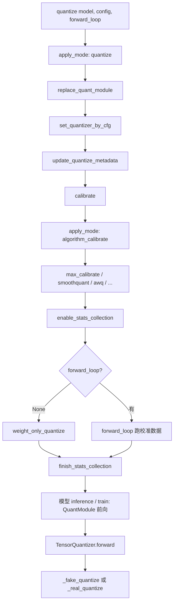

# 从 `quantize()` 到前向推理：量化流程说明

本文以 `modelopt.torch.quantization.model_quant.quantize` 为入口，梳理 Model Optimizer（PyTorch）量化在代码中的**两阶段**执行顺序：**结构转换 + 量化器配置**，以及**校准（统计 amax 等）**。文中路径均相对于仓库根目录。

---

## 1. 用户入口：`quantize()`

**文件**：`modelopt/torch/quantization/model_quant.py`

`quantize(model, config, forward_loop)` 做两件事（顺序固定）：

1. **`apply_mode(model, mode=[("quantize", config)], registry=QuantizeModeRegistry)`**  
   把普通 `nn.Module` 换成带 `TensorQuantizer` 的量化模块，并按 `config["quant_cfg"]` 设置各量化器属性；把状态写入 ModelOpt 的 metadata（便于保存/恢复）。
2. **`calibrate(model, config.get("algorithm"), forward_loop=forward_loop)`**  
   按所选算法收集统计量（如 amax），并**固化**到各 `TensorQuantizer`，最后打开 fake quant 用于训练/推理仿真。

```python
# 等价逻辑（摘自源码语义）
model = apply_mode(model, mode=[("quantize", config)], registry=QuantizeModeRegistry)
return calibrate(model, config.get("algorithm"), forward_loop=forward_loop)
```

**`config` 形状**（`QuantizeConfig`，见 `modelopt/torch/quantization/config.py`）：

| 字段 | 含义 |
|------|------|
| `quant_cfg` | 通配符/过滤函数 → `QuantizerAttributeConfig` 的字典；键 `"default"` 表示未匹配时的默认；也可按模块类名做子配置 |
| `algorithm` | 校准算法：`"max"`、`"smoothquant"`、`"awq_lite"` 等，或带 `method` 的字典 |

---

## 2. 阶段 A：`apply_mode` → `quantize` 模式转换

### 2.1 框架层：`apply_mode`

**文件**：`modelopt/torch/opt/conversion.py`

- 将 `mode` 规范为 `(mode_name, config)` 列表。
- 通过 `QuantizeModeRegistry` 解析名为 `"quantize"` 的模式（见下节）。
- 对每个模式调用 **`descriptor.convert(model, config, **kwargs)`**，并把返回的 `metadata` 记入 `ModeloptStateManager`。

`quantize()` 调用时**不传** `mode_kwargs`，因此此处没有额外参数。

### 2.2 模式描述：`QuantizeModeDescriptor`

**文件**：`modelopt/torch/quantization/mode.py`

- `name == "quantize"`
- `convert` 指向 **`convert_to_quantized_model`**（`modelopt/torch/quantization/conversion.py`）

### 2.3 核心：`convert_to_quantized_model`

**文件**：`modelopt/torch/quantization/conversion.py`

顺序：

1. **`replace_quant_module(model, ...)`**  
   - 递归遍历子模块，若类型在 `QuantModuleRegistry` 中注册，则替换为对应的 `Quant*` 类（如 `nn.Linear` → `QuantLinear`）。  
   - 替换后的模块在 `_setup()` 里挂上 `input_quantizer`、`weight_quantizer`、`output_quantizer` 等（具体见各 `Quant*` 实现）。  
   - 打印插入的 `TensorQuantizer` 数量。
2. **`set_quantizer_by_cfg(model, config.get("quant_cfg", {}))`**  
   - 先应用 `"default"` 键（对全模型 `*` 生效），再按通配符/类名逐项匹配，对**量化器子模块名**（如 `*.weight_quantizer`）调用 `TensorQuantizer.set_from_attribute_config`。  
   - 属性含义见 `QuantizerAttributeConfig`（`num_bits`、`axis`、`fake_quant`、`calibrator`、`block_sizes`、`backend` 等）。
3. **`update_quantize_metadata(model, config, metadata)`**  
   - 把当前所有 `TensorQuantizer` / `SequentialQuantizer` 的状态快照进 `metadata["quantizer_state"]`，供 checkpoint 使用。

### 2.4 量化模块如何接到前向：`QuantLinear` 示例

**文件**：`modelopt/torch/quantization/nn/modules/quant_linear.py`、`quant_module.py`

- `QuantLinearConvBase.forward`：在 `quantize_weight()` 上下文中，`forward` 路径会对 **输入** 和 **权重** 分别调用对应的 `TensorQuantizer`（仿真量化或真实量化由 quantizer 内部决定）。
- `QuantInputBase`（部分层）：只量化输入/输出。

因此，**模型一旦被替换**，前向中凡是经过 `TensorQuantizer` 的张量都会走统一的 `TensorQuantizer.forward` 逻辑。

---

## 3. 阶段 B：`calibrate()` → 再 `apply_mode`（校准算法模式）

**文件**：`modelopt/torch/quantization/model_quant.py`

`calibrate` 并**不是**手写 for 循环调各算法，而是再次调用 `apply_mode`：

```python
apply_mode(
    model,
    mode=get_modelike_from_algo_cfg(algorithm),
    mode_kwargs={"forward_loop": forward_loop},
)
```

### 3.1 `get_modelike_from_algo_cfg(algorithm)`

**文件**：`modelopt/torch/quantization/mode.py`

- 字符串或 `None`：`algo_name` 即算法名，`algo_cfg` 为空 dict。
- 字典：取 `algo_cfg["method"]` 作为算法名。
- 返回 **`[( "<algo>_calibrate", algo_cfg )]`**，例如 `"max"` → `"max_calibrate"`。

每个 `*_calibrate` 模式在 `CalibrateModeRegistry` 中注册，且继承 `BaseCalibrateModeDescriptor`，其 `convert` 实际会走 **`wrapped_calib_func`**：调用对应的 `model_calib` 里函数，然后 `update_quantize_metadata`。

### 3.2 默认算法 `"max"`：`max_calibrate`

**文件**：`modelopt/torch/quantization/model_calib.py`

对 **`max`** 而言，主路径是：

1. **`enable_stats_collection(model)`**  
   对所有未 disable 的 `TensorQuantizer`：  
   - 若有 `_calibrator`：`disable_quant()` + `enable_calib()`（只收集统计，先不做量化输出）；  
   - 否则：`disable()`（该 quantizer 在校准轮次不参与）。
2. **收集统计**  
   - **`forward_loop is None`**：走 **`weight_only_quantize(model)`**——只对各层 `weight_quantizer(weight)` 跑一遍，适合仅权重量化且 max 校准。  
   - **否则**：用户 `forward_loop(model)`，把校准数据跑满前向，激活等 quantizer 在 `enable_calib` 下通过 `collect()` 累积 histogram/max 等。
3. **`finish_stats_collection(model)`**  
   - 对有 calibrator 且非 dynamic 的 quantizer：`cal.compute_amax()`，再 **`module.load_calib_amax()`** 把统计结果写成 `_amax` 等。  
   - 然后 **`enable_quant()` + `disable_calib()`**——之后前向进入正常的 fake quant（若配置为 fake）。
4. **分布式**（`distributed_sync=True` 时）：对 DP/EP/TP 等做 `amax` 的 `all_reduce(MAX)` 等（详见该文件后半部分与 `TensorQuantizer.sync_amax_across_distributed_group`）。

### 3.3 `calibrate()` 收尾

- `model.eval()` 包裹整个 `apply_mode`；结束后遍历 `TensorQuantizer`，对 `_amax`、`_pre_quant_scale` 做 **`validate_attr`**，再恢复 `model.train` 原状态。

---

## 4. 运行时：`TensorQuantizer.forward` —— 校准 vs 量化

**文件**：`modelopt/torch/quantization/nn/modules/tensor_quantizer.py`

一次 `forward` 大致顺序：

1. 可选：`pre_quant_scale`、Hadamard 旋转等预处理。  
2. **`_disabled`**：直接返回输入（仍可能记录 dtype）。  
3. 静态 block quant：必要时 reshape/pad（`_setup_for_blockquant` / `_process_for_blockquant`）。  
4. **若 `_if_calib and not _dynamic`**：调用 **`collect(inputs)`**  
   - `collect` 内部调用 **`_calibrator.collect(inputs)`**（以及可选的 bias calibrator）。  
5. **若 `_if_quant`**：  
   - **`fake_quant`**：走 **`_fake_quantize`**（默认 PTQ 仿真：输出仍为浮点，但数值被量化网格约束）。  
   - 否则：走 **`_real_quantize`**（压缩/部署路径，可能产生 `QTensor` 等）。

### 4.1 `_fake_quantize` 分支（与格式强相关）

同一文件内 `_fake_quantize` 主要分支：

| 条件 | 行为 |
|------|------|
| 注册了 `backend` | 调用用户注册的 `register_quant_backend` 入口 |
| `block_sizes` 且 `type == "dynamic"` | `tensor_quant.dynamic_block_quant`（含 MX/NVFP4/INT4 等动态块） |
| `(2,1)` 且静态 block | `static_blockwise_fp4_fake_quant` |
| `num_bits` 为 tuple（如 FP8 E4M3） | `scaled_e4m3` |
| 否则 | `fake_tensor_quant`（整型量化） |

MX 相关格式在 `is_mx_format` 等属性下可能有 **pass-through backward** 等特殊行为。

---

## 5. 端到端数据流（简图）



---

## 6. 与 CUDA 扩展的关系（可选路径）

**文件**：`modelopt/torch/quantization/tensor_quant.py`、`src/tensor_quant_mx.cu` 等

- 大量低比特/block 逻辑在 **`tensor_quant`** 中实现；部分通过 **CUDA 扩展**（如 `fused_amax_convert`）做 fused amax + 量化仿真。
- 这些函数由 **`dynamic_block_quant`**、MX/FP4 相关路径**按需**调用，**不是** `quantize()` 的直接子调用，而是 **前向 fake quant / 动态块** 时的后端实现。

若只使用 INT8/简单 FP8 且未启用对应 block 配置，可能完全走纯 PyTorch/Triton 路径。

---

## 7. 关键文件索引

| 环节 | 路径 |
|------|------|
| 入口 API | `modelopt/torch/quantization/model_quant.py` |
| 配置模型 | `modelopt/torch/quantization/config.py`（`QuantizeConfig`） |
| 模式注册与校准模式名 | `modelopt/torch/quantization/mode.py` |
| 图替换与 quant_cfg 应用 | `modelopt/torch/quantization/conversion.py` |
| 校准算法实现 | `modelopt/torch/quantization/model_calib.py` |
| 量化器与前向 | `modelopt/torch/quantization/nn/modules/tensor_quantizer.py` |
| 量化 Linear 基类 | `modelopt/torch/quantization/nn/modules/quant_module.py`、`quant_linear.py` |
| apply_mode 框架 | `modelopt/torch/opt/conversion.py` |
| 张量级算子 | `modelopt/torch/quantization/tensor_quant.py` |

---

## 8. 小结

- **`quantize()` = 一次「图替换 + quant_cfg 下发」+ 一次「按 algorithm 做校准」**。  
- **校准**通过第二次 `apply_mode` 调用 `model_calib` 中具体函数，配合 `TensorQuantizer` 的 **`enable_calib` / `collect` / `load_calib_amax`** 完成。  
- **推理/训练仿真**时，量化由嵌入在 `QuantModule` 里的 **`TensorQuantizer.forward`** 完成，默认多为 **fake quant**，底层再分派到 `tensor_quant` 或自定义 `backend`。

如需对照官方概念说明，可结合 `docs/source/guides/_pytorch_quantization.rst` 与 `_basic_quantization.rst`。
