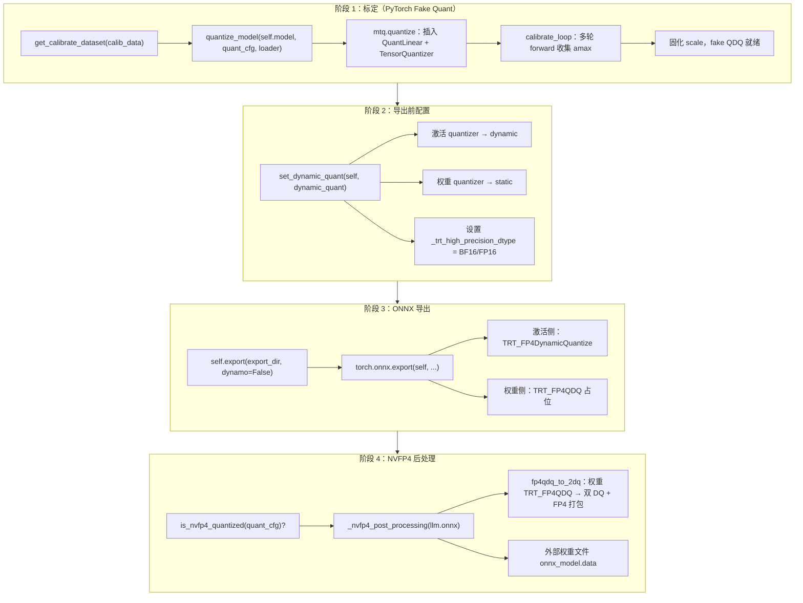

# NVFP4 量化与导出流程说明

> 本文以 pi05 **LLM（Gemma 2B 解码器）** 为主例，说明 NVFP4 从标定、`set_dynamic_quant`、ONNX 导出到 `_nvfp4_post_processing` 的完整链路。  
> 标定阶段 fake quant 原理见 [quantize_flow.md](../pi05/quantize_flow.md)；流水线各 stage 分工见 [pipeline.md](../pi05/pipeline.md)。

---

## 目录

1. [总览：端到端流程](#一总览端到端流程)
2. [阶段 1：`quantize_model` 标定](#二阶段-1quantize_model-标定)
3. [阶段 2：`set_dynamic_quant` 动态激活配置](#三阶段-2set_dynamic_quant-动态激活配置)
4. [阶段 3：`export` ONNX 导出](#四阶段-3export-onnx-导出)
5. [阶段 4：`_nvfp4_post_processing` 后处理](#五阶段-4_nvfp4_post_processing-后处理)
6. [完整数据流：一层 Linear 从标定到 TRT](#六完整数据流一层-linear-从标定到-trt)
7. [与 Vit 等其他 stage 的差异](#七与-vit-等其他-stage-的差异)
8. [配置识别函数对照](#八配置识别函数对照)
9. [关键参考](#九关键参考)

---

## 一、总览：端到端流程

以 `LLM.quantize()` 为例，NVFP4 完整流水线如下：



对应代码入口（`src/model_optimizer/models/pi05/llm.py`）：

```python
def quantize(self, quant_cfg, calib_data, export_dir, *, measure_quant_error=False):
    calib_dataloader = self.get_calibrate_dataset(calib_data)
    # AWQ 族标定可能临时转 fp32，见下文
    quantize_model(self.model, quant_cfg, calib_dataloader, ...)

    self.is_quantized = True
    dynamic_quant = self.feature_config.quantize.get("dynamic_quant", "bf16")
    set_dynamic_quant(self, dynamic_quant)

    dynamo = bool(self.feature_config.export.get("dynamo", False))
    self.export(export_dir, dynamo=dynamo)

    if is_nvfp4_quantized(quant_cfg):
        self._nvfp4_post_processing(f"{export_dir}/llm.onnx", export_dir)
```

**一句话结论**：标定定 scale → 导出前配置 dynamic/static → 导出生成 TRT 自定义 Q/DQ 图 → 后处理仅压缩权重为真实 FP4；激活在推理时仍走动态量化路径。

---

## 二、阶段 1：`quantize_model` 标定

### 2.1 为何 LLM 传入 `self.model` 而不是 `self`

| 对象 | 含义 |
|------|------|
| `self.model` | HF `GemmaModel`（`paligemma.get_decoder()`） |
| `self` | `LLM` 包装类，额外做 KV cache 拼接 |

ModelOpt 的 `register_hf_attentions_on_the_fly` 要求根模块是 **HF PreTrainedModel**，才会注册 `*_bmm_quantizer`。若配置了 `FP8_KV_CFG` / `NVFP4_KV_CFG` 等 KV cache 量化，必须直接量化 `GemmaModel`。

标定前向走的是：

```python
qm(**batch)  # GemmaModel.forward(inputs_embeds=..., attention_mask=..., position_ids=...)
```

**不经过** `LLM.forward` 的 KV 聚合逻辑。标定数据来自 `Pi05LLMCalibCollector`，在 `language_model.forward` 上 hook 采集：

- `inputs_embeds`：`[B, seq_len, 2048]`
- `attention_mask`：`[B, 1, seq_len, seq_len]`
- `position_ids`：`[B, seq_len]`

### 2.2 `quantize_model` 内部步骤

入口：`src/model_optimizer/quantization/quantization_utils.py`

1. **解析 `quant_cfg`**  
   NVFP4 使用 `mtq.NVFP4_DEFAULT_CFG`（`cfg.py` 里 `"nvfp4"`），典型特征：
   - `num_bits = (2, 1)` → FP4 E2M1
   - `block_sizes` 含 `scale_bits: (4, 3)` → NVFP4 block 量化
   - `is_nvfp4_quantized()` 通过 `num_bits[0] == 2` 识别

2. **图改造**  
   每个 `nn.Linear`（q_proj、k_proj、v_proj、o_proj、MLP 等）变为 `QuantLinear`：

   ```
   x → [input_quantizer]  → x̂ (fake QDQ)
     → Linear(Ŵ)         → y
       （W 侧有 weight_quantizer）
   ```

3. **标定循环（Fake Quant）**  
   对每个 calib batch 跑完整 decoder forward：
   - 各层 `input_quantizer` 统计激活 amax（block-wise）
   - 各层 `weight_quantizer` 统计权重 amax
   - 误差在层间传播（上一层 QDQ 输出作为下一层输入）

4. **标定结束**  
   scale 固化；PyTorch 推理仍是 **浮点 MatMul + fake QDQ**，不是整数 GEMM。

### 2.3 LLM 特有的 AWQ fp32 标定保护

`nvfp4_awq` 等 AWQ 族配置会临时把 decoder 转 fp32 标定，避免 bf16 上 CUDA device-side assert；标定完再恢复 bf16 供导出：

```python
awq_fp32_calib = _quant_cfg_uses_awq_family(quant_cfg)
if awq_fp32_calib:
    self.model.to(torch.float32)
try:
    quantize_model(...)
finally:
    if awq_fp32_calib:
        self.model.to(saved_dtype)
```

### 2.4 以 `q_proj` 为例的单层标定

```
标定前:  x [B,L,2048] → Linear(W [2048,2048]) → y

标定后 fake quant 前向:
  x → input_quantizer (NVFP4 block fake QDQ, 收集 amax)
    → weight_quantizer (NVFP4 block fake QDQ, 固化 scale)
      → matmul(x̂, Ŵ^T)  ← 仍是 bf16 GEMM
        → y → 送入 k_proj 的 input_quantizer ...
```

---

## 三、阶段 2：`set_dynamic_quant` 动态激活配置

### 3.1 调用时机与参数

在 **标定完成之后、`export` 之前** 调用，只改 ONNX 导出属性，不改已固化的 scale：

```python
dynamic_quant = self.feature_config.quantize.get("dynamic_quant", "bf16")  # 默认 "bf16"
set_dynamic_quant(self, dynamic_quant)
```

Vit 等未走 `feature_config` 的 stage 通常写死 `set_dynamic_quant(self, "bf16")`。

### 3.2 函数实现

`src/model_optimizer/utils/utils.py`：

```python
def set_dynamic_quant(model: nn.Module, dtype: str) -> None:
    for module in model.modules():
        if is_nvfp4_linear(module):
            module.input_quantizer._trt_high_precision_dtype = (
                "Half" if dtype == "fp16" else "BFloat16"
            )
            module.input_quantizer._onnx_quantizer_type = "dynamic"
            module.weight_quantizer._onnx_quantizer_type = "static"
```

识别 NVFP4 层（`is_nvfp4_linear`）：`QuantLinear` 且 `input_quantizer.block_sizes["scale_bits"] == (4, 3)`。

传入 `self`（LLM 包装）时，`self.modules()` 会遍历到 `self.model` 下所有 `QuantLinear`，因此能正确设置。

### 3.3 三个属性的含义

| 属性 | 设置值 | 作用 |
|------|--------|------|
| `_onnx_quantizer_type`（input） | `"dynamic"` | 激活导出为 **运行时动态量化** |
| `_onnx_quantizer_type`（weight） | `"static"` | 权重导出为 **静态 FP4 打包** |
| `_trt_high_precision_dtype` | `"BFloat16"` / `"Half"` | QDQ 周围 Cast 与 MatMul 的高精度 dtype |

### 3.4 导出时 dynamic vs static 在 ONNX 中的差异

ModelOpt `export_fp4()`（`modelopt/torch/quantization/export_onnx.py`）：

**激活（dynamic）** — 推理时按 block 动态算 scale：

```python
if onnx_quantizer_type == "dynamic":
    sx_f32_per_tensor = float(amax) / 6.0 / 448.0   # 用标定 amax 算 per-tensor 上界
    x_f4, sx_f8 = TRT_FP4DynamicQuantize(...)
    # → DequantizeLinear × 2 → BF16 激活
```

ONNX 图里会出现：

```
激活 x (BF16)
  → Cast (若需要)
  → TRT_FP4DynamicQuantize(x, per_tensor_scale) → (x_f4, sx_f8)
  → DequantizeLinear(sx_f8, per_tensor_scale) → dyn_scale
  → DequantizeLinear(x_f4, dyn_scale, block_size) → x_dequant (BF16)
  → MatMul/Gemm
```

要点：标定 amax 变成 **per-tensor scale 因子**，不是把激活固定成常数；每个 token/block 在推理时仍 **动态** 算 block scale。

**权重（static）** — 导出占位，后处理再压成 FP4：

```python
return g.op("trt::TRT_FP4QDQ", inputs, block_size_i=block_size)
```

### 3.5 为何 NVFP4 要「动态激活 + 静态权重」

| 对象 | 策略 | 原因 |
|------|------|------|
| **权重 W** | static | 离线固定，可预打包 FP4，省显存/带宽 |
| **激活 x** | dynamic | 分布随输入/prefix 变化大；固定 scale 精度损失大；Blackwell TRT 支持 runtime block quant |

标定阶段用 fake quant 定 amax，是为了给 dynamic 路径提供 **per-tensor 上界**；推理时 block scale 仍按实际激活动态计算。

### 3.6 `dynamic_quant` 配置项

通过 `feature_config.quantize.dynamic_quant` 控制：

```json
{ "quantize": { "dynamic_quant": "bf16" } }
{ "quantize": { "dynamic_quant": "fp16" } }
```

影响 ONNX 中 Cast 与 DQ 输出的高精度类型（BF16 vs FP16），需与 TensorRT engine 精度策略一致。

---

## 四、阶段 3：`export` ONNX 导出

NVFP4 量化后默认 `dynamo=False`（含 Q/DQ 的图用 legacy tracer 更稳）。

LLM 默认 `mode="self_forward"`，直接导出 `LLM` 包装模块：

```
输入: inputs_embeds [B, seq, 2048], attention_mask, position_ids
输出: past_keys, past_values, last_hidden_state
```

导出的是 **已插入 QuantLinear 的量化图**。每层 Linear 在 ONNX 中体现为：

```
[激活 Dynamic FP4 QDQ 子图] + [权重 TRT_FP4QDQ 占位] → MatMul/Gemm
```

若还配置了 KV cache 量化（`nvfp4` + `kv_cache_qformat=nvfp4`），attention 的 `*_bmm_quantizer` 也会出现在 ONNX 中（依赖 `self.model` 作为 quantize root）。

---

## 五、阶段 4：`_nvfp4_post_processing` 后处理

LLM 在 `llm.py` 中 override 了基类 `Model._nvfp4_post_processing`，逻辑与 Vit 等 stage 一致。

### 5.1 触发条件

```python
if is_nvfp4_quantized(quant_cfg):   # 配置层：num_bits[0] == 2
    self._nvfp4_post_processing(onnx_path, export_dir)

# 函数内部再检查：
if is_fp4_quantized(self):          # 模型层：存在 scale_bits == (4,3) 的 quantizer
    ...
```

### 5.2 步骤

1. **`self.model.save_pretrained(export_dir)`** — 保留 `config.json` 等元数据
2. **`onnx.shape_inference.infer_shapes_path(onnx_path)`** — 补全 tensor shape
3. **`fp4qdq_to_2dq(onnx_model)`** — 核心转换（见下）
4. **清理 export 目录** — 删除除 `.json` 外的所有文件
5. **`onnx.save_model(..., save_as_external_data=True, location="onnx_model.data", convert_attribute=False)`** — 重新保存 ONNX + 外部权重

`convert_attribute=False` 刻意关闭 attribute 转 external data，避免 TensorRT 解析 external weights 时出现 `"Expected size: … Actual size: 0 bytes"` 错误。

### 5.3 只处理权重，不动激活

| 算子 | 后处理 | 最终形态 |
|------|--------|----------|
| `TRT_FP4QDQ`（权重） | `fp4qdq_to_2dq` 替换 | 双 `DequantizeLinear` + FP4 打包权重 |
| `TRT_FP4DynamicQuantize`（激活） | **保留** | TensorRT 运行时动态量化 |

### 5.4 权重 2DQ 转换细节

对每个 `TRT_FP4QDQ` 节点（`modelopt/onnx/quantization/qdq_utils.py`）：

1. 读 FP16/BF16 权重 initializer
2. 计算 per-tensor scale + per-block scale
3. 量化并 `_cast_fp4` 打包（两个 FP4 值压进 1 byte）
4. 替换为双 DQ 子图：

   ```
   DQ1: (sw_f8_per_block, sw_f32_per_tensor) → sw_f32
   DQ2: (w_f4_packed, sw_f32, block_size) → w_dequant
   ```

5. 在 MatMul/Gemm 输入前插入 Cast（对齐 BF16/FP16）

### 5.5 最终产物

```
export_dir/
├── config.json              # Gemma / SigLIP config
├── llm.onnx                 # 2DQ 权重 + DynamicQuantize 激活
└── onnx_model.data          # FP4 打包权重外部存储
```

---

## 六、完整数据流：一层 Linear 从标定到 TRT

以 `layers.0.self_attn.q_proj` 为例：

```
┌─────────────────────────────────────────────────────────────────┐
│ 标定 (quantize_model)                                           │
│   calib batch → GemmaModel.forward                              │
│   x → input_quantizer.fake_qdq (block NVFP4, 收集 amax)         │
│   W → weight_quantizer.fake_qdq (block NVFP4, 固化 scale)       │
│   y = matmul(x̂, Ŵ^T)                                          │
└─────────────────────────────────────────────────────────────────┘
                              ↓
┌─────────────────────────────────────────────────────────────────┐
│ set_dynamic_quant                                               │
│   input_quantizer._onnx_quantizer_type = "dynamic"              │
│   weight_quantizer._onnx_quantizer_type = "static"              │
│   _trt_high_precision_dtype = "BFloat16"                        │
└─────────────────────────────────────────────────────────────────┘
                              ↓
┌─────────────────────────────────────────────────────────────────┐
│ export → llm.onnx                                               │
│   激活: TRT_FP4DynamicQuantize → 2× DequantizeLinear → BF16 x   │
│   权重: TRT_FP4QDQ (占位, 仍是全精度权重 tensor)                  │
│   → MatMul/Gemm                                                 │
└─────────────────────────────────────────────────────────────────┘
                              ↓
┌─────────────────────────────────────────────────────────────────┐
│ _nvfp4_post_processing → fp4qdq_to_2dq                          │
│   权重: TRT_FP4QDQ → 双 DQ + FP4 packed weights                 │
│   激活: TRT_FP4DynamicQuantize 保持不变                          │
│   保存 llm.onnx + onnx_model.data                               │
└─────────────────────────────────────────────────────────────────┘
                              ↓
┌─────────────────────────────────────────────────────────────────┐
│ TensorRT build                                                  │
│   权重: 真 FP4 GEMM（读 packed weights）                         │
│   激活: 运行时 TRT_FP4DynamicQuantize + FP4 MatMul              │
└─────────────────────────────────────────────────────────────────┘
```

---

## 七、与 Vit 等其他 stage 的差异

| 维度 | LLM | Vit / Expert 等 |
|------|-----|-----------------|
| quantize root | `self.model`（HF GemmaModel） | `self`（整个包装模块） |
| 标定前向 | `model(**{inputs_embeds, ...})` | `self(pixel_values)` 等 |
| AWQ fp32 保护 | 有 | 无 |
| export 对象 | `LLM` 包装（含 KV 输出） | `Vit` 本身 |
| `_nvfp4_post_processing` | `llm.py` override | 基类 `Model` 默认实现 |
| 特性开关 | `feature_config`（fused_mlp、dynamic_quant、dynamo 等） | 较简单，通常固定 `"bf16"` |
| KV 量化 | 支持（需 HF root + bmm_quantizer） | 不涉及 |

各 stage（llm、vit、expert、dit、embed_prefix）在 NVFP4 后处理上模式统一：

```
quantize → set_dynamic_quant → export ONNX → [NVFP4?] _nvfp4_post_processing
```

---

## 八、配置识别函数对照

```python
# 配置层：决定是否走后处理
is_nvfp4_quantized(quant_cfg)
# quant_cfg["quant_cfg"]["*input_quantizer"]["num_bits"][0] == 2

# 模型层：决定 fp4qdq_to_2dq 是否执行
is_fp4_quantized(model)
# 模型中存在 input_quantizer.block_sizes["scale_bits"] == (4, 3)

# 导出层：决定哪些层设置 dynamic/static
is_nvfp4_linear(module)
# QuantLinear + scale_bits == (4, 3)
```

三层判断分别对应：**配置意图 → 模型实际状态 → 逐层 ONNX 导出行为**。

---

## 九、关键参考

| 资源 | 路径 |
|------|------|
| LLM 量化入口 | `src/model_optimizer/models/pi05/llm.py` — `quantize()`、`_nvfp4_post_processing()` |
| Vit 量化入口 | `src/model_optimizer/models/pi05/vit.py` — `quantize()` |
| 基类后处理 | `src/model_optimizer/models/model.py` — `_nvfp4_post_processing()` |
| 量化工具 | `src/model_optimizer/quantization/quantization_utils.py` — `quantize_model()` |
| NVFP4 配置 | `src/model_optimizer/quantization/cfg.py` — `"nvfp4"` / `"nvfp4_awq"` |
| dynamic/static 设置 | `src/model_optimizer/utils/utils.py` — `set_dynamic_quant()` |
| FP4 → 2DQ 转换 | `third_party/Model-Optimizer/modelopt/onnx/quantization/qdq_utils.py` — `fp4qdq_to_2dq()` |
| ONNX 导出 FP4 逻辑 | `third_party/Model-Optimizer/modelopt/torch/quantization/export_onnx.py` — `export_fp4()` |
| Fake quant 原理 | [quantize_flow.md](../pi05/quantize_flow.md) |

---

*文档整理自 pi05 NVFP4 量化与导出流程分析。*
