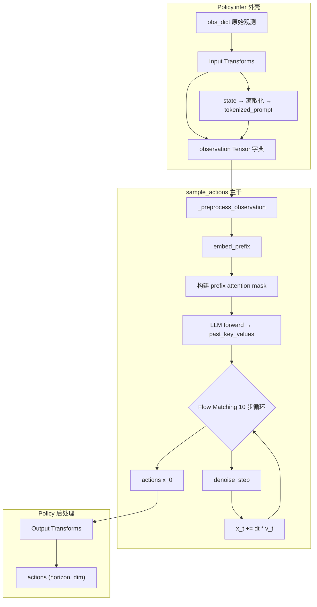
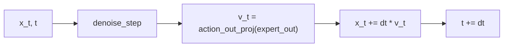
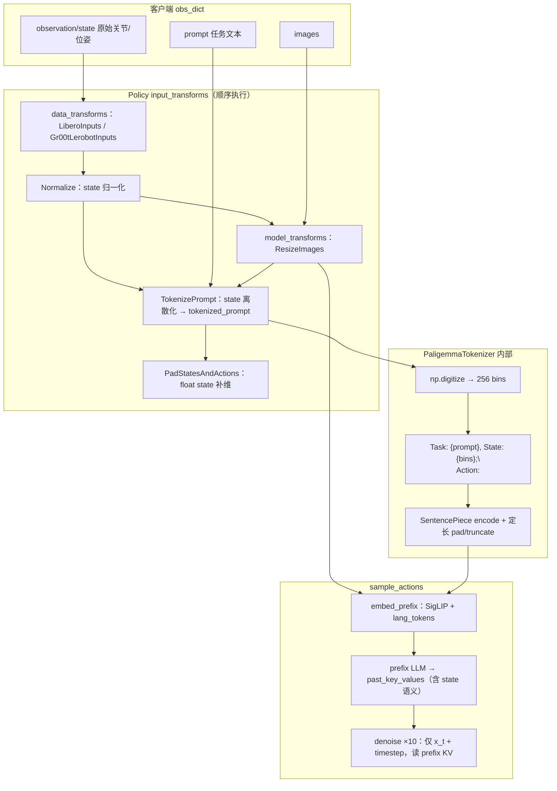
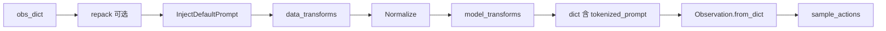
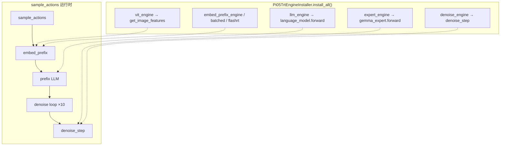
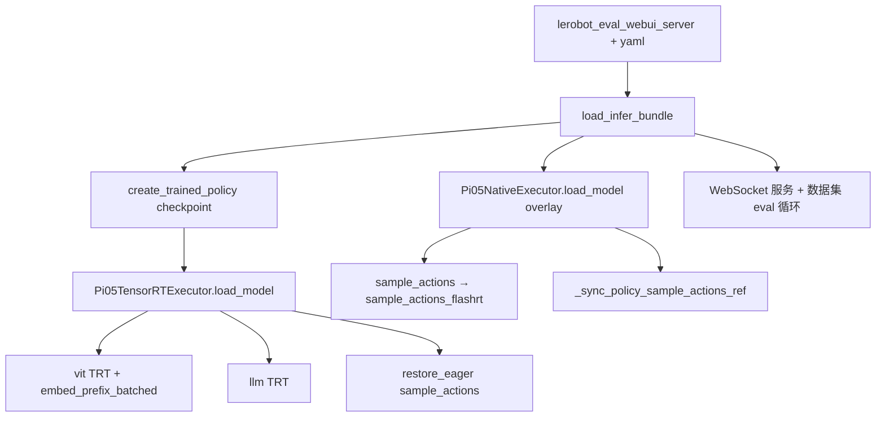
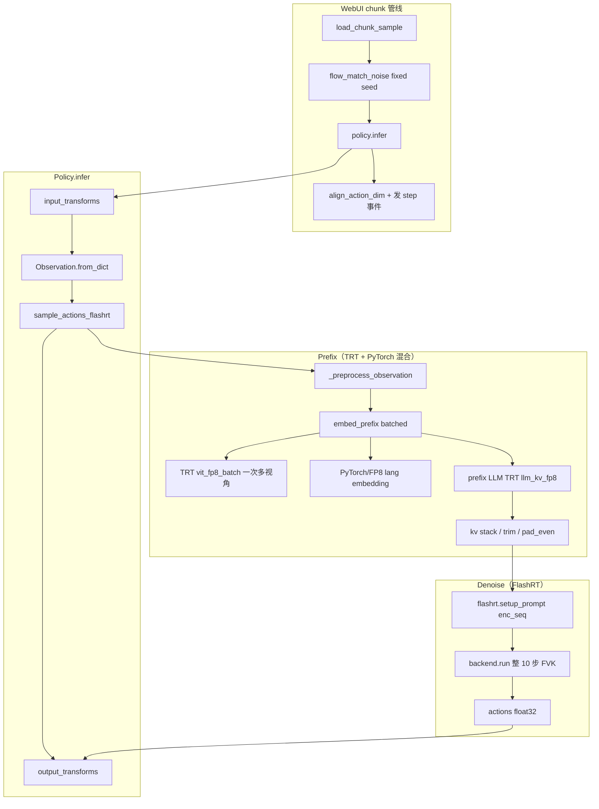
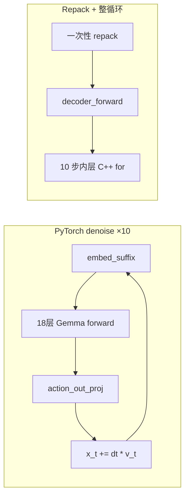

# Pi0.5 推理全流程分析

以 `Pi05TensorRTExecutor` 为入口，Pi0.5 推理是一条 **Policy 外壳 → `sample_actions` 主干 → 5 个子阶段（vit / embed_prefix / llm / expert / denoise）** 的流水线。Executor 本身几乎不跑计算，核心职责是 **挂载 TRT 引擎、恢复 eager 路径、同步 Policy 引用**。

---

## 1. 入口与初始化

### 1.1 调用链

```
serve_policy / client
    └─ Policy.infer(obs_dict)
           ├─ input_transforms（归一化、tokenize、resize 等）
           ├─ model.sample_actions(device, observation, noise, num_steps=10)  ← 核心
           └─ output_transforms（反归一化、裁剪 action 维度）
```

`Pi05TensorRTExecutor` 在 `load_model()` 中完成引擎挂载：

```python
# src/model_optimizer/infer/tensorrt/pi05_executor.py
def load_model(self, config=None):
    self.config = config
    self._setup_trt_engine()           # Pi05TrtEngineInstaller.install_all()
    self._restore_eager_sample_actions()  # 去掉 torch.compile(sample_actions)
    self._sync_policy_sample_actions_ref()  # 刷新 Policy._sample_actions
```

关键动作：

| 步骤 | 作用 |
|------|------|
| `Pi05TrtEngineInstaller.install_all()` | 按 config 将各 stage 替换为 TRT Engine |
| `_restore_eager_sample_actions()` | 去掉 `PI0Pytorch.__init__` 里的 `torch.compile(sample_actions)` |
| `_sync_policy_sample_actions_ref()` | 刷新 `Policy._sample_actions`，否则 `infer()` 仍走旧引用 |

### 1.2 模型结构（5 个可替换 stage）

定义于 `src/model_optimizer/architectures/pi05.py`：

| Stage | 说明 | 可替换后端 |
|-------|------|-----------|
| `vit` | SigLIP 视觉编码 | pytorch / tensorrt / onnxrt / flashrt |
| `embed_prefix` | 图像 + 语言前缀嵌入 | pytorch / tensorrt / onnxrt |
| `llm` | PaliGemma prefix LLM | pytorch / tensorrt / onnxrt |
| `expert` | Gemma 动作解码器 | pytorch / tensorrt / onnxrt / native |
| `denoise` | Flow Matching 单步去噪 | pytorch / tensorrt / onnxrt / native / flashrt |

底层模型是 OpenPI 的 `PI0Pytorch`（`policy._model`），核心组件：

- **PaliGemma**：SigLIP ViT + 语言 embedding + Gemma LLM（处理 prefix）
- **Gemma Expert**：动作解码器（处理 suffix，cross-attention 复用 prefix KV）
- **Flow Matching 头**：`action_in_proj` / `time_mlp_*` / `action_out_proj`

---

## 2. 端到端流程图



---

## 3. 各阶段详解

### Stage 0：Policy 预处理（Executor 之外）

**输入**：客户端 `obs_dict`（图像 HWC/CHW、state、prompt、可选 RTC 字段）

**输出**：经 transforms 后的 `observation` 字典，典型字段：

| 字段 | 形状/类型 | 说明 |
|------|-----------|------|
| `image` / 多路相机 | `[B,3,H,W]` float | 归一化后图像 |
| `state` | `[B, state_dim]` | 机器人 proprio；**经离散化写入 `tokenized_prompt`**（见 [§4 Robot State](#4-robot-state-使用方式与流程)） |
| `prompt` → `tokenized_prompt` | token ids + mask | 任务文本 + **离散 state 字符串**（Pi0.5 格式） |
| `action` / `action_mask` / `infer_delay` | 可选 | RTC 实时控制 |

Input Transforms 典型链路（见 `docs/pi05_deploy.md`；state 在 **Normalize 之后、TokenizePrompt** 写入 `tokenized_prompt`，详见 [§4.3](#43-transform-阶段详解state-如何写入-tokenized_prompt)）：

```
InjectDefaultPrompt → Gr00tLerobotInputs → Normalize → ResizeImages → TokenizePrompt → PadStatesAndActions
```

---

### Stage 1：`_preprocess_observation`

**输入**：`observation` 字典

**输出**：

| 输出 | 形状 | 说明 |
|------|------|------|
| `images` | `list[Tensor]`，每路 `[B,3,H,W]` | 多视角图像 |
| `img_masks` | `list[Tensor]` `[B,1]` 或 `[B,256]` | 每路图像有效 mask |
| `lang_tokens` | `[B, lang_len]` | 语言 token |
| `lang_masks` | `[B, lang_len]` bool | 语言 padding mask |
| `state` | `[B, state_dim]` | 仍随 Observation 传递（定 batch、Policy 输出）；**Pi0.5 的 `embed_suffix` 忽略该 float 向量** |

---

### Stage 2：`embed_prefix` — 前缀嵌入

**计算**：SigLIP 编码图像 + 语言 embedding 拼接

**PyTorch 路径**（`Pi05EmbedPrefix.embed_prefix`）：

```
images [B,V,3,H,W]
  → vision_tower → multi_modal_projector → /sqrt(hidden_size)
  → 与 lang_emb = embed_tokens(lang_tokens) * sqrt(dim) 拼接
```

**输出**：

| 张量 | 形状 | 说明 |
|------|------|------|
| `prefix_embs` | `[B, prefix_len, hidden]` | 图像 token + 语言 token 拼接 |
| `prefix_pad_masks` | `[B, prefix_len]` bool | 有效 token mask |
| `prefix_att_masks` | `[B, prefix_len]` bool | 全 0 → prefix 双向注意力 |

典型 `prefix_len` ≈ `num_views × 256 + lang_len`（如 2 视角 + 48 token ≈ 560）

**TRT 替换策略**（`Pi05TrtEngineInstaller`，`pi05_trt_engine_setup.py`）：

| 配置 | 实现 |
|------|------|
| `vit_engine` | 替换 `get_image_features`，其余 PyTorch |
| `embed_prefix_engine` | 整图 TRT（多路 image + lang 一次出） |
| `vit_batch_views` | 多视角 batch 一次 ViT |
| `use_flashrt_siglip` | FlashRT SigLIP + PyTorch 语言 embedding |

---

### Stage 3：`prefix_llm` — 前缀 KV Cache

**输入**：

| 张量 | 形状 |
|------|------|
| `prefix_embs` | `[B, prefix_len, hidden]` |
| `prefix_att_2d_masks_4d` | `[B, 1, prefix_len, prefix_len]` 加性 mask |
| `prefix_position_ids` | `[B, prefix_len]` |

**计算**：

```python
_, past_key_values = paligemma_with_expert.forward(
    attention_mask=prefix_att_2d_masks_4d,
    position_ids=prefix_position_ids,
    past_key_values=None,
    inputs_embeds=[prefix_embs, None],  # 仅 prefix 分支
    use_cache=True,
)
```

**输出**：

| 输出 | 形状 | 说明 |
|------|------|------|
| `past_key_values` | 每层 `(K, V)` | `DynamicCache`，每层 `[B, num_kv_heads, prefix_len, head_dim]` |
| TRT 堆叠形式 | `past_keys/values` | `[num_layers, B, num_kv_heads, prefix_len, head_dim]` |

TRT 替换：`language_model.forward` → `llm_engine(inputs_embeds, attention_mask, position_ids)`

---

### Stage 4：Flow Matching 去噪循环（10 步 Euler）

**初始化**：

```
noise ~ N(0,1)     → x_t: [B, action_horizon, action_dim]  例 [1,30,16]
time = 1.0, dt = -0.1
```

**每步循环**（`t = 1.0 → 0.0`）：



**RTC 机制**（可选）：若传入 `action_prefix` + `delay`，前 `delay` 步的 `x_t` 被锁定为已知动作，`time_cond=0`。

---

### Stage 5：`denoise_step` — 单步去噪（核心计算单元）

Pi0.5 与 Pi0 的关键区别：**suffix 不含 state token**，仅 action tokens + 时间条件（AdaRMS）。

#### 5.1 Suffix 嵌入（`embed_suffix` / 图内等效计算）

| 步骤 | 输入 | 输出 |
|------|------|------|
| `action_in_proj(x_t)` | `[B, horizon, action_dim]` | `suffix_embs` `[B, horizon, hidden]` |
| 正弦时间编码 + `time_mlp` | `timestep` `[B]` | `adarms_cond` `[B, hidden]` |
| suffix mask | — | AR mask：`[1,0,0,...]`（首 token 可见全部 prefix） |

#### 5.2 注意力 mask 构造

```
full_att_2d_masks = cat([prefix_pad_2d, suffix_att_2d], dim=seq)
position_ids = prefix_offset + cumsum(suffix_pad_masks) - 1
full_att_2d_masks_4d = _prepare_attention_masks_4d(...)
```

#### 5.3 Expert 前向（cross-attention 复用 prefix KV）

```python
outputs_embeds, _ = paligemma_with_expert.forward(
    attention_mask=full_att_2d_masks_4d,
    position_ids=position_ids,
    past_key_values=past_key_values,   # 来自 prefix_llm，不再更新
    inputs_embeds=[None, suffix_embs],
    adarms_cond=[None, adarms_cond],
    use_cache=False,
)
suffix_out = outputs_embeds[1][:, -action_horizon:]
v_t = action_out_proj(suffix_out)      # float32 [B, horizon, action_dim]
```

**denoise_step 输入/输出汇总**：

| 方向 | 名称 | 形状 |
|------|------|------|
| 入 | `prefix_pad_masks` | `[B, prefix_len]` |
| 入 | `past_key_values` | 每层 K/V |
| 入 | `x_t` | `[B, action_horizon, action_dim]` |
| 入 | `timestep` | `[B]` 或 AdaRMS 预计算时 `adarms_mod` |
| 出 | `v_t` | `[B, action_horizon, action_dim]` float32 |

**TRT 替换**：

| Stage | 替换点 |
|-------|--------|
| `expert_engine` | `gemma_expert.model.forward` |
| `denoise_engine` | 整步 `denoise_step`（embed_suffix + expert + action_out_proj 合一） |

`denoise_engine` 输入（TRT）：

```
prefix_pad_masks, past_keys, past_values, x_t, timestep (或 adarms_mod)
→ v_t
```

实现见 `pi05_trt_engine_setup.py` 中 `install_denoise()`；逻辑对齐 `Pi05DenoiseStep.forward()`（`models/pi05/dit.py`）。

---

## 4. Robot State 使用方式与流程

Pi0.5 与 Pi0 在 state 处理上有关键架构差异（`openpi/models/pi0_config.py`）：

- **Pi0**：`state` → `state_proj` → suffix **第 1 个连续 token**（action expert 直接读 proprio 向量）
- **Pi0.5**：`state` → **256-bin 离散化** → 拼进语言 prompt → prefix 语言 token → LLM KV cache；denoise **不再**把 float `state` 投影进 suffix

因此 Pi0.5 **仍然使用**机器人当前 state，但路径是 **「离散文本 → prefix 语言模型」**，而非 suffix 连续嵌入。

### 4.1 设计对比（Pi0 vs Pi0.5）

| 维度 | Pi0 | Pi0.5 |
|------|-----|-------|
| state 编码 | `state_proj(state)` 连续向量 | 256-bin 离散化 → SentencePiece 文本 token |
| state 进入模型的位置 | suffix 第 1 token | **prefix 语言序列**（prompt 内） |
| 去噪时间条件 | 与 action 拼接进 MLP | **adaRMSNorm**（`time_mlp_*` → `adarms_cond`） |
| `embed_suffix(state, …)` | 使用 `state` | **忽略 `state`**（保留参数仅为 API 兼容） |
| 模型权重 | 有 `state_proj` | 无 `state_proj`，有 `time_mlp_in/out` |
| 默认 `discrete_state_input` | `False` | `True`（随 `pi05=True` 自动设置） |

### 4.2 State 从机器人到模型的完整流程



Transform 在 `Policy.infer` 内通过 `compose(transforms)` **顺序、就地**作用于 `data` 字典；**state 写入 `tokenized_prompt` 发生在 `TokenizePrompt` 一步**，详见 [§4.3](#43-transform-阶段详解state-如何写入-tokenized_prompt)。

---

### 4.3 Transform 阶段详解：state 如何写入 `tokenized_prompt`

本节只讨论 **Policy 输入 transform**（`create_trained_policy` 组装、`Policy.infer` 调用），不涉及 `sample_actions` 内部。

#### 4.3.1 入口：`Policy.infer` 如何串起 transforms

```python
# openpi/policies/policy.py
inputs = jax.tree.map(lambda x: x, obs)          # 浅拷贝，避免原地修改客户端 dict
inputs = self._input_transform(inputs)           # 顺序执行下方整条 input 链
...
observation = _model.Observation.from_dict(inputs)
```

`create_trained_policy` 组装的 **input 链**（`openpi/policies/policy_config.py`）：

```python
transforms=[
    *repack_transforms.inputs,                    # 可选：推理端通常为空；训练数据 repack 键名
    transforms.InjectDefaultPrompt(default_prompt),
    *data_config.data_transforms.inputs,          # 数据集相关：LiberoInputs / Gr00tLerobotInputs 等
    transforms.Normalize(norm_stats, use_quantiles=...),
    *data_config.model_transforms.inputs,         # Pi0.5：InjectDefaultPrompt → ResizeImages → TokenizePrompt → PadStatesAndActions
]
```



**与 state 相关的关键事实**：

| 事实 | 说明 |
|------|------|
| 执行顺序固定 | 先 **Normalize state**，再 **TokenizePrompt**，最后 **PadStatesAndActions** |
| `TokenizePrompt` 消费 `prompt` | `data.pop("prompt")` —— prompt 字符串此后不再存在于 dict |
| `TokenizePrompt` 读取 `state` | 读取的是 **归一化后、尚未 pad 到 action_dim** 的 float 向量 |
| 输出新字段 | 增加 `tokenized_prompt`、`tokenized_prompt_mask`；`state` 键保留 |
| `PadStatesAndActions` 在 tokenize **之后** | 只延长 **float `state`**（及训练时的 `actions`），**不改变已生成的 `tokenized_prompt`** |

#### 4.3.2 逐步：各 transform 对 state / prompt 的作用

以 **Libero + Pi0.5** 为例（`LeRobotLiberoDataConfig` + `ModelType.PI05`）。

**Step 0 — 客户端 `obs_dict`（推理脚本 / WebSocket 上报）**

```python
{
    "observation/state": np.float32[8],      # 关节角、gripper 等原始 proprio
    "observation/image": uint8[224,224,3],
    "observation/wrist_image": uint8[224,224,3],
    "prompt": "pick up the bowl",
}
```

**Step 1 — `LiberoInputs`（`data_transforms.inputs`）**

将环境键名映射为模型约定结构；**state 数值不变**，仅换键：

```python
# openpi/policies/libero_policy.py
{
    "state": data["observation/state"],       # shape [8]，仍为物理空间原始值
    "image": {"base_0_rgb": ..., "left_wrist_0_rgb": ..., "right_wrist_0_rgb": zeros},
    "image_mask": {...},
    "prompt": "pick up the bowl",
}
```

真机/双臂场景常用 **`Gr00tLerobotInputs`**（`docs/pi05_deploy.md`）：将多机种 state **对齐到 `align_dim`（如 16 维）** 的统一动作空间，再进入 Normalize。此时 Step 1 输出 `state` shape 为 `[16]` 而非 `[8]`。

**Step 2 — `Normalize`（`norm_stats` 来自 checkpoint `assets/<asset_id>/`）**

对 `norm_stats` 树中与 `data` **键路径匹配** 的叶子做归一化（`apply_tree`）：

```python
# z-score（默认）
state_norm = (state - mean) / (std + 1e-6)

# quantile（use_quantile_norm=True 时，训练常用）
state_norm = (state - q01) / (q99 - q01 + 1e-6) * 2.0 - 1.0   # 映射到约 [-1, 1]
```

| 输入 | 输出 |
|------|------|
| `state` float `[D]` 物理量 | `state` float `[D]`，约 **[-1, 1]** |
| `prompt` | 不变 |
| `image` | 一般 **不**在 norm_stats 中，不变 |

**Step 3 — `model_transforms` 前半：`InjectDefaultPrompt` + `ResizeImages`**

- `InjectDefaultPrompt`：若 dict 无 `prompt` 则注入默认字符串；**不碰 state**。
- `ResizeImages`：仅 resize `data["image"]` 各视角到 224×224；**不碰 state / prompt**。

**Step 4 — `TokenizePrompt`（state 写入 `tokenized_prompt` 的核心）**

Pi0.5 的 `ModelTransformFactory` 构造（`openpi/training/config.py`）：

```python
_transforms.TokenizePrompt(
    _tokenizer.PaligemmaTokenizer(model_config.max_token_len),  # Pi0.5 默认 max_token_len=200
    discrete_state_input=model_config.discrete_state_input,   # pi05=True 时默认 True
)
```

`TokenizePrompt.__call__` 完整逻辑：

```python
# openpi/transforms.py
def __call__(self, data):
    prompt = data.pop("prompt")                    # ① 取出并删除 prompt 键

    if self.discrete_state_input:
        state = data["state"]                      # ② 必须有 state（已 Normalize，维度 D）
    else:
        state = None                               # Pi0：tokenize 时不带 state

    tokens, token_masks = self.tokenizer.tokenize(prompt, state)

    return {
        **data,                                    # ③ 保留 state、image、image_mask 等
        "tokenized_prompt": tokens,                # ④ 新增
        "tokenized_prompt_mask": token_masks,        # ⑤ 新增
    }
```

**Step 5 — `PadStatesAndActions(model_action_dim=32)`**

```python
data["state"] = pad_to_dim(data["state"], 32)    # [D] → [32]，尾部补 0
```

| 字段 | Tokenize 之后 | Pad 之后 |
|------|---------------|----------|
| `tokenized_prompt` | `[max_token_len]` int32 | **不变**（已固化 state 的 D 维离散串） |
| `state` | `[D]` 归一化 float | `[32]` 归一化 float + 尾部 0 |

> **注意**：离散化用的是 **Step 4 时 `state` 的有效维 D**（如 Libero 8 维、Gr00t 16 维），**不是** pad 后的 32 维。Pad 仅服务于 `Observation.state` 张量形状与训练时 `action_dim` 对齐，与 `tokenized_prompt` 内容无关。

#### 4.3.3 `PaligemmaTokenizer` 内部：从 float state 到 token id

```python
# openpi/models/tokenizer.py
def tokenize(self, prompt: str, state: np.ndarray | None = None):
    cleaned_text = prompt.strip().replace("_", " ").replace("\n", " ")

    if state is not None:   # Pi0.5 discrete_state_input=True
        # 1) 每维独立离散：均匀划分 [-1, 1] 为 256 个区间
        bins = np.linspace(-1, 1, 256 + 1)[:-1]          # 255 个边界 + digitize 语义 → 256 bin
        discretized_state = np.digitize(state, bins=bins) - 1   # 每维 ∈ [0, 255]

        # 2) 拼成可读字符串（数字即 bin 索引，空格分隔）
        state_str = " ".join(map(str, discretized_state))
        full_prompt = f"Task: {cleaned_text}, State: {state_str};\nAction: "

        # 3) SentencePiece 整句编码（含 BOS）
        tokens = self._tokenizer.encode(full_prompt, add_bos=True)
    else:                   # Pi0
        tokens = self._tokenizer.encode(cleaned_text, add_bos=True) + self._tokenizer.encode("\n")

    # 4) 定长到 max_len：不足补 0（padding token id），mask 标 false；超长 truncate + warning
    ...
    return np.asarray(tokens), np.asarray(mask)
```

**数值示例**（Libero，`D=8`，归一化后某一维 `state[0]=0.0`）：

```
state[0] = 0.0
  → digitize 落入中间 bin → 约 127
state_str 片段: "127 98 201 45 ..."
full_prompt: "Task: pick up the bowl, State: 127 98 201 45 12 200 88 156;\nAction: "
  → SentencePiece → tokenized_prompt: [2, 4521, 573, ...]   # 长度 ≤ max_token_len
  → tokenized_prompt_mask:  [T, T, T, ..., F, F]            # 真实 token 为 True，padding 为 False
```

Pi0 同 prompt 下 **无 `State:` 段**，且以单独 `encode("\n")` 作 answer 起始，与 Pi0.5 格式不同。

#### 4.3.4 Transform 结束后的 `data` 字典 → `Observation`

`Observation.from_dict`（`openpi/models/model.py`）映射：

| dict 键 | Observation 字段 | 进入 `sample_actions` 的用法 |
|---------|------------------|------------------------------|
| `image` / `image_mask` | `images` / `image_masks` | `embed_prefix` 视觉支路 |
| `tokenized_prompt` | `tokenized_prompt` | `embed_prefix` → `lang_tokens`（**含 state 语义**） |
| `tokenized_prompt_mask` | `tokenized_prompt_mask` | `lang_masks` |
| `state` | `state` | batch 维；Pi0.5 **denoise 不用** float 值 |

```python
# pi0_pytorch._preprocess_observation 解包
return images, img_masks, observation.tokenized_prompt, observation.tokenized_prompt_mask, observation.state
```

此后 **`embed_prefix` 不再读取 float `state`**，只读 `lang_tokens`（已由 transform 固化）。

#### 4.3.5 Pi0 vs Pi0.5 在 Transform 阶段的差异

| 步骤 | Pi0 | Pi0.5 |
|------|-----|-------|
| `TokenizePrompt.discrete_state_input` | `False` | `True`（默认） |
| `tokenizer.tokenize(prompt, state)` | `state=None` | 传入归一化 `state` |
| Prompt 文本 | `{task}\n` | `Task: {task}, State: {bins};\nAction: ` |
| `tokenized_prompt` 是否含 state | 否 | **是**（离散 bin 的文本 token） |
| 后续 `PadStatesAndActions` | 对 state pad 到 32 | 同左；**与 token 内容无关** |
| 模型侧 state 使用 | suffix `state_proj` | 仅 prefix 语言路径 |

#### 4.3.6 常见错误与排查

| 现象 | 可能原因 |
|------|----------|
| `ValueError: State is required.` | `discrete_state_input=True` 但 transform 前 dict 无 `state` 键 |
| `ValueError: Prompt is required` | 无 `prompt` 且未配置 `InjectDefaultPrompt` |
| state 似乎「没起作用」 | `discrete_state_input=False`；或 Normalize 统计量与 checkpoint 不一致导致 bin 错乱 |
| token 被截断 | `len(tokens) > max_token_len`；高维 state（如 16×3 字符/维）+ 长 prompt 易触发，需增大 `max_token_len` |
| C++ / edge 与 Python 不一致 | 须同一套：Normalize 参数 + 相同 prompt 模板 + 相同 digitize bins（见 `edge-llm/src/pi05/tokenizer.cpp`） |

---

### 4.4 离散化与 Prompt 格式（速查）

`TokenizePrompt` 在 `discrete_state_input=True` 时 **要求** `data["state"]` 存在（见 §4.3.2 Step 4）。

要点：

| 项 | 说明 |
|----|------|
| 归一化前提 | `Normalize` 后 state 约在 **[-1, 1]**（quantile：`(x-q01)/(q99-q01)*2-1`） |
| 离散粒度 | 每维 256 个 bin，输出为 **空格分隔的整数字符串** |
| 离散化维度 | **有效 proprio 维 D**（Tokenize 时刻）；**不是** pad 后的 `action_dim=32` |
| `max_token_len` | Pi0.5 默认 **200**（`Pi0Config.__post_init__`）；Pi0 默认 48 |
| Prompt 示例 | `Task: pick up the bowl, State: 128 45 201 ...;\nAction: ` |
| Pi0 对比 | `encode(prompt) + encode("\n")`，**prompt 不含 state** |

---

### 4.5 State 在 `sample_actions` 各 stage 中的去向

| Stage | float `observation.state` | state 信息是否影响计算 |
|-------|---------------------------|------------------------|
| Policy transforms | 输入 | ✅ 写入 `tokenized_prompt` |
| `_preprocess_observation` | 透传 | ✅ 提供 batch 维；**不改写数值** |
| `embed_prefix` | 不直接传入 | ✅ 经 `lang_tokens`（已含离散 state 文本）进入 `prefix_embs` |
| `prefix_llm` | — | ✅ 语言 token（含 state）经 self-attn 写入 **past_key_values** |
| `denoise_step` / `embed_suffix` | 形参传入 | ❌ **`if not self.pi05` 分支才用 `state_proj`**；Pi0.5 跳过 |
| TRT `denoise_step_trt` | — | ❌ 显式 `del state`（`pi05_trt_engine_setup.py`） |
| Policy 输出 | 原样带回 | 供日志 / 下游，**不参与 action 反归一化公式** |

**间接作用路径**（Pi0.5 denoise 如何「看到」state）：

```
state → 离散文本 → lang token → prefix_embs → prefix LLM → past_key_values
                                                              ↑
suffix action tokens ───────────── cross-attention ───────────┘
```

图像 token 与语言 token（含 state 文本）在 prefix 内 **双向注意力**；state 与视觉、任务语义一起编码进 KV cache。Denoise 每步只更新 `x_t` 与 `timestep`，**不重新编码 state**。

### 4.6 代码锚点（OpenPI `PI0Pytorch`）

**`embed_suffix`：Pi0.5 跳过 state 投影**

```python
# openpi/models_pytorch/pi0_pytorch.py
if not self.pi05:
    state_emb = self.state_proj(state)
    embs.append(state_emb[:, None, :])   # suffix 第 1 token
    ...
else:
    time_emb = time_mlp(sinusoid(timestep))
    action_time_emb = action_in_proj(noisy_actions)
    adarms_cond = time_emb               # 仅时间，无 state
```

**`sample_actions`：仍传 state，但 Pi0.5 下仅为 API 兼容**

```python
images, img_masks, lang_tokens, lang_masks, state = self._preprocess_observation(...)
...
v_t = self.denoise_step(state, prefix_pad_masks, past_key_values, x_t, expanded_time)
```

**`Policy.infer`：state 双轨输出**

```python
# openpi/policies/policy.py
outputs = {
    "state": inputs["state"],           # float 向量（Pad 后）原样返回
    "actions": self._sample_actions(..., observation, ...),
}
```

### 4.7 配置与部署注意事项

1. **`discrete_state_input=True`**：Pi0.5 默认开启；若误设为 `False`，state 既不进 prompt、又不进 suffix，**等价于推理时不使用 state**。
2. **Normalize 统计量**：须与训练 checkpoint 的 `assets/` 一致，否则 bin 分布偏移。
3. **TRT / Native / FlashRT**：只替换算子子图，**不改变** state → prompt 的 Policy 侧逻辑；`embed_prefix` / `llm` engine 消费的仍是已 tokenize 的 `lang_tokens`。
4. **与 RTC 的关系**：RTC 锁定的是 **action prefix**（`action` / `infer_delay`），与 proprio `state` 是独立机制。

更细的 denoise 侧 time / action / state 三分工见 `docs/model_pipeline/denoise_flow.md`。

---

## 5. TRT 挂载总览



各 stage 可 **独立选择后端**（PyTorch / TRT / Native / FlashRT），通过 `ServerConfig.resolve_stages()` 组合（见 `backends/pi05.py`）。

---

## 6. 完整数据流（典型 Libero 配置）

以 `action_horizon=30, action_dim=7, 2 视角, lang_len≈48` 为例：

```
obs_dict
  │  observation/state [8]
  │       ├─ LiberoInputs → Normalize → TokenizePrompt（8 维离散化进 prompt）
  │       └─ PadStatesAndActions → state float [32]（与 token 内容无关）
  │  Input Transforms（图像、prompt 等同上）
  ▼
observation {images, state, tokenized_prompt, ...}
  │
  ├─ embed_prefix
  │    IN:  images[2×[1,3,224,224]], lang_tokens[1, max_token_len]（含离散 state）
  │    OUT: prefix_embs[1,560,2048], prefix_pad_masks[1,560]
  │
  ├─ prefix_llm
  │    IN:  prefix_embs, masks, position_ids
  │    OUT: past_key_values（KV 已编码 图像+任务+state 语义）
  │
  └─ denoise ×10
       IN:  x_t[1,30,7], t=1.0→0.0, past_key_values（无 float state 入参）
       MID: suffix_embs[1,30,2048], adarms_cond[1,2048]
       OUT: v_t[1,30,7] → x_t 更新
  │
  ▼
actions[1,30,7] → Output Transforms → [30,7] 物理动作
```

Output Transforms 典型链路：

```
ModelTransforms.outputs → Unnormalize → Gr00tLerobotOutputs
```

---

## 7. 与其他 Executor 的关系

| Executor | 文件 | 职责 |
|----------|------|------|
| `Pi05TensorRTExecutor` | `infer/tensorrt/pi05_executor.py` | 挂载 TRT 子图，恢复 eager `sample_actions` |
| `Pi05NativeExecutor` | `infer/native/pi05_executor.py` | 可选替换 `expert`（compile）/ `denoise`（CUDA Graph / FlashRT 整循环） |
| `Pi05PyTorchExecutor` | `infer/pytorch/pi05_executor.py` | 仅 `torch.compile(action_head.forward)` |
| `Pi05OnnxRTExecutor` | `infer/onnxrt/pi05_executor.py` | 与 TRT 类似的 ORT 挂载 |

Native 的 **full-loop graph** 路径会把 prefix 部分仍走 eager，仅 capture 10 步 denoise 循环；FlashRT 路径则把 **整段 10 步 denoise** 交给 C++ decoder，prefix 仍走 PyTorch/TRT。

---

## 8. 性能 profiling 分段

`StagePerfCollector` 按以下 key 计时（见 `infer/perf/stage_perf.py`，与 webui 对齐）：

| Key | 覆盖范围 |
|-----|----------|
| `policy.infer` | 整段 infer |
| `policy.preprocess.*` | transforms + H2D |
| `sample_actions` | 模型纯推理 |
| `embed_prefix` | 前缀嵌入 |
| `prefix_llm` | KV cache 构建 |
| `denoise.total` / `denoise.step.k` | 去噪循环 |

---

## 9. 小结

Pi0.5 推理本质是 **两阶段 Transformer**：

1. **Prefix 阶段**（一次性）：多模态观测 + **离散 state 文本** → token 嵌入 → LLM 自注意力 → 缓存 KV
2. **Suffix 阶段**（10 次迭代）：噪声动作 + 时间条件 → Expert cross-attention（读含 state 的 prefix KV）→ 预测速度场 → Euler 积分得到最终动作

**State 小结**：Pi0.5 不把 float `state` 作为 suffix token；它在 Policy transform 阶段被 **离散化并写入语言 prompt**，经 prefix LLM 进入 KV cache，denoise 通过 cross-attention **间接**使用当前 proprio 信息。

`Pi05TensorRTExecutor` 不改变算法，只在上述 5 个 stage 上用 TRT Engine **替换对应 PyTorch 子图**，并通过 `_sync_policy_sample_actions_ref` 确保 `Policy.infer()` 真正走到替换后的路径。

---

## 10. 配置实例：`tensorrt_native_denoise.yaml` 混合推理路径

本节对应 [`config/webui_configs/tensorrt_native_denoise.yaml`](../../config/webui_configs/tensorrt_native_denoise.yaml)：**vit/llm = TensorRT（FP8 引擎 + CUDA Graph）**，**denoise = 仓内 FlashRT 整循环（FP16 baseline）**，expert / denoise TRT 引擎均不加载。

启动命令：

```bash
python scripts/deployment/pi05/lerobot_eval_webui_server.py \
  --webui-config config/webui_configs/tensorrt_native_denoise.yaml
```

### 10.1 配置项与 stage 路由

| YAML 字段 | 值 | 作用 |
|-----------|-----|------|
| `inference_mode` | `tensorrt` | 主路径走 `Pi05TensorRTExecutor` |
| `vit_engine` | `vit_fp8_batch.engine` | SigLIP **FP8** + **多视角 batch** 引擎 |
| `llm_engine` | `llm_kv_fp8.engine` | Prefix LLM **FP8** 引擎（文件名暗示 KV 优化布局） |
| `denoise_engine` | `""` | **不**挂 TRT denoise |
| `expert_engine` | （未设） | **不**挂 TRT expert |
| `vit_batch_views` | `true` | 多相机 **一次** 过 ViT + 定制 `embed_prefix` |
| `native_overlay_on_tensorrt` | `true` | TRT 加载后再叠 `Pi05NativeExecutor` |
| `native_enable_expert` | `false` | 不替换 expert（denoise 整段由 FlashRT 接管） |
| `native_enable_denoise` | `true` | 启用 native denoise 覆盖 |
| `native_flashrt_decoder` | `true` | 用 **FlashRT FVK 整 10 步循环** 替代 PyTorch `denoise_step`×10 |
| `native_flashrt_use_fp8` | `false` | FlashRT 走 **FP16 baseline** kernel（非静态 FP8） |
| `native_use_cuda_graph` / `native_full_loop_graph` | `false` | **关闭** PyTorch denoise CUDA Graph（与 FlashRT 无关） |
| `trt_cuda_graph` | `true` | vit/llm TRT 引擎启用 **CUDA Graph replay** |
| `noise` / `noise_seed` | `fixed` / `0` | 每 chunk **确定性** flow-matching 初值 |

### 10.2 启动与挂载顺序



代码路径：

1. `bundle_policies._attach_tensorrt_single` → `load_tensorrt_engines` → `Pi05TrtEngineInstaller.install_all()`
2. 同一 policy 上 `load_native_overlay` → `Pi05NativeExecutor.load_model` → `_install_flashrt_loop_runtime`
3. **后挂载的 native 会再次替换 `model.sample_actions`** 并刷新 `Policy._sample_actions`（TRT 的 vit/llm hook 保留）

环境变量（由 yaml 间接设置）：

| 环境变量 | 来源 | 作用 |
|----------|------|------|
| `MO_TRT_HOOK_STATS=1` | `trt_enable_hook_profile: true` | TRT 子图 hook 级耗时 |
| `MO_PI0_STAGE_PROFILE` | `trt_enable_stage_profile: false` → **不设置** | 本配置关闭 Pi0 stage profiler |

### 10.3 单次 chunk 推理全流程

WebUI 每个 dataset chunk 调用 `SingleTorchBackend.predict` → `policy.infer(obs, noise=flow_noise)`：



**逐步说明**：

| 阶段 | 实现 | 输入 → 输出 |
|------|------|-------------|
| 数据取样 | `chunk_pipeline` | LeRobot 样本 → `obs` dict + GT action |
| 确定性 noise | `flow_match_noise_for_chunk` | `noise=fixed` → `(horizon, dim)` 高斯，seed 含 chunk index |
| Policy transforms | 同 §4.3 | state → `tokenized_prompt`；图像 resize 等 |
| `_preprocess_observation` | PyTorch | images, lang_tokens, state |
| **embed_prefix** | TRT batched | 多视角 `cat` → **单次** `vit_engine` → 与 lang_emb 拼接 → `prefix_embs` |
| **prefix_llm** | TRT | `prefix_embs` → **`llm_kv_fp8.engine`** → `past_key_values` |
| **KV 预处理** | PyTorch（FlashRT 适配） | stack → 按有效 token **trim** → 奇数 seq **pad_even** |
| **denoise** | **FlashRT** | `past_keys/values` + noise → **一次 kernel 循环 10 步** → actions |
| 后处理 | Unnormalize 等 | 物理量纲 action → WebUI 对比 GT |

本配置 **不会** 走：`denoise_step` PyTorch 循环、TRT `denoise_engine`、TRT `expert_engine`、Native CUDA Graph full-loop。

### 10.4 本配置启用的优化手段

按 pipeline 阶段归类（✓ = 本 yaml 启用，✗ = 未启用或显式关闭）。

#### A. Prefix / TensorRT

| 优化 | 状态 | 说明 |
|------|------|------|
| **TensorRT FP8 ViT** | ✓ | `vit_fp8_batch.engine`，INT8/FP8 量化 SigLIP |
| **多视角 ViT batching** | ✓ | `vit_batch_views`：`torch.cat(images)` 后 **一次** `get_image_features`，减少 launch |
| **定制 embed_prefix_batched** | ✓ | 替换 openpi 逐 view 循环；vision + lang 拼接逻辑与 TRT 对齐 |
| **FP8 语言 embedding lookup** | ✓* | `vit_batch_views` 时自动 `maybe_install_fp8_lang_embedding`（sidecar 存在则走 FP8 查表 + dequant） |
| **TensorRT FP8 LLM（prefix KV）** | ✓ | `llm_kv_fp8.engine` 生成 prefix KV cache |
| **TRT CUDA Graph** | ✓ | `trt_cuda_graph: true`，vit/llm 引擎 capture/replay，降低 launch 开销 |
| **TRT perf 统计** | ✓ | `trt_perf` + warmup/print_interval，引擎级 total/prepare/execute |
| **TRT hook 计时** | ✓ | `trt_enable_hook_profile` → `trt.vit.*` / `trt.llm.*` 等 |
| **eager sample_actions** | ✓ | TRT 加载后 `_restore_eager_sample_actions`，避免 `torch.compile` 与 hook 冲突 |
| TRT denoise 整图 | ✗ | `denoise_engine: ""` |
| TRT expert | ✗ | 未配置 |
| embed_prefix 整图 TRT | ✗ | 用 batched vit + PyTorch lang，而非 `embed_prefix_engine` |
| `llm_kv_only` hook 裁剪 | ✗ | yaml 未开；依赖引擎导出本身是否 KV-only |
| `trt_vit_scale_fix` | ✗ | 未设；可读环境变量 `PI05_TRT_VIT_SCALE_FIX` |

#### B. Denoise / FlashRT

| 优化 | 状态 | 说明 |
|------|------|------|
| **FlashRT 整循环 decoder** | ✓ | `FvkContext` + `Pi05ThorDecoderLoop`：**10 步 flow matching 一次跑完**，替代 Python for-loop |
| **权重静态 repack** | ✓ | expert 权重一次性 repack 为 FlashRT 布局；详见 [§10.4 B.1](#b1-权重静态-repack详解) |
| **AdaRMS 预计算** | ✓ | 每 prompt `setup_prompt(enc_seq)` 预算 RoPE + flow 步 styles（`precompute.py`） |
| **Prefix KV trim** | ✓ | 按有效 image/lang token 裁剪 KV，缩短 encoder 序列 |
| **KV pad_even** | ✓ | Thor kernel 要求偶数 `enc_seq`，末尾 duplicate 1 token |
| **Backend 实例缓存** | ✓ | `_flashrt_backend` 复用；`enc_seq` 变化时 `setup_prompt` 重建 buffer |
| **FP16 FlashRT kernel** | ✓ | `native_flashrt_use_fp8: false`（精度/调试友好；仍可用预导 act scales 路径但不读 FP8 激活） |
| FlashRT 静态 FP8 | ✗ | `use_fp8: false` |
| 在线 act scale 标定 | ✗ | `native_flashrt_calibrate: false` |
| CUTLASS FMHA | ✗ | `native_flashrt_fmha_so: ""` |
| PyTorch denoise CUDA Graph | ✗ | `native_use_cuda_graph: false` |
| Native full-loop graph | ✗ | `native_full_loop_graph: false` |
| `torch.compile(expert)` | ✗ | `native_enable_expert: false` |

#### B.1 权重静态 repack（详解）

**是什么**：在 `FlashRtDecoderBackend.__init__` 时，把 OpenPI/HF 里 **Gemma action expert** 的 `state_dict` **一次性**重排、融合、（可选）量化，变成 Thor `decoder_forward` CUDA kernel 能直接消费的 **扁平 GPU 缓冲区 + `data_ptr` 裸指针**。代码：`infer/native/flashrt_decoder/weights.py::repack_decoder_weights()`。

**「静态」的含义**：

| 维度 | 静态 repack | 对比：PyTorch denoise |
|------|-------------|------------------------|
| 时机 | Backend 创建时 **1 次** | 每步 `denoise_step` 从 `nn.Linear` 读权重 |
| 与 prompt | 与 `enc_seq`、图像、state **无关** | — |
| 会话内 | 全 eval **复用**同一块 repack 权重 | 每 chunk 走 module forward |

与 repack 配套、**按 prompt 变化** 的工作在 `setup_prompt(enc_seq)`（RoPE 表、AdaRMS styles、KV buffer 尺寸），**不**重复 repack。

```
FlashRtDecoderBackend.__init__
  └─ repack_decoder_weights(state_dict)     ← 静态，只做一次

每次 sample_actions
  └─ setup_prompt(enc_seq)                  ← 动态：buffer / RoPE / styles
  └─ backend.run(past_kv, noise)            ← 热路径：只传指针
```

**Repack 对 18 层 decoder 做什么**（OpenPI 标准 `Linear [out,in]` → FlashRT 融合布局）：

| 输出 buffer | 原始权重 | 操作 |
|-------------|----------|------|
| `dec_qkv_flat` | `q_proj`, `k_proj`, `v_proj` | Q/K **pair-interleave**（RoPE kernel 布局）→ `cat[Q,K,V]` → **转置** `.t()` → 可选 FP8 → 拉平 |
| `dec_o_flat` | `o_proj` | 转置 → 可选 FP8 → 拉平 |
| `dec_gu_flat` | `gate_proj`, `up_proj` | **gate+up 融合** → 转置 → 可选 FP8 → 拉平 |
| `dec_d_flat` | `down_proj` | 转置 → 可选 FP8 → 拉平 |

与 kernel 的 GEMM 维度约定（节选）：

```
qw: [K=D, N=2560]    # 2560 = 8×256(Q) + 256(K) + 256(V)
ow: [K=NH×HD, N=D]
gw: [K=D, N=2H]      # gate+up 融合
dw: [K=H, N=D]
```

**单例投影 + 积分因子烘入**（与 18 层无关，一并 repack）：

| 张量 | 来源 | 处理 |
|------|------|------|
| `ain_w`, `ain_b` | `action_in_proj` | 转置，FP16 |
| `aow`, `aob` | `action_out_proj` | 转置后 **× (−1/steps)**，把 Euler `dt` 烘进权重，kernel 内 10 步不再每步乘 `dt` |

**本 yaml（`native_flashrt_use_fp8: false`）**：repack **仍做**融合、转置、flat、指针接口；权重保持 **FP16**，不写有效 `ae_w_scales`。若改 `use_fp8: true`，则 additionally 对每层 4 个张量做 per-tensor E4M3 量化（`scale = max(|w|)/448`）。



**收益**：

| 类别 | 说明 |
|------|------|
| **更少 kernel launch** | QKV 三合一、gate+up 二合一；10 步 × 18 层少掉大量小 GEMM 启动 |
| **零运行时布局转换** | 转置 / concat / interleave 在 repack 完成；热路径只有 pointer + 自定义 GEMM |
| **整 10 步单入口** | 避免 Python `for` + `paligemma_with_expert.forward` 调度栈 |
| **FP8 时带宽**（`use_fp8: true`） | 权重 offline FP8 + `w_scales`，GEMM 走 FP8 tensor core |
| **一次成本全 session 摊销** | WebUI 500 chunk 时 repack 可忽略；每 chunk 只付 `setup_prompt` + `run` |
| **Thor 数值对齐** | 逻辑移植自 FlashRT `_pi05_thor_spec` / `torch_weights.py` |

**与「激活标定」的区别**（勿混淆）：

| 项目 | 权重 repack | 激活 scale 标定 |
|------|-------------|-----------------|
| 对象 | Linear **权重** `w` | 每层 4 个 FP8 GEMM 的**输入激活** |
| 时机 | `__init__` 一次 | 可选离线（`native_flashrt_calibrate`） |
| 本 yaml | ✓（FP16 版 repack） | ✗（`use_fp8: false`） |

即使不用 FP8，repack 仍是 FlashRT 能跑起来的 **必要条件**——不 repack 就无法把 HF 权重喂给 `pipeline.decoder_forward`。

自检：`scripts/deployment/pi05/flashrt_decoder_smoke.py --mode repack`（无需 kernel/GPU 亦可校验 buffer `numel`）。

#### C. 评估 / 可复现 / 观测

| 优化 | 状态 | 说明 |
|------|------|------|
| **固定 flow noise** | ✓ | `noise: fixed` + `noise_seed: 0`，chunk 间可复现 |
| **StagePerfCollector** | ✓ | native `perf: true`：`embed_prefix` / `prefix_llm` / `denoise.total` / `flashrt.setup` / `kv.*` |
| **Chunk 级 profile** | ✓ | `perf_profile_chunk`：数据加载 / 推理 / 后处理分解 + Top-N 瓶颈 |
| Pi0 stage profiler | ✗ | `trt_enable_stage_profile: false`（FlashRT 下 `denoise_step` 统计无意义） |

### 10.5 与「全 TRT」或「PyTorch baseline」的差异

| 路径 | vit | llm | denoise |
|------|-----|-----|---------|
| **本配置** | TRT FP8 batch | TRT FP8 KV | **FlashRT 整循环 FP16** |
| `tensorrt_full.yaml` | TRT | TRT | TRT denoise engine + TRT expert |
| `pytorch_baseline.yaml` | PyTorch | PyTorch | PyTorch 10× `denoise_step` |
| `tensorrt_flashrt_denoise.yaml` | 同左（常含 `trt_vit_scale_fix`、FP8 FlashRT 选项） | 同左 | 同 FlashRT，可开 `use_fp8: true` |

**设计意图**：prefix（计算量大、shape 相对固定）用 **TRT + CUDA Graph**；denoise（10 步小循环、launch 密集）用 **FlashRT 融合 kernel**，避免 Python 逐步 `denoise_step` + Expert TRT 的调度开销。

### 10.6 前置产物与常见误配

| 前置 | 路径（yaml 占位） |
|------|-------------------|
| Checkpoint | `/srcs/openpi/pytorch_pi05_libero/` |
| TRT 引擎目录 | `/tmp/build/pi05/opt/` |
| FlashRT kernel | `bash scripts/deployment/pi05/build_flashrt_kernels.sh` → `native_flashrt_build_dir` |
| （可选）FP8 lang embedding sidecar | 与 checkpoint / engine 同目录，供 `maybe_install_fp8_lang_embedding` |

| 误配现象 | 原因 |
|----------|------|
| `[native] capture invalidated` | 误开 `native_use_cuda_graph`；本文件已关 |
| ViT batch 维度错误 | `vit_fp8_batch.engine` 与 `vit_batch_views` 不匹配（须动态 batch 编译） |
| FlashRT 与 TRT CUDA Graph 冲突 | 若 **同时** 开 native PyTorch denoise graph + TRT graph，server 会自动关 `trt_cuda_graph`；本配置因 FlashRT **无需** 该逻辑 |
| denoise 仍很慢且走 PyTorch | `native_flashrt_decoder` 未 true 或 overlay 失败回退 `_orig_sample_actions` |

---

## 相关文件

| 文件 | 说明 |
|------|------|
| `src/model_optimizer/infer/tensorrt/pi05_executor.py` | TRT Executor 入口 |
| `src/model_optimizer/infer/tensorrt/pi05_trt_engine_setup.py` | 各 stage TRT hook 工厂 |
| `src/model_optimizer/infer/native/pi05_executor.py` | Native / CUDA Graph / FlashRT 路径 |
| `src/model_optimizer/models/pi05/dit.py` | `Pi05DenoiseStep` 单步去噪逻辑 |
| `src/model_optimizer/models/pi05/embed_prefix.py` | 前缀嵌入子图 |
| `src/model_optimizer/models/pi05/utils/whole_export.py` | `sample_actions` / `denoise_step` hook 参考实现 |
| `docs/pi05_deploy.md` | 部署与 Policy 数据变换文档 |
| `docs/model_pipeline/denoise_flow.md` | state / time / action 三分工与 denoise 细节 |
| `openpi/src/openpi/models/pi0_config.py` | `pi05` / `discrete_state_input` 配置 |
| `openpi/src/openpi/models/tokenizer.py` | state 256-bin 离散化与 prompt 格式 |
| `openpi/src/openpi/transforms.py` | `TokenizePrompt` / `Normalize` / `PadStatesAndActions` |
| `openpi/src/openpi/models_pytorch/pi0_pytorch.py` | `embed_suffix` / `sample_actions` / `denoise_step` |
| `openpi/src/openpi/policies/policy.py` | `Policy.infer` 入口 |
| `config/webui_configs/tensorrt_native_denoise.yaml` | TRT vit/llm + FlashRT denoise 混合配置 |
| `scripts/deployment/pi05/lerobot_eval_webui/bundle_policies.py` | TRT + native overlay 挂载 |
| `scripts/deployment/pi05/lerobot_eval_webui/native_backend.py` | Native / FlashRT 参数桥接 |
| `src/model_optimizer/infer/native/flashrt_decoder/` | FlashRT decoder 后端（FVK 整循环） |
| `src/model_optimizer/infer/native/flashrt_decoder/weights.py` | 权重静态 repack（`repack_decoder_weights`） |
| `src/model_optimizer/infer/kernels/fp8_lang_embedding.py` | vit_batch_views 时可选 FP8 lang lookup |
| `src/model_optimizer/infer/tensorrt/trt_torch.py` | TRT Engine + CUDA Graph |
