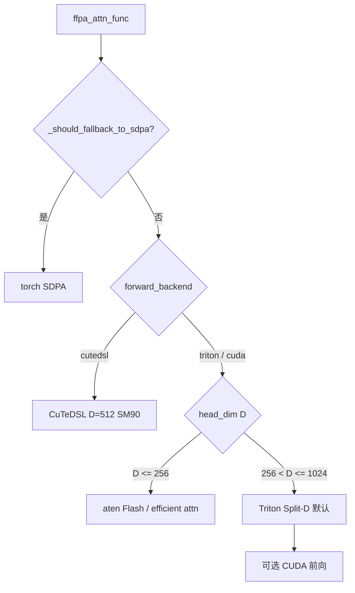

# FFPA（ffpa-attn）

本文档说明独立项目 **[ffpa-attn](https://github.com/xlite-dev/ffpa-attn)** 的功能、代码结构、支持的 Q/K/V 规格与 GPU 架构。路径以 ffpa-attn 仓库为准（例如本地 clone 于 `/path/to/ffpa-attn`）。

FFPA 与 TensorRT-Edge-LLM 的 FMHA v2 / CuTe DSL **无直接集成关系**：前者是 **PyTorch 侧大 head_dim prefill** 加速库；后者是 **TRT engine 内** 的融合注意力。对比见 [§9](#9-与-tensorrt-edge-llm-fmha-的对比)。

---

## 1. 项目定位

**FFPA（Faster Flash Prefill Attention）** 面向 **大 head_dim（D > 256，典型 320～1024）** 的 **Prefill（上下文）阶段** 注意力，核心算法为 **Split-D**：在 **Tensor Core MMA 粒度** 对 \(QK^\top\) 与 \(PV\) 做细粒度分块，使：

- **SRAM 复杂度** 约 \(O(B_r \times 16) \approx O(1)\)（\(B_r=B_c\) 为序列方向 tile）；
- **寄存器复杂度** 约 \(O(d/4)\)；

从而支持 **D 远大于 256**，相对 PyTorch **SDPA** 在合适 shape 上宣称约 **1.5～3×** 加速。

**主要场景**：训练/推理中的 **prefill**；**decode（Nq=1）** 仅小幅提升，多数情况会回退 SDPA。

**快速接入**（一行替换 SDPA，不支持项自动回退）：

```python
import torch.nn.functional as F
from ffpa_attn import ffpa_attn_func

F.scaled_dot_product_attention = ffpa_attn_func
```

在线文档：[ffpa-attn.readthedocs.io](https://ffpa-attn.readthedocs.io/en/latest/)

---

## 2. 核心算法：Split-D

| 对比项 | 经典 FlashAttention | FFPA Split-D |
|--------|---------------------|--------------|
| **分块层级** | Attention 级（沿 Q/KV 序列） | **MMA 级**（沿 head_dim D 再切分） |
| **大 D 时** | smem / 寄存器压力大 | Q/K/V smem 块约 **\(B_r \times 16\)** 固定量级 |
| **适用 D** | 通常 ≤ 256 较优 | **257～1024+** 为主战场 |

`env.py` 中 `ENABLE_FFPA_PERSIST_KV_G2S` 等开关体现 **双模式**：

- **D ≤ 256**：更接近 FlashAttention 的 **attention 级 tiling**（`aten` / 持久化 KV g2s 等）；
- **D > 256**：走 **MMA 级 Split-D**（`triton/` 默认大 D 路径）。

---

## 3. 目录结构与模块作用

| 路径 | 作用 |
|------|------|
| **`src/ffpa_attn/`** | Python 包主体 |
| `ffpa_attn_interface.py` | 对外 API：`ffpa_attn_func`、`ffpa_attn_varlen_func`、SDPA 回退判定 |
| `functional.py` | `FFPAAttnMeta`、`FFPAAttnFunc` autograd，按 D / backend 路由 |
| **`triton/`** | **默认大 D 路径**：Split-D Triton 前向/反向；含 SM90 TMA 实验、autotune JSON |
| **`cuda/`** + **`csrc/cuffpa/`** | **可选** 原生 CUDA **前向**（`ENABLE_FFPA_CUDA_IMPL=1`）；**无 CUDA backward** |
| **`cutedsl/`** | **Hopper 专用** CuTeDSL Split-D（**D=512、SM90**），含 varlen |
| **`aten/`** | **小 D（D≤256）** 走 PyTorch ATen / Flash 风格路径 |
| `env.py` | 编译开关、`FFPA_BUILD_ARCH`、head_dim 实例化范围等 |
| `examples/`、`tests/` | 示例与正确性/性能测试 |

---

## 4. 执行路径与调度



| 路径 | 条件 | 实现 |
|------|------|------|
| **SDPA 回退** | 见 [§6.3](#63-自动回退-sdpa) | `torch.nn.functional.scaled_dot_product_attention` |
| **小 D** | **0 < D ≤ 256** 且未触发回退 | `aten/` |
| **大 D Triton** | **256 < D ≤ 1024** | `triton/`（`forward_backend='triton'`，默认） |
| **大 D CUDA** | 同上 + 编译启用 `_C` | `forward_backend='cuda'`（仅前向） |
| **CuTeDSL** | `forward_backend='cutedsl'` | **仅 D=512 + SM90**；硬件不匹配时 **warning 后回退 SDPA** |

**Backward**：大 D 走 Triton FFPA backward 或 SDPA backward；**无原生 CUDA backward**。

---

## 5. 支持的 Q / K / V 与张量规格

### 5.1 稠密 API：`ffpa_attn_func`

与 `torch.nn.functional.scaled_dot_product_attention` 对齐（布局为 **H 在序列维之前**）。

| 项目 | 规格 |
|------|------|
| **query** | **`[B, Nh_q, Nq, D]`** |
| **key / value** | **`[B, Nh_kv, Nkv, D]`** |
| **dtype** | **`float16` / `bfloat16`**（Q/K/V 需一致） |
| **head_dim D** | 加速区 **257～1024**；**≤256** 多走 aten/SDPA；**>1024** 回退 SDPA |
| **GQA / MQA** | `enable_gqa=True`；要求 **`Nh_q % Nh_kv == 0`** |
| **Cross-attn** | **`Nq ≠ Nkv`** 支持 |
| **Causal** | `is_causal=True` 时要求 **`Nkv >= Nq`**（query 对齐 KV 尾部） |
| **Mask** | 可选 `attn_mask`，可 broadcast 至 `[B, Nh_q, Nq, Nkv]`；大 D Triton 支持 **additive mask 梯度** |
| **Dropout** | 部分 backend 支持；**cutedsl 不支持** `dropout_p > 0` |
| **scale** | 默认 `1/sqrt(D)` |
| **累加精度** | `acc='f16'/'f32'`（主要影响 CUDA；bf16 不能 `acc='f16'`） |

### 5.2 变长 API：`ffpa_attn_varlen_func`

- 形态接近 FlashAttention varlen：`cu_seqlens_q/k`、`max_seqlen_*`、packed **`[T, H, D]`**。
- **当前仅 CuTeDSL**：**SM90 + D=512**；其它 shape / backend → `NotImplementedError`。

### 5.3 功能矩阵（README 摘要）

| Self | GQA/MQA | Cross | Causal/Mask | Dropout | Head dim | 相对 SDPA |
|------|---------|-------|-------------|---------|----------|-----------|
| ✔ `Nq=Nkv` | ✔ `Hq≠Hkv` | ✔ `Nq≠Nkv` | ✔ | ✔（分 backend） | **320～1024** | **~1.5～3×** |

---

## 6. 回退与能力边界

### 6.1 设计意图

README 说明：FFPA **主要为 prefill + 大 D** 设计；下列情况 **可能不比 SDPA 快**，接口会 **自动回退** 或建议不用 FFPA：

- **短序列**：`N < 512`（实现上见下表 `Nq` / `Nkv` 阈值）；
- **小 head_dim**：`D ≤ 256`；
- **decode**：`Nq=1` 仅约 ~10% 提升。

### 6.2 已测试硬件（README）

Ampere、Ada、Hopper、Blackwell 等，例如 **A30、L20、4090、H800/H200、5090**。

### 6.3 自动回退 SDPA

逻辑在 `ffpa_attn_interface._should_fallback_to_sdpa`：

| 条件 | 说明 |
|------|------|
| **D ≤ 256** | 小 head，非 FFPA 主场景 |
| **D > 1024** | 超出当前大 D 支持 |
| **8 ≤ Nq < 512** | 短 query 序列 prefill |
| **Nkv < 512** | 短 KV 序列 |
| **cutedsl** 且 **D ≠ 512** 或 **非 SM90** | 硬件不匹配；`warning_once` 后回退 SDPA |

**CuTeDSL 其它约束**（dtype、fp16 training、`dropout_p > 0`、显式 `attn_mask`、FA 扩展 kwargs 等）在 cutedsl wrapper 内 **抛错**，**不**经 `_should_fallback_to_sdpa` 静默回退。

### 6.4 各 backend 能力边界小结

| 维度 | Triton（默认大 D） | CUDA 前向（可选） | CuTeDSL | aten（小 D） |
|------|-------------------|-------------------|---------|--------------|
| **D** | 257～1024（编译/headdim 表见 §7） | 同左 | **仅 512** | ≤ 256 |
| **GPU** | sm_80+ 等广泛架构 | 随 `FFPA_BUILD_ARCH` | **SM90 Hopper** | 随 PyTorch Flash |
| **Bwd** | ✔ | ✗ | ✔ | ✔ |
| **Varlen** | ✗（当前） | ✗ | ✔（D=512, SM90） | — |

---

## 7. GPU 架构与构建

### 7.1 PyPI / 预编译 wheel

安装说明支持 **`sm_80` … `sm_120`** 一类目标（以发布 wheel 为准）。

### 7.2 源码编译：`FFPA_BUILD_ARCH`（`env.py`）

| 别名 | SM |
|------|-----|
| ampere | 80 |
| ada | 89 |
| hopper | 90 |
| blackwell | 100 |
| blackwell_geforce | 120 |

未设置时按 **当前 GPU** 推断；可为逗号/分号/空格分隔的多 SM 列表，对每个 SM 生成 `-gencode arch=compute_XX,code=sm_XX`。

### 7.3 编译期 head_dim 实例集合（CUDA 代码生成）

| 环境变量 | 生成 head_dim |
|----------|----------------|
| `ENABLE_FFPA_ALL_HEADDIM=0`（默认） | **256, 320, …, 1024**，步长 **64** |
| `ENABLE_FFPA_ALL_HEADDIM=1` | **32～1024**，步长 **32** |
| `FFPA_DEV_HEADDIMS` | 开发子集，如 `256,512` |

Triton autotune 常见大 D 示例：**320, 512, 640, 768, 1024**。

### 7.4 依赖与安装模式

| 项 | 要求 |
|----|------|
| Python | **≥ 3.10** |
| PyTorch | **≥ 2.7.0** |
| 默认 `pip install` | **仅 Triton**，无需 CUDA 扩展 |
| CUDA 扩展 | `ENABLE_FFPA_CUDA_IMPL=1` 后本地 `pip install -e .` |
| CuTeDSL 可选 | `pip install ffpa-attn[cutedsl]` → `nvidia-cutlass-dsl`、`quack-kernels` 等 |

### 7.5 常用环境变量（节选）

| 变量 | 默认 | 含义 |
|------|------|------|
| `ENABLE_FFPA_CUDA_IMPL` | 0 | 是否编译/启用原生 CUDA 前向 |
| `ENABLE_FFPA_ALL_HEADDIM` | 0 | 扩展编译 head_dim 范围 |
| `ENABLE_FFPA_PERSIST_KV_G2S` | 1 | D≤256 时偏 Flash 式 attention tiling |
| `FFPA_BUILD_ARCH` | （空） | 指定编译 SM 列表 |

完整列表见 `env.py` 中 `ENV.list_ffpa_env()`。

---

## 8. CuTeDSL 专线路径（Hopper + D=512）

`cutedsl/_interface.py` 中：

```python
SUPPORTED_HEAD_DIM = 512
```

- 基于 FlashAttention CuTe 接口裁剪，**仅保留 Split-D、D=512、SM90** 训练向路径；
- 前向 tile 示例：`FWD_TILE_M=64`, `FWD_TILE_N=128`；
- H200 等上 README 宣称可达极高 TFLOPS（见仓库 benchmark 图）。

**硬约束**：`head_dim != 512` 或非 SM90 → 稠密 `ffpa_attn_func(cutedsl)` **回退 SDPA**；varlen 则直接 `NotImplementedError`。

---

## 9. 与 TensorRT-Edge-LLM FMHA 的对比

| | **FFPA（ffpa-attn）** | **Edge-LLM FMHA v2** | **Edge-LLM CuTe DSL FMHA** |
|--|----------------------|----------------------|----------------------------|
| **集成** | PyTorch `pip` / monkey-patch | TRT 插件 + cubin | AOT `build_cutedsl.py` + 静态库 |
| **场景** | 大 D **prefill**（HF 训练/推理） | TRT **context/prefill** 部署 | 新 SM / 持久化等 |
| **Head dim** | **320～1024** 为主；CuTeDSL **512** | **64, 128, 256**（+ ViT 72/80） | LLM **64/128**；ViT 等 |
| **精度** | fp16 / bf16 | 运行路径 **FP16** I/O | 按构建配置 |
| **Layout** | `[B, H, N, D]` | **`SEPARATE_Q_K_V`** 等 | 插件约定 |
| **GPU** | **sm_80～sm_120** 类；CuTeDSL **SM90** | cubin：**80, 86, 87, 89, 100, 101, 120, 121**（无 90） | 主要 Blackwell 等新核 |

Edge-LLM FMHA 细节见 [fmha_v2.md](./fmha_v2.md)；CuTe DSL 构建见 [how_to_build_dsl.md](./how_to_build_dsl.md)。

---

## 10. 能力边界小结

| 维度 | FFPA |
|------|------|
| **功能** | 大 head_dim **Prefill Attention**（Split-D） |
| **主后端** | **Triton**（256 < D ≤ 1024）；D≤256 → **aten**；可选 **CUDA 前向**；**CuTeDSL** = Hopper D=512 |
| **序列** | 建议 **Nq、Nkv ≥ 512**；过短自动 SDPA |
| **GPU** | 广泛 **Ampere～Blackwell**；CuTeDSL **必须 SM90** |
| **非目标** | 短序列 decode 专用、TRT 插件、小 D 全面超越 SDPA |

---

## 11. 参考链接

| 资源 | URL |
|------|-----|
| 源码 | https://github.com/xlite-dev/ffpa-attn |
| PyPI | https://pypi.org/project/ffpa-attn/ |
| 文档 | https://ffpa-attn.readthedocs.io/en/latest/ |

---

*规格与回退逻辑以所用 ffpa-attn 版本的 `ffpa_attn_interface.py`、`env.py` 及 README 为准。*
