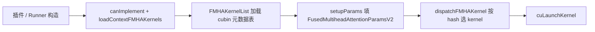

# FMHA v2（TensorRT-Edge-LLM）

本文档说明 TensorRT-Edge-LLM 中 **FMHA v2（Fused Multi-Head Attention v2）** 的作用、代码位置、支持的 Q/K/V 规格与 GPU 架构。路径以 Edge-LLM 仓库为准（例如 `third_party/TensorRT-Edge-LLM`）。

---

## 1. 两层含义：目录 vs 运行时

需要区分：

| 位置 | 内容 |
|------|------|
| **`kernelSrcs/fmha_v2/`** | 仅 **README** + **`gen_fmha_cubin.patch`**：说明如何从 TensorRT-LLM 源码 **生成 cubin**，**不含**完整 CUDA 内核源码 |
| **运行时实际使用** | 预编译 **`.cubin` 嵌入** + **`ContextFMHARunner`**（`cpp/kernels/contextAttentionKernels/`） |

---

## 2. 作用是什么

**FMHA v2** 是 NVIDIA 在 TensorRT-LLM 中维护的一套 **上下文阶段（prefill / context）融合多头注意力** CUDA 内核，特点包括：

- **Flash Attention 风格** 分块计算（元数据 `mS=0` 表示支持任意序列长度）；
- **FP16 计算 + FP32 累加**（内核名中的 `fp16_fp32`）；
- 支持 **GQA/MQA**（`h` 与 `h_kv` 可不同）；
- 支持多种 **mask** 与 **Q/K/V 内存布局**（Edge-LLM 裁剪后主要启用其中一种）。

在 Edge-LLM 中的角色：

| 组件 | 作用 |
|------|------|
| **嵌入 cubin**（`cubin/fmha_cubin.h` + `cubin/*.cubin.cpp`） | 预编译 GPU 机器码，按 SM / head_dim / mask / tiled 等分变体 |
| **`ContextFMHARunner`** | 按 SM、head、mask、layout 选 cubin，`cuModuleLoadData` + `cuLaunchKernel` |
| **`FusedMultiheadAttentionParamsV2`** | 传给 device kernel 的 Q/K/V 指针、stride、`cu_q_seqlens` / `cu_kv_seqlens`、缩放等 |
| **插件** | `AttentionPlugin`（LLM prefill）、`ViTAttentionPlugin`（CuTe DSL 不可用时的 **回退**）等 |

与 **CuTe DSL FMHA**（`CuteDslFMHARunner`）的关系：同一业务的 **两条实现**；插件里通常 **优先 CuTe DSL，失败则回退 FMHA v2**。

---

## 3. 源码从哪里来（`kernelSrcs/fmha_v2`）

仓库内 **不携带** 完整 `cpp/kernels/fmha_v2` 源码，流程是：

1. Clone **TensorRT-LLM** 指定 commit；
2. `git apply gen_fmha_cubin.patch`（扩展 SM101/SM121、`GENERATE_EDGE_LLM` 枚举、Edge 专用 head 尺寸等）；
3. 在 TRT-LLM 的 `cpp/kernels/fmha_v2` 里：

```bash
export GENERATE_EDGE_LLM=1 GENERATE_CUBIN=1 ENABLE_SM10X=1   # 或 ENABLE_SM12X=1
python3 setup.py
make cubin_demobert -j$(nproc)
```

4. 合并 `generated_*` / `cubin_*` 到  
   `cpp/kernels/contextAttentionKernels/cubin/`。

Patch 中 **Edge-LLM 专有限制**（生成时）要点：

- 只生成 **`InputLayout.SEPARATE_Q_K_V`** 的 flash 变体；
- **head_size**：64、128、256 及 ViT 用的 72、80；
- 关闭部分 TRT-LLM 全量 mask/layout 组合以减小 cubin 体积。

### 构建时的 CUDA 工具链

| 目标 SM | README 建议 CUDA |
|---------|------------------|
| 80, 86, 87, 89, 100, 101 | **CUDA 12.8+** |
| 120, 121 | **CUDA 12.9+** |

---

## 4. 运行时工作流程（`ContextFMHARunner`）



1. **`loadContextFMHAKernels(sm, FP16)`**  
   遍历 `sMhaKernelMetaInfosV2[]`，对匹配 `mSM`、`mDataTypeIn/Out` 的条目 `cuModuleLoadData(mCubin)`。

2. **`setupParams`**（Edge-LLM 当前路径）  
   - **仅支持 `AttentionInputLayout::SEPARATE_Q_K_V`**；  
   - 填 `b, h, h_kv, h_q_per_kv, s, d`、Q/K/V stride、softmax 缩放；  
   - `is_s_padded`：`true` → **`[B,S,H,D]`**；`false` → **ragged + `cu_*_seqlens`**。

3. **`dispatchFMHAKernel`**  
   用 `(dtype, seqLen, headSize, unroll, fp32_acc, flash, maskType, tiled, inputLayout)` 查表；launch 网格 **`(unroll, h, b)`**（Ampere/Ada flash 路径）。

4. **Kernel 选择启发式**（构造 `LaunchParams`）  
   - 一律 **`flash_attention = true`**；  
   - `paddedSeqLen <= 64` 或 `headSize < 256` → **非 tiled**；否则 **granular tiled**。

---

## 5. 支持的 GPU 架构（SM）

### 5.1 Edge-LLM 已编入的 cubin（`fmha_cubin.h`）

| SM | 典型平台 |
|----|----------|
| **80** | A100 等 |
| **86, 87** | 含 Jetson Orin |
| **89** | Ada |
| **100, 101** | Blackwell 类 |
| **120, 121** | 部分 Thor / GB10 等 |

`ContextFMHARunner` 构造函数显式允许 **80/86/87/89、100/101、120/121**。

**注意**：TRT-LLM 构建说明里可能出现 **SM90**，但 **当前 Edge-LLM 的 `fmha_cubin.h` 无 SM90 变体**。

### 5.2 CMake 与 cubin 裁剪

构建 C++ 时可通过 **`EXCLUDE_SM_*`** 宏裁剪不需要的 SM cubin，减小二进制体积。

---

## 6. Q / K / V 规格与布局

### 6.1 Edge-LLM 运行时实际使用（`ContextFMHARunner`）

| 项目 | 支持情况 |
|------|----------|
| **dtype** | **仅 FP16**（`canImplement` 要求 `DataType::kHALF`） |
| **输入 layout** | **`SEPARATE_Q_K_V`（枚举值 3）**；`CONTIGUOUS_Q_KV` 在 runner 中已禁用 |
| **Q** | `is_s_padded=true`：**`[B, S, H_q, D]`**；`false`：**packed tokens + `cu_q_seqlens[B+1]`** |
| **K / V** | 同 Q；**`h_kv` 可小于 `h_q`**（GQA） |
| **O** | FP16 |
| **D（head_dim）** | **64, 128, 256**；**72, 80** 仅 **`mask=PADDING` + `SEPARATE_Q_K_V`**（ViT 回退） |
| **Mask** | **PADDING(0)**、**CAUSAL(1)**、**SLIDING_OR_CHUNKED_CAUSAL(2)**；当前 cubin 表 **无 CUSTOM(3)** |
| **序列长度** | Flash：**任意 S**（元数据 `mS=0`） |

### 6.2 预编译 cubin 中的 head_dim × tiling

每个物理 cubin 对应一种 **(D, mStepQ, mStepKV, tiled)**，再 × **3 种 mask** × **layout=3**：

| head_dim D | 典型 mStepQ / mStepKV | tiled |
|------------|----------------------|--------|
| **64** | 64 / 32 | 否（`_nl`） |
| **72, 80** | 64 / 32 | 否 |
| **128** | 64/32 或 64/128 | 非 tiled / **tiled** 均有 |
| **256** | 64/16 或 64/128 | 非 tiled / **tiled** 均有 |

#### 6.2.1 什么是 mStepQ / mStepKV？

**`mStepQ` / `mStepKV`** 是 FMHA v2 **内核元数据**（`FusedMultiHeadAttentionKernelMetaInfoV2`）里的字段，表示 Flash Attention 在 **序列方向** 上对 **Q** 和 **K/V** 各自采用的 **分块步长（tile step）**：

- **不是** batch 大小，**不是** `head_dim`，**不是** 每次推理的序列长度 `S`。
- **是** 该 cubin 在 **编译期固定** 的内核分块参数，用来在 shared memory / 寄存器限制下分块计算 attention。

在元数据表中的位置（`cpp/kernels/contextAttentionKernels/cubin/fmha_cubin.h`）：

```cpp
unsigned int mS;       // flash 时常为 0，表示不绑死固定 S
unsigned int mStepQ;   // Q 侧序列维 tile 步长
unsigned int mStepKV;  // K/V 侧序列维 tile 步长
unsigned int mD;       // head_dim
```

**直观理解**：FMHA v2 不会一次把整个 `[S, …]` 放进 shared memory，而是沿序列维一块一块算。`mStepQ` 是 **Q 侧** 每块覆盖的 token 数；`mStepKV` 是 **K/V 侧** 对应的块步长。内核名里的 `64_32` 即 **mStepQ=64、mStepKV=32**。

**为何 KV step 有时更小、有时更大？** 这是在 **寄存器 / shared memory / occupancy** 之间，为不同 **head_dim** 和 **是否 tiled** 做的固定调优：例如 D=256 的非 tiled 路径常用 **64/16**；长序列 tiled 路径常用 **64/128** 以提高吞吐。

**与运行时 `unroll` 的关系**：`ContextFMHARunner::dispatchFMHAKernel` 会根据当前 `params.s` 和元数据里的 **`mUnrollStep`** 计算 launch 网格：

```cpp
int32_t unroll = (params.s + kernelInfo.mUnrollStep - 1) / kernelInfo.mUnrollStep;
cuLaunchKernel(..., unroll, params.h, params.b, ...);
```

- **mStepQ / mStepKV**：描述 **kernel 内部** 如何切 Q/KV 块（编译期固定）。
- **unroll**：host 根据 **当前序列长度 `s`** 决定沿序列要 launch 多少格。
- **mS = 0**（flash）：该变体 **不绑死固定 S**，任意 S 由 unroll + flash 循环处理。

| 概念 | 含义 |
|------|------|
| **S / `params.s`** | 当前 batch 的 **逻辑序列长度**（或 padding 后的 S） |
| **mStepQ / mStepKV** | **编译期固定** 的分块步长，不随每次推理的 S 变化 |
| **mS = 0** | Flash 变体：支持 **任意 S** |

### 6.3 内核命名示例（解码）

`fmha_v2_flash_attention_fp16_fp32_64_32_S_q_k_v_128_sm87`

| 片段 | 含义 |
|------|------|
| `fp16_fp32` | FP16 I/O，FP32 累加 |
| `64_32` | Q tile 64、KV tile 32 |
| `S` | 变长 / flash（`mS=0`） |
| `q_k_v` | **分离 Q、K、V** |
| `128` | **head_dim** |
| `sm87` | 目标 SM |
| `_causal_` / `_sliding_or_chunked_causal_` / 无 | **mask 类型** |
| `_tiled` | granular tiling 变体 |

同一 **`.cubin` 二进制** 常被多个 mask 变体 **共用**，仅 **device 函数名** 不同。

### 6.4 场景对应

| 场景 | mask | head | 说明 |
|------|------|------|------|
| **LLM prefill** | CAUSAL / SLIDING | 64, 128, 256 等 | `AttentionPlugin` → `ContextFMHARunner` |
| **ViT** | **PADDING** | 64, 72, 80, 128 | `ViTAttentionPlugin` 回退；`[total_S,H,D]` + `cu_seqlens` |

TRT-LLM 侧单测示例（GQA）：

```bash
bin/fmha.exe ... -s 1024 -d 128 -causal-mask -grouped-query-attention 2 -h 14 -separate-q-k-v
```

---

## 7. `FusedMultiheadAttentionParamsV2` 关键字段

定义于 `cpp/kernels/contextAttentionKernels/fmhaParams_v2.h`：

- **指针**：`q_ptr`, `k_ptr`, `v_ptr`, `o_ptr`
- **变长**：`cu_q_seqlens`, `cu_kv_seqlens`（长度 `b+1`）
- **维度**：`b, h, h_kv, h_q_per_kv, s, s_kv, d, dv`
- **缩放**：`scale_bmm1`（常 `1/sqrt(d)`）等
- **滑动窗口**：`sliding_window_size`（`INT_MAX` 表示关闭）
- **布局**：`is_s_padded`

**Layout 枚举**（内核族能力 vs Edge 实际启用）：

| 枚举 | 含义 | Edge `ContextFMHARunner` |
|------|------|---------------------------|
| `PACKED_QKV` | `[B,S,3,H,D]` | 未启用 |
| `CONTIGUOUS_Q_KV` | Q 与 KV 连续布局 | **已禁用** |
| `Q_PAGED_KV` | Q dense + paged KV | 未启用 |
| `SEPARATE_Q_K_V` | 分离 Q、K、V | **唯一启用** |

---

## 8. 能力边界小结

| 维度 | FMHA v2（Edge-LLM 当前产物） |
|------|---------------------------|
| **GPU** | SM **80, 86, 87, 89, 100, 101, 120, 121**（无 90 cubin） |
| **精度** | **FP16** I/O（runner） |
| **Layout** | 运行路径 **仅 `SEPARATE_Q_K_V`** |
| **Head dim** | **64, 128, 256**；**72/80 + PADDING**（ViT） |
| **Mask** | PADDING、CAUSAL、SLIDING_OR_CHUNKED；无 CUSTOM |
| **Seq** | Flash：任意 S |
| **GQA** | 支持（`h` ≠ `h_kv`） |
| **Paged KV** | 内核族有；Edge runner **未启用** |

---

## 9. 与 CuTe DSL FMHA 的对比

| | **FMHA v2** | **CuTe DSL FMHA** |
|--|-------------|-------------------|
| **产物** | 预编译 cubin 嵌入 | `build_cutedsl.py` AOT + `libcutedsl_*.a` |
| **SM** | 80–89, 100–101, 120–121 | 主要 100, 101, 110 等 |
| **Head** | 64, 72, 80, 128, 256 | LLM: 64/128；ViT: 64/72/80/128 |
| **典型优势** | 覆盖 Orin/Ada/多代 GPU、无需构建时 Python DSL | Blackwell 等新核、持久化等 |

CuTe DSL 构建说明见 [how_to_build_dsl.md](./how_to_build_dsl.md)。

---

*具体 cubin 列表与 pin 版本以所用 TensorRT-Edge-LLM 分支的 `fmha_cubin.h` 与 `kernelSrcs/fmha_v2/README.md` 为准。*
