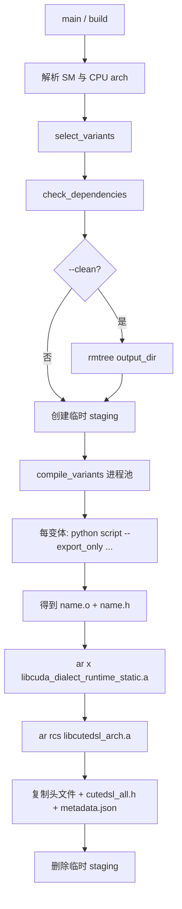

# CuTe DSL 内核构建：`build_cutedsl.py`

本文档说明 TensorRT-Edge-LLM 中 **`kernelSrcs/build_cutedsl.py`** 的功能、作用与完整工作流程。脚本路径以仓库根目录为基准（例如在 `third_party/TensorRT-Edge-LLM/kernelSrcs/build_cutedsl.py`）。

---

## 1. 脚本定位：做什么

`build_cutedsl.py` 是 **CuTe DSL 内核的 AOT（Ahead-of-Time）批量编译编排器**。

它**不手写 CUDA**，而是：

1. 根据 **目标 GPU SM** 和 **内核组（group）** 从注册表选出要编的变体；
2. **并行调用** 各 `kernelSrcs/` 下的 Python 脚本（如 `fmha.py`、`gdn_decode.py`）；
3. 每个脚本用 **nvidia-cutlass-dsl** 做 `cute.compile` + `export_to_c`，产出 **`.o` + `.h`**（含 `cute_dsl_*_wrapper`）；
4. 把所有 kernel `.o` 与 **CUTLASS DSL 静态 runtime** 打成 **`libcutedsl_{arch}.a`**，并生成 **伞头文件** 与 **`metadata.json`**，供 **CMake** 链接与开关 `CUTE_DSL_*_ENABLED`。

一句话：**把「Python 里写的 CuTe DSL 算子」变成「C++ 可链接的静态库 + 头文件」**，避免在 Edge-LLM 的 C++ build 里再跑 Python 编译。

### 常用命令（在仓库根目录执行）

```bash
python kernelSrcs/build_cutedsl.py                      # 为本机 GPU 编所有支持的 group
python kernelSrcs/build_cutedsl.py --kernels gdn        # 只编 gdn
python kernelSrcs/build_cutedsl.py --kernels fmha,gdn   # 多 group
python kernelSrcs/build_cutedsl.py --gpu_arch sm_110    # 覆盖 SM（仅用于变体筛选）
python kernelSrcs/build_cutedsl.py --clean --verbose    # 清空后重建并打印子进程输出
```

---

## 2. 管理的五类内核（`KERNEL_VARIANTS`）

注册表 `KERNEL_VARIANTS` 里每个条目是 `KernelVariant`：`name`、`group`、`supported_sms`、`script`、`script_args`。

| Group | 用途（脚本侧） | 典型 SM |
|--------|----------------|---------|
| **gdn** | Gated Delta Net decode/prefill | 80–121 等 |
| **fmha** | Blackwell 持久化 FMHA（LLM causal + sliding window、FP8、ViT varlen） | 100, 101, 110 |
| **ssd** | Mamba2 SSM chunk-scan prefill | 80+ / Blackwell 子集 |
| **gemm** | Talker MLP 等 GEMM（Ampere / Blackwell DC / BW GeForce，含 fused epilogue） | 按架构分 |
| **nvfp4_moe** | NvFP4 MoE FC1/FC2 grouped GEMM | 100, 101, 110 |

CMake 侧会按 group 打开宏，例如 **`CUTE_DSL_FMHA_ENABLED`**（与 `cmake/CuteDsl.cmake` 读 `metadata.json` 一致）。

### FMHA 变体示例（与 `CuteDslFMHARunner` 对应）

- **LLM**：`fmha_d64` / `fmha_d128`（`--is_causal`、`--is_persistent`、`--bottom_right_align`）
- **滑动窗口**：`fmha_d64_sw` 等（`--window_size 4096,-1`）
- **FP8 输入**：`fmha_*_fp8`
- **ViT**：`vit_fmha_d64` / `d72` / `d80` / `d128`（`--vit_mode`）

---

## 3. 命令行与筛选逻辑

| 参数 | 作用 |
|------|------|
| `--gpu_arch sm_110` | 指定 SM，只编 `supported_sms` 含该 SM 的变体；**不传给** 子脚本（子脚本按本机 GPU device-native 编译） |
| （默认） | `detect_gpu_sm()`：先 **cupy** `compute_capability`，再 **nvidia-smi** |
| `--kernels ALL` | 所有支持当前 SM 的变体 |
| `--kernels fmha` 或 `fmha,gdn` | 只编指定 group |
| `--output_dir` | 默认 `cpp/kernels/cuteDSLArtifact` |
| `--arch x86_64/aarch64` | 产物路径 `{output_dir}/{arch}/sm_{NN}/` |
| `-j N` | 并行编译变体（默认 4） |
| `--clean` | 删掉该 arch/sm 输出目录再编 |
| `--verbose` | 子进程 stdout 不打断 |

**`select_variants(sm, kernels_arg)`**：先按 group 过滤，再按 `supported_sms` 过滤；不支持的会 **NOTE 跳过** 或在无可用变体时 **ValueError**。

---

## 4. 工作流程（按执行顺序）



### 4.1 依赖检查 `check_dependencies()`

固定要求：

- **`nvidia-cutlass-dsl==4.4.1`**
- **cupy**（按 CUDA 大版本：`cupy-cuda12x` 或 `cupy-cuda13x`）
- **`cuda-python`**
- **`ar`**（binutils）
- 能检测到 **CUDA 版本**（nvcc 或 cupy）

通过后返回 **`lib_dir`**（包内 `lib/`，含 `libcuda_dialect_runtime_static.a`）。

### 4.2 单变体编译 `_compile_one()`

对每个 `KernelVariant` 执行类似：

```bash
python kernelSrcs/<variant.script> \
  --output_dir <staging>/<name>/ \
  --file_name <name> \
  --function_prefix <name> \
  <variant.script_args...>
```

工作目录为 **`kernelSrcs/`**。成功则必须有 **`{name}.o`** 和 **`{name}.h`**。

各脚本内部典型路径（以 FMHA 为例）：`cute.compile` → `export_to_c` → 生成 **`cute_dsl_{prefix}_wrapper`** 等符号。

### 4.3 打包静态库

1. 收集所有变体的 **`.o`**；
2. 用 **`ar x`** 解开 **`libcuda_dialect_runtime_static.a`** 到单独目录（避免与 kernel `.o` 重名，会做 **collision 检查**）；
3. **`ar rcs libcutedsl_{arch}.a`** 合并 kernel + runtime 对象；
4. 复制各 **`{name}.h`** 到 **`include/`**；
5. 写 **`cutedsl_{group}_all.h`** 与总 **`cutedsl_all.h`**（`#include` 所有变体头）；
6. 写 **`metadata.json`**（arch、sm、CUDA/DSL 版本、groups、variants 列表、构建时间）。

### 4.4 输出目录结构

```text
cpp/kernels/cuteDSLArtifact/{x86_64|aarch64}/sm_{NN}/
  libcutedsl_{arch}.a
  include/
    cutedsl_all.h
    cutedsl_fmha_all.h
    fmha_d64.h
    vit_fmha_d64.h
    ...
  metadata.json
```

### 4.5 与「预编译 tarball」的关系

对 Thor 等目标，仓库可在 **`kernelSrcs/cuteDSLPrebuilt/`** 放预编译包；**CMake 在 artifact 目录不存在时自动解压**，开发者不必本地跑本脚本。需要**重新生成**预编译包时再执行，例如：

```bash
python kernelSrcs/build_cutedsl.py --gpu_arch sm_110 --arch aarch64 --clean
```

---

## 5. 在 Edge-LLM 工程里的作用

| 环节 | 关系 |
|------|------|
| **C++ Runner**（如 `cuteDslFMHARunner.cpp`） | 通过 `#include "cutedsl_all.h"` 调用各 `cute_dsl_*_wrapper` |
| **CMake `CuteDsl.cmake`** | 读 `cuteDSLArtifact/<arch>/<tag>/`，链 `libcutedsl_*.a` 与 DSL runtime |
| **旧 `CuteDslFMHA.cmake`** | 构建时现场调 `fmha.py`；新统一入口更多是 **`build_cutedsl.py` + 预编译/本地 artifact** |
| **插件 / runtime** | 仅在 **`CUTE_DSL_FMHA_ENABLED`** 等宏打开时走 CuTe DSL 路径 |

本脚本是 **「DSL 源码 → 可链接产物」** 的工厂；**不是** ONNX 导出或 TRT engine build 的一步。

---

## 6. 设计要点（为何这样写）

1. **按 SM 白名单**：同一脚本多 shape/模式拆成多个 `name`，避免在错误 GPU 上链错误 cubin。
2. **每变体独立 staging**：多个变体共用 `fmha.py` 时不会互相覆盖 `.o/.h`。
3. **`--gpu_arch` 只用于筛选**：实际 cubin 由子脚本在**当前机器 GPU** 上 device-native 编译（Linux/QNX 一致）。交叉编译 host 时需在有对应 GPU 的机器上生成 artifact，或使用预编译包。
4. **静态库合并 runtime**：C++ 侧链一个 **`libcutedsl_*.a`**（内已含 dialect runtime 对象），简化 CMake。
5. **`metadata.json`**：让 CMake 知道本次构建了哪些 group/variant，决定编译宏与链接内容。

---

## 7. 小结

| 问题 | 答案 |
|------|------|
| **功能** | 批量 AOT 编译 CuTe DSL 内核，产出静态库 + 头文件 + 元数据 |
| **输入** | `KERNEL_VARIANTS` 注册表 + CLI（SM、group、arch、并行度） |
| **核心步骤** | 选变体 → 查依赖 → 并行调各 `kernelSrcs/*.py --export_only` → 打 `libcutedsl_*.a` → 写 umbrella 头与 metadata |
| **输出** | `cpp/kernels/cuteDSLArtifact/{arch}/sm_{NN}/` |
| **谁消费** | Edge-LLM CMake 与 `CuteDslFMHARunner` 等 C++ 代码 |

---

*具体 API 与 pin 版本以所用 TensorRT-Edge-LLM 分支的 `build_cutedsl.py` 与 `cmake/CuteDsl.cmake` 为准。*
