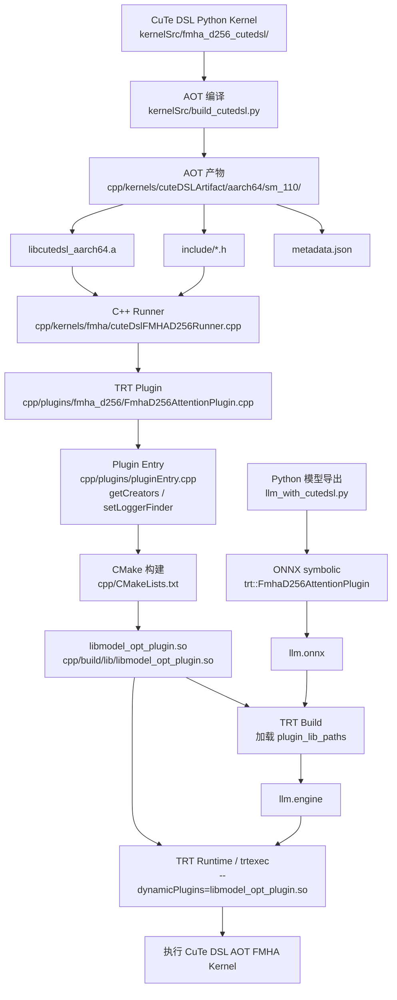

# 1. AOT 编译（需 SM100/SM110 GPU + cutlass-dsl 4.4.1）
pip install -r kernelSrc/requirements-cutedsl.txt

```bash
python kernelSrc/build_cutedsl.py --kernels fmha --gpu_arch sm_110 -j 4 --output_dir cpp/kernels/cuteDSLArtifact
```

# 2. 构建 Plugin
```bash
mkdir -p cpp/build && cd cpp/build
cmake -S cpp -B cpp/build/ -DCMAKE_BUILD_TYPE=Release   -DTRT_PACKAGE_DIR=/usr/include/aarch64-linux-gnu/   -DENABLE_CUTE_DSL=fmha   -DCUTE_DSL_ARTIFACT_TAG=sm_110
cmake --build cpp/build/ -j 10
```

# 3. 导出 ONNX（π0.5 LLM，含 FmhaD256AttentionPlugin）
```bash
model-optimizer-cli export --model_name pi05_libero/llm_with_cutedsl ...
```

# 4. TRT 建引擎
```bash
model-optimizer-cli build --build_cfg config/build_configs/llm_cutedsl_build_cfg.py ...
```

# 5. CuTe DSL 自定义 TRT Plugin 总体流程

当前 `model_optimizer` 通过 CuTe DSL 支持自定义 TensorRT Plugin 的链路可以分成四层：

1. `kernelSrc/fmha_d256_cutedsl/`：CuTe DSL Python kernel 源码。
2. `kernelSrc/build_cutedsl.py`：AOT 编译，导出 C ABI 头文件、目标文件和静态库。
3. `cpp/`：C++ Runner + TensorRT Plugin，链接 AOT 静态库并生成 plugin `.so`。
4. `src/model_optimizer/`：Python/ONNX 导出，把模型里的 attention 映射成 TRT plugin op。

整体流程如下：



## 5.1 CuTe DSL Kernel 层

源代码位于：

```text
kernelSrc/fmha_d256_cutedsl/
```

其中 `export.py` 是 AOT 导出入口。它调用：

```python
cute.compile(...)
compiled.export_to_c(...)
```

把 Python CuTe DSL kernel 导出为 C++ 可调用的 `.h` 和 `.o`。

当前首批导出的 kernel variant：

| Variant | 用途 | dtype |
| --- | --- | --- |
| `fmha_d256_homo_bf16` | BF16 Q/K/V/O | BF16 |
| `fmha_d256_homo_fp16` | FP16 TRT engine | FP16 |

## 5.2 AOT 编译层

执行：

```bash
python kernelSrc/build_cutedsl.py \
  --kernels fmha \
  --gpu_arch sm_110 \
  -j 4 \
  --output_dir cpp/kernels/cuteDSLArtifact
```

会生成：

```text
cpp/kernels/cuteDSLArtifact/aarch64/sm_110/
├── libcutedsl_aarch64.a
├── metadata.json
└── include/
    ├── cutedsl_all.h
    ├── fmha_d256_homo_bf16.h
    └── fmha_d256_homo_fp16.h
```

这一步完成后，CuTe DSL kernel 已经变成静态库和 C ABI 头文件，不再需要运行时 JIT。

## 5.3 C++ Runner 层

Runner 位于：

```text
cpp/kernels/fmha/cuteDslFMHAD256Runner.cpp
```

它负责把 TensorRT Plugin 传来的运行时参数转换成 AOT wrapper 需要的 tensor struct：

```text
Q              [B, S, Hq, 256]
KV cache       [B, 2, Hkv, Cap, 256]
O              [B, S, Hq, 256]
cu_kv_seqlens  [B + 1]
```

然后按 dtype 调用 AOT wrapper：

```cpp
cute_dsl_fmha_d256_homo_fp16_wrapper(...)
cute_dsl_fmha_d256_homo_bf16_wrapper(...)
```

## 5.4 TensorRT Plugin 层

Plugin 位于：

```text
cpp/plugins/fmha_d256/FmhaD256AttentionPlugin.cpp
```

主要职责：

- `supportsFormatCombination()`：声明支持的输入输出 dtype/layout。
- `getOutputDimensions()`：推导 plugin 输出 shape。
- `enqueue()`：组装 `FmhaD256Params`，调用 `CuteDslFMHAD256Runner::run()`。
- `serialize()` / `deserializePlugin()`：支持 engine 序列化和反序列化。
- `FmhaD256AttentionPluginCreator`：让 TensorRT 能通过 plugin name/version 创建 plugin。

TensorRT 10 的 `trtexec --dynamicPlugins` 还需要动态库导出：

```cpp
extern "C" TENSORRTAPI void setLoggerFinder(nvinfer1::ILoggerFinder*);

extern "C" TENSORRTAPI nvinfer1::IPluginCreatorInterface* const* getCreators(
    int32_t& nbCreators);
```

入口实现位于：

```text
cpp/plugins/pluginEntry.cpp
```

如果缺少 `getCreators`，运行时会报：

```text
SymbolAddress for getCreators could not be loaded
```

## 5.5 编译生成 Plugin `.so`

重新 configure 并 build：

```bash
cmake -S cpp -B cpp/build \
  -DCMAKE_BUILD_TYPE=Release \
  -DTRT_PACKAGE_DIR=/usr \
  -DENABLE_CUTE_DSL=fmha \
  -DCUTE_DSL_ARTIFACT_TAG=sm_110

cmake --build cpp/build -j 10
```

生成：

```text
cpp/build/lib/libmodel_opt_plugin.so
```

可以检查动态入口：

```bash
nm -D cpp/build/lib/libmodel_opt_plugin.so | c++filt | grep -E "getCreators|setLoggerFinder"
```

## 5.6 Python ONNX 导出层

相关文件：

```text
src/model_optimizer/ops/fmha_d256_attention_plugin.py
src/model_optimizer/models/pi05/llm_with_cutedsl.py
```

Python 侧通过 `torch.library.custom_op` 定义 dummy op，再通过 ONNX symbolic 映射成：

```text
trt::FmhaD256AttentionPlugin
```

导出 ONNX 时，π0.5 LLM 的 attention 会被替换为该 TRT plugin op。

## 5.7 TRT Build / Runtime

TRT build config 需要加载 plugin：

```python
plugin_lib_paths = [
    "cpp/build/lib/libmodel_opt_plugin.so",
]
```

构建 engine 时，TensorRT 解析 ONNX 中的：

```text
trt::FmhaD256AttentionPlugin
```

然后通过 `libmodel_opt_plugin.so` 中的 creator 创建 plugin，并把 plugin 序列化进 engine。

运行时需要再次加载 plugin 动态库：

```bash
trtexec \
  --dynamicPlugins=cpp/build/lib/libmodel_opt_plugin.so \
  --loadEngine=/tmp/pi05/build/llm.engine \
  --warmUp=0 \
  --iterations=1
```

普通执行可以结束后，再测试 CUDA Graph：

```bash
trtexec \
  --dynamicPlugins=cpp/build/lib/libmodel_opt_plugin.so \
  --loadEngine=/tmp/pi05/build/llm.engine \
  --warmUp=1 \
  --iterations=1 \
  --useCudaGraph
```

## 5.8 当前调试注意点

- AOT 产物和 C++ plugin 必须使用同一个 `sm_110` artifact tag。
- 只修改 `libmodel_opt_plugin.so` 时不需要重导 ONNX；但如果修改了 Python symbolic、模型导出逻辑或 plugin 的输入输出语义，需要重新导出 ONNX 并重新 build engine。
- `cu_kv_seqlens` 必须和实际 KV cache capacity 一致。当前 prefill-only 路径中，KV cache 包含当前序列，因此 B=1 时应是 `[0, seq_len]`，不是 `[0, 2 * seq_len]`。
- 调试 hang 时先不要开 `--useCudaGraph`，先用 `--warmUp=0 --iterations=1 --verbose` 验证普通 enqueue 能结束。