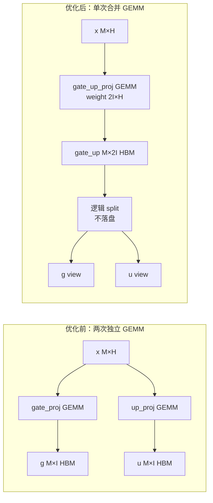
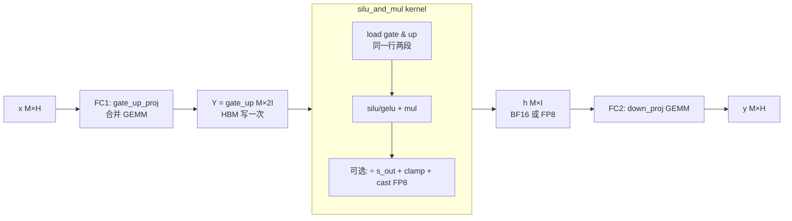
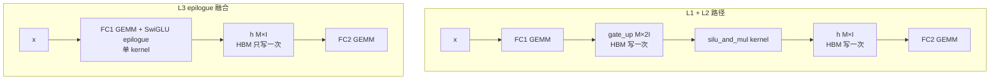
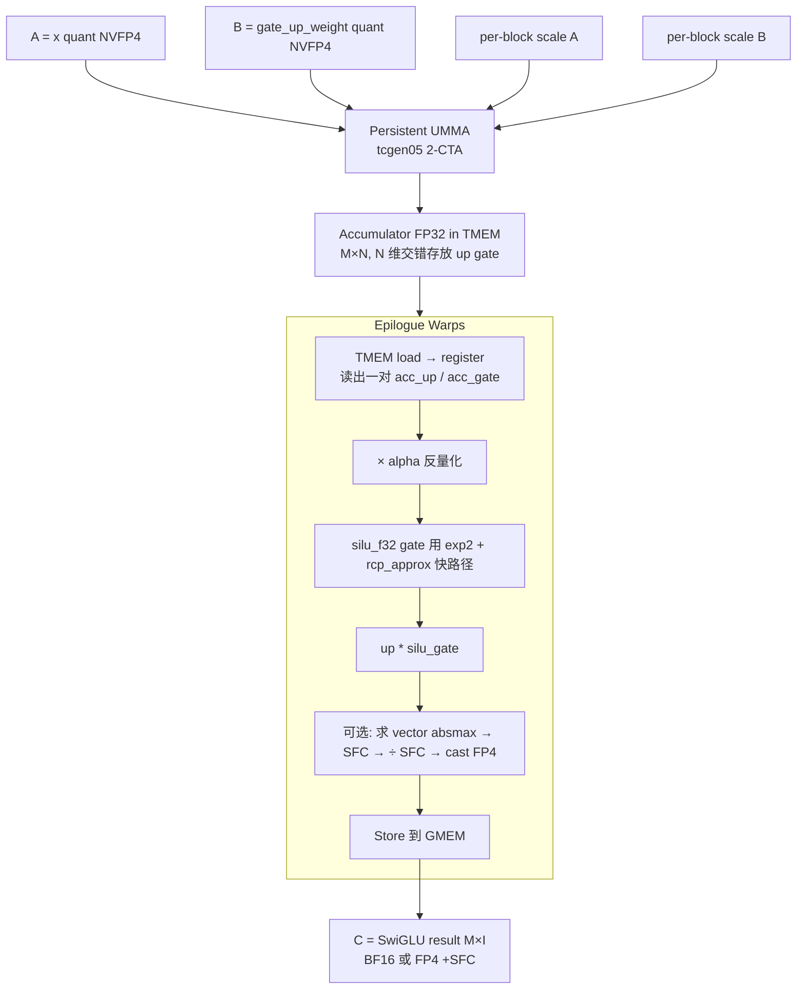

# Fused MLP 设计与对接方案（pi0.5 / Gemma）

本文档记录把 TensorRT-LLM 的 fused MLP 技术迁移到 `model_optimizer` pi0.5 LLM 导出链路上的设计与实施计划。

- 目标模型：`models/pi05/llm.py` 与 `models/pi05/llm_with_cutedsl.py` 使用的 PaliGemma 解码器（`openpi.models_pytorch.transformers_replace.models.gemma.modeling_gemma.GemmaMLP`）。
- 部署形态：ONNX → TensorRT engine（**不是** PyTorch backend），因此融合方案以 ONNX 图重写 + TRT plugin 为主。
- 加速对象：prefill 阶段的逐层 `GemmaMLP`（gate / up / down，三个 `nn.Linear`，激活 `gelu_pytorch_tanh`）。

---

## 1. TensorRT-LLM fused MLP 实现原理

TRT-LLM 把 SwiGLU/GeGLU 风格的 MLP `down(act(gate(x)) * up(x))` 拆成 3 个独立的融合层级，可按硬件能力和量化精度逐级开启。

### 1.0 FC1 / FC2 是什么

LLM MLP 在论文/代码里通常叫 **two-layer feed-forward**，所以习惯把两次 GEMM 编号：

| 名称 | 含义 | shape（pi0.5 Gemma 为例，单层） |
|------|------|-------------------------------|
| **FC1** | 第一次 GEMM：`hidden → intermediate`（**或合并后** `hidden → 2*intermediate`） | `[M, 2048] · [2048, 2 * 16384] → [M, 32768]` |
| **激活 + 门控** | `gate, up = split(FC1); h = act(gate) * up` | `[M, 32768] → [M, 16384]` |
| **FC2** | 第二次 GEMM：`intermediate → hidden`，即 `down_proj` | `[M, 16384] · [16384, 2048] → [M, 2048]` |

非门控 MLP（如 BERT）只有 1 个 FC1 和 1 个 FC2；门控 MLP（SwiGLU/GeGLU）需要 2 套 FC1 权重（`gate`/`up`），合并后仍叫 **FC1**，输出维度变成 `2 * intermediate`。本文 **FC1 默认指合并后的 `gate_up_proj`**。

整体公式（GeGLU；SwiGLU 把 GELU 换成 SiLU）：

\[
\mathrm{MLP}(x) = W_{down}\bigl(\,\underbrace{\mathrm{GELU}(W_{gate}\,x)}_{\text{gate 分支}}\;\odot\;\underbrace{W_{up}\,x}_{\text{up 分支}}\,\bigr)
\]

合并 gate/up 后：

\[
[g \,;\, u] = W_{gu}\,x,\qquad h = \mathrm{GELU}(g)\odot u,\qquad y = W_{down}\,h
\]

### 1.1 L1：gate + up **权重合并**（单次 FC1 GEMM）

**目标**：把两次相同形状的 GEMM 合成一次。

#### 数学等价

原始：
\[
g = x\,W_{gate}^{\top}\in\mathbb{R}^{M\times I},\quad u = x\,W_{up}^{\top}\in\mathbb{R}^{M\times I}
\]

合并后（在 N 维 concat 权重）：
\[
W_{gu} = \begin{bmatrix} W_{gate} \\ W_{up} \end{bmatrix}\in\mathbb{R}^{2I\times H},\qquad
[g \,;\, u] = x\,W_{gu}^{\top}\in\mathbb{R}^{M\times 2I}
\]

数学上完全等价，只是把两次 mat-mul 合成一次。

#### 流程图



#### 收益的本质

- **HBM 带宽**：两次 GEMM 各自要把权重从 HBM load 一遍；合并后 weight 只需 load 一次，**省一次 `hidden × intermediate × dtype_size` 的权重读取**。对于带宽受限的 prefill / decode，节省非常明显。
- **算术强度提高**：M 不变、K 不变、N 翻倍 → 每字节权重做的 FLOPS 翻倍。
- **kernel launch / wave quantization**：少一次 cuBLAS 调用，少一次 grid 离散化损失。

#### 实现位置

代码：[`tensorrt_llm/_torch/modules/gated_mlp.py`](../../../../TensorRT-LLM/tensorrt_llm/_torch/modules/gated_mlp.py)

```python
self.gate_up_proj = Linear(
    self.hidden_size,
    self.intermediate_size * 2,          # N 维翻倍
    bias=bias,
    tensor_parallel_mode=TensorParallelMode.COLUMN,
    weights_loading_config=WeightsLoadingConfig(
        weight_mode=WeightMode.FUSED_GATE_UP_LINEAR),   # ← 关键标记
    fused_weight_shard_indices_mapping={
        'gate': (0, local_intermediate_size),
        'up':   (local_intermediate_size, local_intermediate_size),
    },
    ...)
```

`WeightMode.FUSED_GATE_UP_LINEAR` 告诉 weight loader：从 HF checkpoint 的两个独立 tensor（`mlp.gate_proj.weight`、`mlp.up_proj.weight`）按 `[gate; up]` 顺序 concat 装到同一个 buffer。

> AutoDeploy 走 FX rewrite 也是同样思路（`FuseSwiGLU` transform 里 `torch.cat([gate_weight, up_weight], dim=0)` 后注册成新 buffer）。

---

### 1.2 L2：activation 融合（`silu_and_mul` / `gelu_and_mul`）

**目标**：把 L1 输出后的 `split → activation → element-wise mul` 这三步合成一个 GPU kernel。

#### 数学

输入 `Y = [g, u] ∈ R^{M×2I}`（gate 在前 I 列，up 在后 I 列），输出：
\[
H_{ij} = \sigma(g_{ij})\,g_{ij}\,u_{ij}\quad\text{(SwiGLU)} \qquad\text{或}\qquad H_{ij} = \mathrm{GELU}(g_{ij})\,u_{ij}\quad\text{(GeGLU)}
\]

其中 SiLU = `x * sigmoid(x)`，GELU(tanh approx) = `0.5 * x * (1 + tanh(√(2/π) * (x + 0.044715 * x³)))`。

可选量化（写出时直接量化到 FP8）：
\[
H_{ij}^{\text{fp8}} = \mathrm{clamp}\!\Bigl(\tfrac{\sigma(g_{ij})\,g_{ij}\,u_{ij}}{s_{\text{out}}}, -448, 448\Bigr).\mathrm{to}(\text{e4m3})
\]

#### 流程图（**做了 L1+L2 后的 dataflow**）



#### 没融合时会发生什么

朴素 PyTorch 写法：
```python
gate, up = gu.chunk(2, dim=-1)  # 触发 2 个 view（不落盘）
silu_g  = F.silu(gate)          # kernel 1：读 gate I 元素，写 silu_g I 元素
h       = silu_g * up           # kernel 2：读 silu_g、up，写 h
```

每个 element 在 HBM 上来回 **3 次读 + 2 次写**。融合后只剩 **2 次读 + 1 次写**（gate 读、up 读、h 写）。对 `M × I` 量级的张量，带宽节省 40–60%。

#### Triton kernel（TRT-LLM 默认路径）

[`tensorrt_llm/_torch/modules/swiglu.py`](../../../../TensorRT-LLM/tensorrt_llm/_torch/modules/swiglu.py)：

```python
@triton.jit
def silu_and_mul_kernel(o_ptr, ..., x_ptr, x_stride, d, BLOCK_SIZE, HAS_O_SCALE):
    i = tl.program_id(0)              # 行
    j = tl.program_id(1)              # N 维分块
    offsets = j * BLOCK_SIZE + tl.arange(0, BLOCK_SIZE)
    a = tl.load(x_row_ptr + offsets,       mask=offsets < d).to(tl.float32)   # gate
    b = tl.load(x_row_ptr + offsets + d,   mask=offsets < d).to(tl.float32)   # up
    result = tl.sigmoid(a) * a * b                                            # SwiGLU
    if HAS_O_SCALE:
        result = scale_and_clamp(result, o_scale, o_ptr.dtype.element_ty)    # → FP8
    tl.store(o_row_ptr + offsets, result, mask=offsets < d)
```

注册：
```python
torch.ops.trtllm.silu_and_mul(x)                          # BF16/FP16 输出
torch.ops.trtllm.silu_and_mul(x, scale=s, dtype=fp8)      # 顺带 FP8 量化
```

#### Triton kernel（vendored from Triton 项目）

更高性能版本：[`triton_kernels/swiglu.py`](../../../../TensorRT-LLM/triton_kernels/swiglu.py)

差异：
- `BLOCK_M=32//itemsize, BLOCK_N=128, num_warps=4`，半持久化 grid（`min(M_BLOCKS*N_BLOCKS, 8*num_sms)`）。
- gate/up **交错存放** `a[..., ::2]` / `a[..., 1::2]`，更利于 vector load。
- 内置 `precision_config.limit` 做 clamp（限制激活幅度）。
- 公式微调：`out_gelu * (a_linear + 1)`（gpt-oss 等使用的变体）。

> 这两个 kernel 选哪个由 `GatedMLP._apply_activation` 根据是否需要 FP8 量化决定。

#### 实现位置

| 入口 | 文件 |
|------|------|
| `torch.ops.trtllm.silu_and_mul` 注册 | `cpp/tensorrt_llm/thop/...` |
| Triton kernel（FP8 量化版） | `tensorrt_llm/_torch/modules/swiglu.py` |
| Triton kernel（高性能版） | `triton_kernels/swiglu.py` |
| AutoDeploy fallback | `auto_deploy/custom_ops/linear/swiglu.py`（用 `flashinfer.activation.silu_and_mul`） |

---

### 1.3 L3：FC1 + SwiGLU **epilogue 融合**（CuTe DSL，Blackwell）

**目标**：连 L1+L2 中间的那一次 HBM 落盘也省掉——FC1 GEMM 的累加器还在 register/TMEM 时就完成 SwiGLU，直接写出 `[M, I]` 而不是 `[M, 2I]`。

#### 数据流对比



**L3 比 L1+L2 省去 `M × 2I × dtype` 大小的中间 HBM 写 + 读**。对 pi0.5（`I=16384`、BF16），单 MLP 单层省 `≈ 1 GB / batch tokens` 的 HBM 来回。

#### CuTe DSL kernel 内部流程

代码：[`tensorrt_llm/_torch/cute_dsl_kernels/blackwell/dense_blockscaled_gemm_swiglu_fusion.py`](../../../../TensorRT-LLM/tensorrt_llm/_torch/cute_dsl_kernels/blackwell/dense_blockscaled_gemm_swiglu_fusion.py)（约 2400 行）



#### 关键设计点

1. **N 维交错布局**：累加器 N 维按 `(up, gate)` **交错**存放，epilogue warp 用 `tcgen05_ld` 一次读出一对 `(acc_up_i, acc_gate_i)`，直接在寄存器里算 SwiGLU。
2. **2-CTA UMMA cluster**：`cluster_shape_mn = (2, 1)`，两个 CTA 协作完成 `mma_tiler_m = 256`，跑满 Blackwell 的 TMA multicast。
3. **Persistent + warp specialization**：4 个 epilog warp、1 个 MMA warp、1 个 TMA warp，每个 CTA 长时间占住 SM 处理多个 tile。
4. **数值快路径**：`silu(x) = x / (1 + exp(-x))`，CuTe DSL 用 `exp2(log2(e) * (-x))` + `rcp_approx` 而不是直接 `exp`，省时钟。
5. **block-scaled 量化**：A/B 都是 NVFP4（每 16 个 element 一个 FP8 scale），SwiGLU 之后可选再做 **SFC**（Scale-Factor C）量化把输出再量到 FP4 给下一层。

代码片段（SwiGLU 标量路径，约 line 1526）：

```python
# SwiGLU Unpacked Version: scalar operations
# Computes: output = (alpha * up) * silu(alpha * gate)
for i in cutlass.range_constexpr(cute.size(tTR_rAcc_up)):
    acc_vec_up_alpha   = acc_vec_up[i]   * alpha_val
    acc_vec_gate_alpha = acc_vec_gate[i] * alpha_val
    tCompute[i] = acc_vec_up_alpha * silu_f32(acc_vec_gate_alpha, fastmath=True)
```

向量化版本用 `add_packed_f32x2 / mul_packed_f32x2`，每条指令做两个 FP32。

#### 两个公开 op

| op 名 | 输出 dtype | 何时启用 | 额外好处 |
|-------|-----------|----------|----------|
| `cute_dsl_nvfp4_dense_gemm_swiglu_blackwell` | BF16 | NVFP4 + Blackwell | 省 FC1 中间落盘 |
| `cute_dsl_nvfp4_dense_gemm_swiglu_fp4out_blackwell` | NVFP4 (+ SFC) | 上面条件 **且** down_proj 也是 NVFP4 **且** `m ≥ 128` | 再省一次 BF16→FP4 重量化，FC2 直接吃 FP4 |

启用判定（`gated_mlp.py::_can_fuse_gate_up_swiglu` / `_fp4out`）：

```python
def _can_fuse_gate_up_swiglu(self):
    return (self.use_cute_dsl_blockscaling_mm
            and self.activation == F.silu
            and self.gate_up_proj.has_nvfp4
            and not self.gate_up_proj.has_bias)

def _can_fuse_gate_up_swiglu_fp4out(self):
    return (self._can_fuse_gate_up_swiglu()
            and self.down_proj.has_nvfp4
            and self.down_proj.input_scale is not None
            and not self.down_proj.force_dynamic_quantization)
```

> **注意**：L3 当前只覆盖 **SwiGLU（SiLU）** 且仅 Blackwell + NVFP4；要在 pi0.5 上复用必须改 epilogue（GeGLU）+ 改 dtype 路径（BF16 起步），见本仓库方案 C。

---

### 1.4 三层融合的累计收益（pi0.5 Gemma 估算）

以单层 MLP，`M = 968`（pi0.5 prefill 序列长度），`H = 2048`，`I = 16384`，BF16 为例：

| 路径 | FC1 HBM 写 | activation HBM 来回 | 中间张量大小 | 相对总 HBM 流量 |
|------|-----------|---------------------|-------------|----------------|
| 朴素（gate/up 分两次 GEMM） | `M × 2I × 2B = 60 MB` × 2 | 读 + 读 + 写 ≈ `M × I × 2B × 3 = 90 MB` | gate I, up I, h I | **1.0×（基线）** |
| L1（合并 GEMM） | `M × 2I × 2B = 60 MB` × 1 | 同上 90 MB | gate_up 2I, h I | **≈ 0.65×** |
| L1 + L2（+ silu_and_mul） | 60 MB | `M × I × 2B × 3 ≈ 90 MB` → `× 2 ≈ 60 MB`（读 gate+up, 写 h） | gate_up 2I, h I | **≈ 0.50×** |
| L3（epilogue 融合） | **0**（中间不落盘） | 0 | 只剩 h I | **≈ 0.20×** |
| L3 + FP4out | 0 | 0；输出 0.5 字节/element | h I (FP4) | **≈ 0.10×** |

实际端到端 prefill 提速通常是 L1 +5–10%，L1+L2 再 +3–8%，L3 再 +5–15%（Blackwell + FP4 时更大）。

---

### 1.5 AutoDeploy（FX graph rewrite）等价路径

代码位置：[`tensorrt_llm/_torch/auto_deploy/transform/library/fuse_swiglu.py`](../../../../TensorRT-LLM/tensorrt_llm/_torch/auto_deploy/transform/library/fuse_swiglu.py) + [`auto_deploy/custom_ops/linear/swiglu.py`](../../../../TensorRT-LLM/tensorrt_llm/_torch/auto_deploy/custom_ops/linear/swiglu.py)

两段式（与 L1 + L2 等价，但在 FX 图层做）：

1. `MatchSwiGLUPattern` — 在 FX 图里匹配 `silu(linear(x, gate)) * linear(x, up) → linear(down)`，替换成 `auto_deploy::torch_swiglu_mlp`（中间表示）。
2. `FuseSwiGLU` — 把 `gate_weight` 与 `up_weight` 在 dim=0 concat，转为 `auto_deploy::fused_swiglu_mlp`，内部优先调用 `flashinfer.activation.silu_and_mul`。

同样的两段式还覆盖 **NVFP4 量化**（`fused_nvfp4_swiglu_mlp`）和 **FineGrained FP8 / DeepGEMM**（`fused_finegrained_fp8_deepgemm_swiglu_mlp`）。

> 对 pi0.5（导出 ONNX 而非 PyTorch backend），等价的"图层 rewrite"应在 `torch.nn.Module` 层做（替换 `layer.mlp`），见方案 A。

---

## 2. pi0.5 当前 MLP 结构

### 2.1 模型链路

- `models/pi05/llm.py::LLM` → `paligemma.get_decoder()` → HuggingFace `transformers.models.gemma.modeling_gemma`，实际被 `openpi/.../transformers_replace/.../modeling_gemma.py` patch。
- pi0.5 Gemma 配置：`hidden_activation = "gelu_pytorch_tanh"`（**GELU，不是 SiLU**），所以 TRT-LLM 的 `silu_and_mul` 不能直接复用，需要 `gelu_and_mul`（tanh approximation）变体。

### 2.2 MLP 定义（参考）

```python
# openpi/.../transformers_replace/models/gemma/modeling_gemma.py
class GemmaMLP(nn.Module):
    def __init__(self, config):
        super().__init__()
        self.hidden_size = config.hidden_size
        self.intermediate_size = config.intermediate_size
        self.gate_proj = nn.Linear(self.hidden_size, self.intermediate_size, bias=False)
        self.up_proj   = nn.Linear(self.hidden_size, self.intermediate_size, bias=False)
        self.down_proj = nn.Linear(self.intermediate_size, self.hidden_size, bias=False)
        self.act_fn = ACT2FN[config.hidden_act]  # gelu_pytorch_tanh

    def forward(self, x):
        return self.down_proj(self.act_fn(self.gate_proj(x)) * self.up_proj(x))
```

### 2.3 已有的 plugin 接入框架（attention 路径，可直接复用）

```text
src/model_optimizer/ops/fmha_d256_attention_plugin.py    # torch.library.custom_op + ONNX symbolic + dynamo translation
cpp/plugins/fmha_d256/                                   # FmhaD256AttentionPlugin
cpp/kernels/fmha/                                        # cuteDslFMHAD256Runner
kernelSrc/fmha_d256_cutedsl/                             # CuTe DSL AOT 源码
cpp/plugins/pluginEntry.cpp                              # 统一 getCreators / setLoggerFinder
```

对接 fused MLP 完全可以 mirror 这条路径（同一个 `libmodel_opt_plugin.so`，同一个 `CUTE_DSL_ARTIFACT_TAG`，同一张 dynamo translation 表）。

---

## 3. 三个层级的对接方案

### 方案 A：纯 ONNX 图重写（零 plugin，先拿确定性收益）

只在 PyTorch / ONNX 层做 gate + up 权重 concat，激活保留 ONNX 原生 op。**不需要写 kernel、不需要 CuTe DSL**，TRT builder 自己会把后续的 `Split / GELU / Mul` 融合到 MyelinGraph 里。

#### 实施步骤

1. 新文件 `src/model_optimizer/models/pi05/fused_mlp.py`：

   ```python
   import torch
   import torch.nn as nn

   class FusedGemmaMLP(nn.Module):
       """gate + up 权重合并版的 GemmaMLP；导出 ONNX 后由 TRT 后续 fuse。"""

       def __init__(self, gemma_mlp: nn.Module):
           super().__init__()
           H, I = gemma_mlp.hidden_size, gemma_mlp.intermediate_size
           self.gate_up_proj = nn.Linear(H, 2 * I, bias=False,
                                         dtype=gemma_mlp.gate_proj.weight.dtype,
                                         device=gemma_mlp.gate_proj.weight.device)
           self.down_proj = gemma_mlp.down_proj
           self.act_fn = gemma_mlp.act_fn
           with torch.no_grad():
               self.gate_up_proj.weight.copy_(
                   torch.cat([gemma_mlp.gate_proj.weight,
                              gemma_mlp.up_proj.weight], dim=0))

       def forward(self, x):
           gu = self.gate_up_proj(x)          # [..., 2I]
           gate, up = gu.chunk(2, dim=-1)     # ONNX: Split
           return self.down_proj(self.act_fn(gate) * up)


   def install_fused_mlp(gemma_model: nn.Module) -> None:
       for layer in gemma_model.layers:
           if not isinstance(layer.mlp, FusedGemmaMLP):
               layer.mlp = FusedGemmaMLP(layer.mlp)
   ```

2. 在 `llm.py` 或 `llm_with_cutedsl.py` 构造 `LLM` 之后、`quantize()` 或 `export()` 之前调用：
   ```python
   from .fused_mlp import install_fused_mlp
   install_fused_mlp(self.model)
   ```

3. PTQ：把 `gate_proj` / `up_proj` 的量化 spec 迁移到 `gate_up_proj`（同 axis、同 group），在 `quantize_model` 里加一个白名单 / 命名映射。

4. 校准：跑一遍 calib，确认 `gate_up_proj` 的 weight scale 与原来 `cat(gate_scale, up_scale)` 吻合（应可忽略误差）。

5. 导出 → 建引擎 → `trtexec --useCudaGraph`，对比 prefill latency。

#### 收益与代价

- ✅ 节省一次 weight load（GEMM HBM 带宽），通常 5–10% 端到端 prefill 提速。
- ✅ ONNX QDQ / ModelOpt PTQ 完全兼容。
- ✅ TRT 10.x 的 fuser 通常能把 `Linear → Split → GELU → Mul → Linear` 融到同一个 myelin region。
- ❌ 激活 + 下一次 GEMM 之间仍可能有一次 HBM 落盘（看 TRT 融合结果）。
- ❌ 已量化 checkpoint 的迁移需要重新校准（gate / up 合并后输入 scale 要重算）。

**优先级最高、风险最低，建议先做这一步。**

---

### 方案 B：自定义 TRT Plugin `GemmaFusedMlpPlugin`（控制激活 + Mul 这一步）

把 `Split → GELU → Mul` 中间段封装成 plugin，让 plugin 内部用一个手写 kernel 完成 `gelu_and_mul`，省两次 HBM 来回。

#### 目录结构（mirror attention plugin）

```text
src/model_optimizer/ops/
  └── fused_mlp_plugin.py            # torch.library.custom_op + ONNX symbolic
cpp/plugins/
  └── gemma_fused_mlp/               # GemmaFusedMlpPlugin
cpp/kernels/
  └── fused_mlp/                     # gelu_and_mul runner
kernelSrc/
  └── gelu_and_mul_cutedsl/          # CuTe DSL kernel 源码（可选）
```

#### Python 侧 wrapper（直接照搬 `FmhaD256Attention` 模式）

```python
@torch.library.custom_op("model_opt::gelu_and_mul", mutates_args=())
def gelu_and_mul(x: torch.Tensor) -> torch.Tensor:
    a, b = x.chunk(2, dim=-1)
    return torch.nn.functional.gelu(a, approximate="tanh") * b

@gelu_and_mul.register_fake
def _(x):
    return x.new_empty(*x.shape[:-1], x.shape[-1] // 2)

@symbolic_helper.parse_args("v")
def _symbolic(g, x):
    return g.op("trt::GemmaFusedMlpPlugin", x, outputs=1)
```

ONNX 图：

```text
x ──Linear(2I)──► gelu_and_mul plugin ──Linear(hidden)──► out
```

#### kernel 实现选项

| 实现 | 难度 | 性能 |
|------|------|------|
| 手写 CUDA：`__global__ void gelu_and_mul(half2 *, half2 *, int N)` | 低 | 已接近带宽峰值 |
| 调 cuBLAS / cuDNN 现成 fused activation | — | 没有对应 op |
| CuTe DSL `gelu_and_mul` | 中 | 同手写 CUDA，但能与后续 GEMM 在 PDL 上排队 |

#### 收益与代价

- ✅ 在方案 A 基础上再省 1 次 HBM `[M, intermediate]` 的写回。
- ✅ plugin 与 attention plugin 共用 `libmodel_opt_plugin.so`，构建链路不需要重做。
- ❌ 引入 ONNX 自定义 op，与 ModelOpt PTQ 的 QDQ 插入需要协调（建议把 `gelu_and_mul` 当 black-box，输入 scale 由前一个 Linear 输出 + scale 注入）。

---

### 方案 C：CuTe DSL fused FC1 + GeGLU epilogue Plugin（最高收益）

最接近 TRT-LLM `cute_dsl_nvfp4_dense_gemm_swiglu_blackwell` 的做法：**FC1 GEMM 的 epilogue 里直接做 GeGLU**，输出 `[M, intermediate]`，单 plugin 替代 `gate_up_proj + split + gelu + mul`。

这是 SM100 / SM110 / SM120（Blackwell、Jetson Thor、GB10）上性能最高的路径。

#### 落地步骤

1. **写 CuTe DSL kernel**：`kernelSrc/gemm_geglu_cutedsl/`

   起点：直接拿 TRT-LLM 的 `dense_blockscaled_gemm_swiglu_fusion.py` 改 epilogue：

   ```python
   # 原版 SwiGLU：out = up * silu(gate)
   # 改为 GeGLU(tanh approx)：
   y = 0.7978845608 * (gate + 0.044715 * gate * gate * gate)
   gelu = 0.5 * gate * (1.0 + tanh(y))
   out  = up * gelu
   ```

   - kernel 与 weight loader 的 layout 约定：TRT-LLM 把 `(up, gate)` 在 N 维 **交错** 排列；简单实现可以先按 `[up; gate]` 顺序拼，让 epilogue 知道偏移即可。
   - dtype 起点：**先做 BF16 / FP16**（与 attention 路径对齐）；后续再加 NVFP4 / FP8。

2. **AOT 编译入口**：`kernelSrc/build_cutedsl.py` 增加 `--kernels gemm_geglu`：

   ```bash
   python kernelSrc/build_cutedsl.py --kernels gemm_geglu \
       --gpu_arch sm_110 --output_dir cpp/kernels/cuteDSLArtifact
   ```

   产出 `libcutedsl_<arch>.a` + `gemm_geglu_bf16.h`。

3. **C++ Runner + Plugin**：

   ```text
   cpp/kernels/gemm_geglu/cuteDslGemmGegluRunner.{h,cpp}
   cpp/plugins/gemm_geglu/GemmGegluPlugin.{h,cpp}
   ```

   Plugin 的 attribute 携带 `[N=intermediate, K=hidden, dtype]`。

4. **Python wrapper**：`src/model_optimizer/ops/gemm_geglu_plugin.py`：

   ```python
   @torch.library.custom_op("model_opt::gemm_geglu", mutates_args=())
   def gemm_geglu(x: torch.Tensor, weight: torch.Tensor) -> torch.Tensor:
       gu = F.linear(x, weight)
       g, u = gu.chunk(2, dim=-1)
       return F.gelu(g, approximate="tanh") * u
   ```

5. **替换 PyTorch MLP**（`fused_mlp.py` 增加变体）：

   ```python
   class GemmGegluFusedMLP(nn.Module):
       def forward(self, x):
           h = torch.ops.model_opt.gemm_geglu(x, self._gate_up_weight)
           return self.down_proj(h)
   ```

#### 与现有 attention plugin 的复用

- **同一个 `.so`**：`cpp/plugins/pluginEntry.cpp` 已经统一注册 creator，新增 `GemmGegluPlugin` 只需追加 creator。
- **同一个 CuTe DSL artifact tag**（如 `sm_110`），`CUTE_DSL_ARTIFACT_TAG` 已统一。
- **同一套 ONNX dynamo translation 表**：在 `llm_with_cutedsl.py` 的 `export_kwargs["custom_translation_table"]` 里合并 attention + mlp 两张表。

---

## 4. 方案对比与推荐路线

| 方案 | 实现量 | 预期 prefill 提速 | 风险 | 何时上 |
|------|--------|------------------|------|--------|
| **A** 仅 weight concat | < 100 行 Python | 5–10% | 极低，PTQ 完全可用 | **立即做** |
| **B** GeGLU plugin | + ~600 行 C++/CUDA | 再 +3–8% | 中，需协调 QDQ | A 验证后做 |
| **C** CuTe DSL FC1+GeGLU 融合 | + ~1500 行 CuTe DSL + plugin | 再 +5–15%（Blackwell；FP4 时更多） | 较高，依赖 SM10x | Jetson Thor 重点 GPU 时做 |

**推荐顺序**：A → C。B 是 A → C 的中间过渡，可跳过；除非短期内 Blackwell 不就绪，则先做 B。

### 进一步把 down_proj、residual、norm 也吃掉？

TRT-LLM 在 PyTorch backend **没有** 把 `down_proj` 和 SwiGLU 融到一个 kernel（因为 `down` shape 不同、后接 all-reduce）。pi0.5 prefill 目前 **不建议** 做 `FC1 + act + FC2` 三段融合，收益边际而权重布局复杂。

完成方案 C 后，下一个性价比更高的方向是 **`down_proj` 的 NVFP4 GEMM + 输入 FP4 直通**（仿 TRT-LLM 的 `fp4out` 路径），可继续在 FC1 → FC2 之间省一次量化。

---

## 5. 第一步落地清单（方案 A）

1. ☐ 新增 `src/model_optimizer/models/pi05/fused_mlp.py`（`FusedGemmaMLP` + `install_fused_mlp`）。
2. ☐ `llm.py` / `llm_with_cutedsl.py`：构造 `LLM` 后挂 `install_fused_mlp(self.model)`。
3. ☐ `quantization_utils`：`gate_proj` / `up_proj` 的量化命名映射到 `gate_up_proj`（白名单 / 命名规则）。
4. ☐ 跑 calib，对比 `cat(gate_scale, up_scale)` 与新 `gate_up_scale`，确认精度无回退。
5. ☐ 导出 ONNX，确认 TRT 后续把 `Linear → Split → GELU(tanh) → Mul → Linear` 融到同一个 myelin region（看 `--verbose` 日志）。
6. ☐ `trtexec --useCudaGraph --warmUp=1 --iterations=100` 对比 prefill latency 与原版。
7. ☐ 用 `Pi05Metric` 跑数值精度回归。

---

## 6. 参考代码索引

| 主题 | 路径 |
|------|------|
| TRT-LLM GatedMLP | `TensorRT-LLM/tensorrt_llm/_torch/modules/gated_mlp.py` |
| TRT-LLM SiLU+Mul Triton | `TensorRT-LLM/tensorrt_llm/_torch/modules/swiglu.py` |
| TRT-LLM AutoDeploy SwiGLU 自定义 op | `TensorRT-LLM/tensorrt_llm/_torch/auto_deploy/custom_ops/linear/swiglu.py` |
| TRT-LLM AutoDeploy SwiGLU fusion transform | `TensorRT-LLM/tensorrt_llm/_torch/auto_deploy/transform/library/fuse_swiglu.py` |
| TRT-LLM CuTe DSL GEMM + SwiGLU epilogue | `TensorRT-LLM/tensorrt_llm/_torch/cute_dsl_kernels/blackwell/dense_blockscaled_gemm_swiglu_fusion.py` |
| pi0.5 GemmaMLP（patch） | `openpi/src/openpi/models_pytorch/transformers_replace/models/gemma/modeling_gemma.py` |
| pi0.5 PyTorch LLM 包装 | `model_optimizer/src/model_optimizer/models/pi05/llm.py` |
| pi0.5 CuTe DSL LLM 包装 | `model_optimizer/src/model_optimizer/models/pi05/llm_with_cutedsl.py` |
| 现有 attention plugin（参考） | `model_optimizer/src/model_optimizer/ops/fmha_d256_attention_plugin.py` |
| 现有 attention plugin 构建链路 | `model_optimizer/kernelSrc/README.md`、`model_optimizer/cpp/plugins/fmha_d256/`、`model_optimizer/cpp/kernels/fmha/` |
